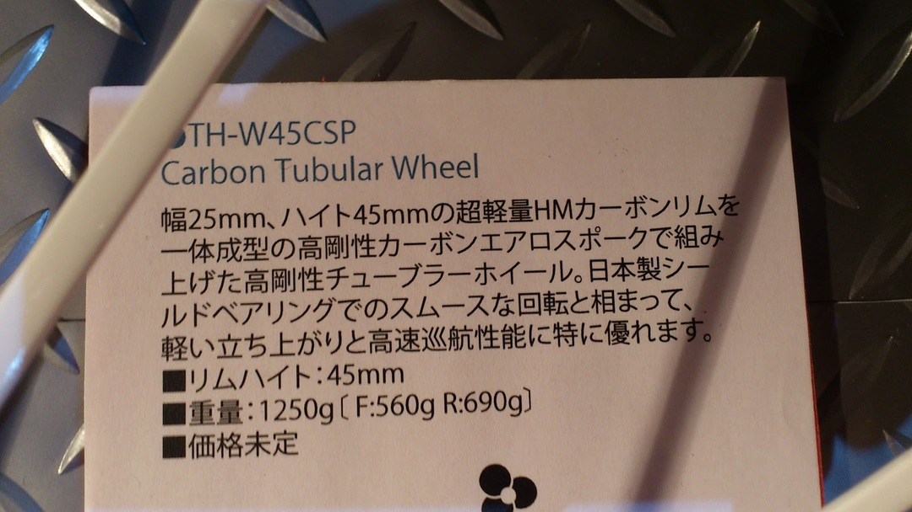
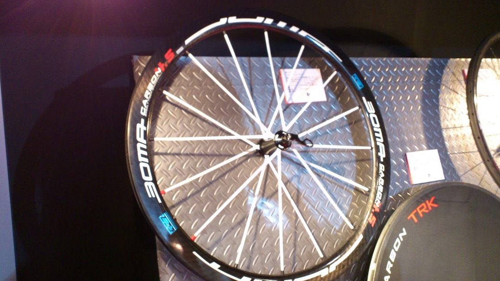
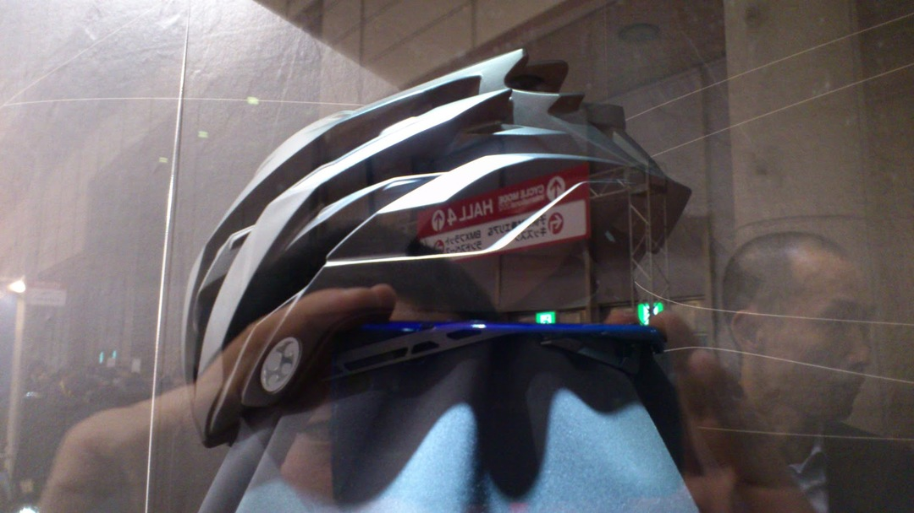
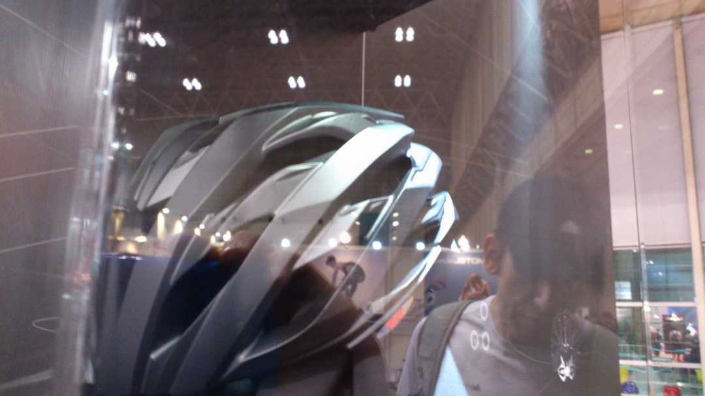
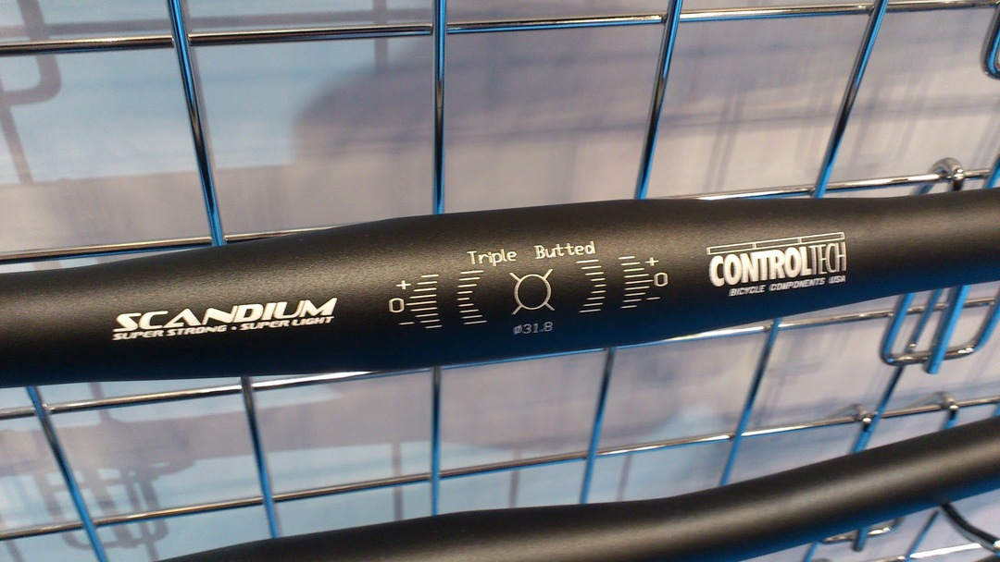
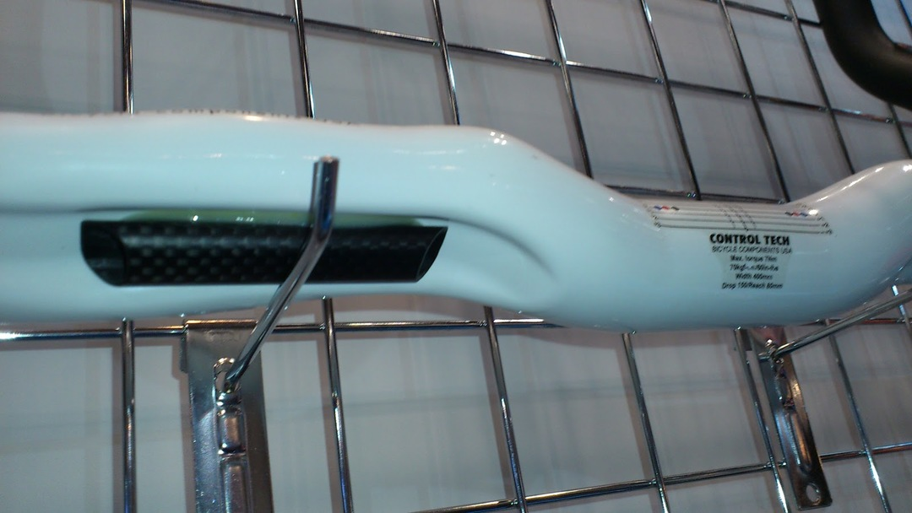
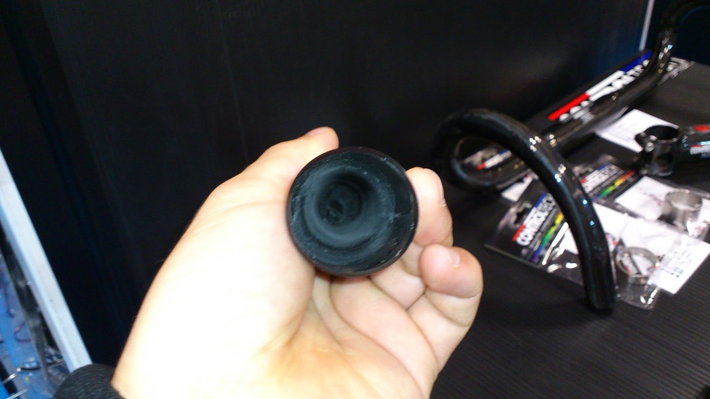
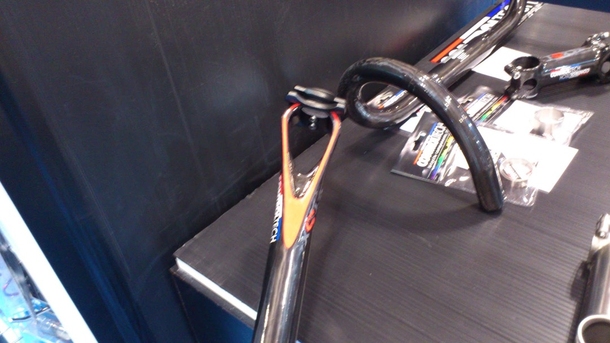
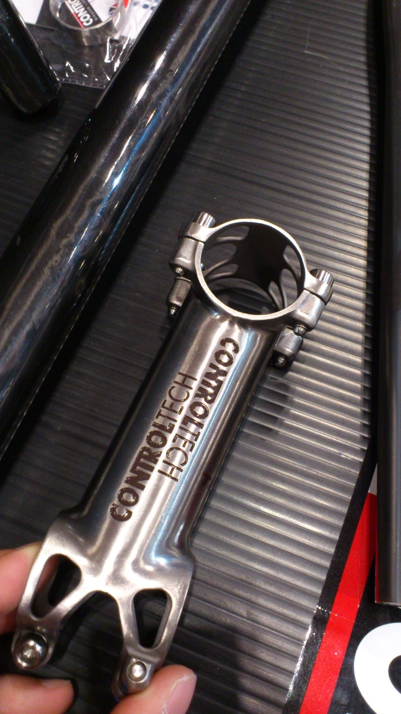
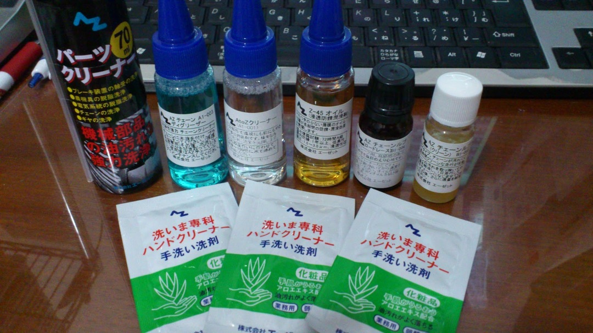

サイクルモード行って来ました。

金曜日に行ったのですが既にすごい人で…土日はどんなんになってしまっているのでしょうか

今回は参加ブランド数も少なかったので

試乗はNeilPrydeのBura SLとかJAMISの650Bなどちょっと気になっていたものだけにして、主に面白そうなモノを探していました。

Buraは「軽いことがすごくわかりやすいバイク」って感じですね。それ以上はわかりませんでしたw\
 650Bは、26inchしか乗ったことない身としてはコメントしづらいですが、フロントの安定感がかなり増しているように思えます。ただやっぱり小柄な自分としてはハンドルが高い…29erみたいな超下向きステムが必要そうです

ここから本番のちょっとだけ気になったもの！
9000系とかの本命ともいえるブツはちゃんとレポートしてるひとにおまかせします

まずはBOMAのカーボンスポークホイール！

価格未定なのがちょっと気になりますが45mmで1,250gはかなり頑張ってる！\

20万以下でオナシャス。二本のカーボンスポークがそれぞれセットになって組み付けられていましたね

それとOGKの新ヘルメット、名前を撮り忘れた上にショーケースの中でスマホには写真がつらいw

かなりエアロ効果を意識した作りという売り込みです、後ろのラチェットもさらなる新型に。形状はMS-2とREDIMOSのちょうど中間ぐらいだそうで。来春発売予定。

コントロールテックさんは相変わらずの変態パーツ群を出していました

スカンジウムハンドル！とっくに旬の過ぎた素材かと思っていましたがw

裏にカーボンのケーブルガイドのあるハンドルとか・・・

変態形状のシートポストw　そしてカーボンが薄いwww

説明不要のステム

ホムセンでおなじみのAZが自転車ケミカルに参入ということで試供品も頂きました

個人的には大量に使いたいけど値の張ってしまうディグリーザーが安いのがいいですね

すでに<a href="https://www.az-oil.jp/index.html">AZ公式サイト</a>で予約を受け付けているようです

