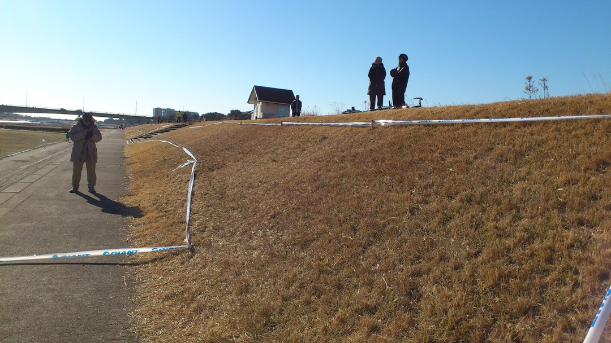
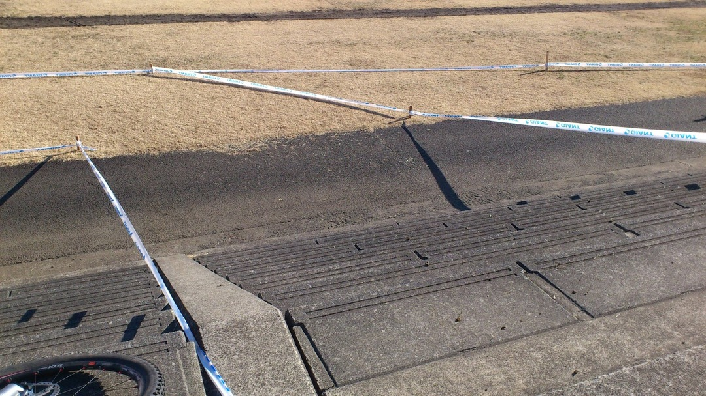
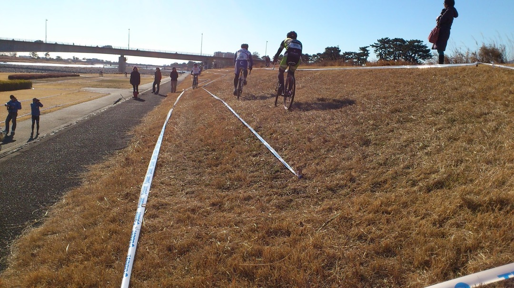
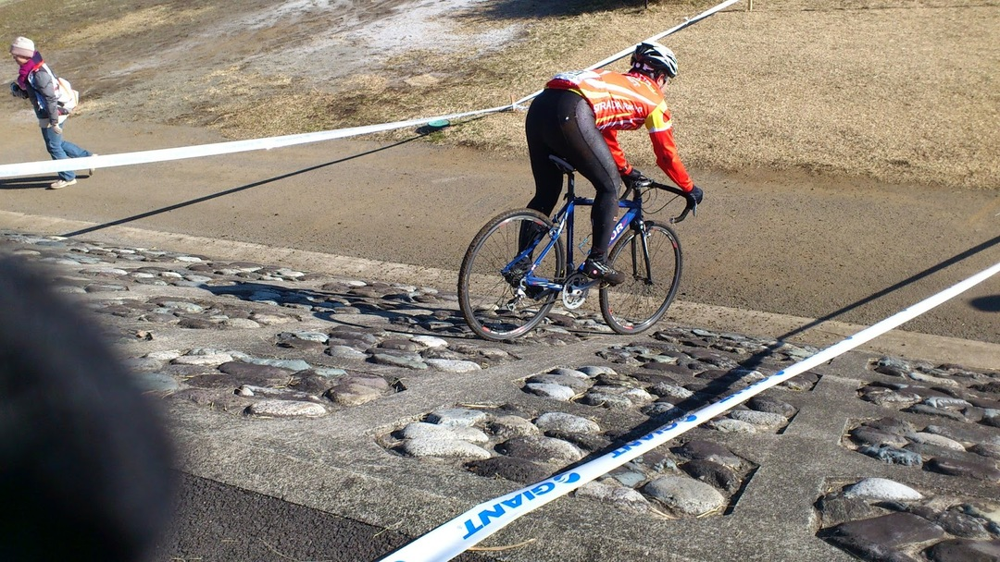
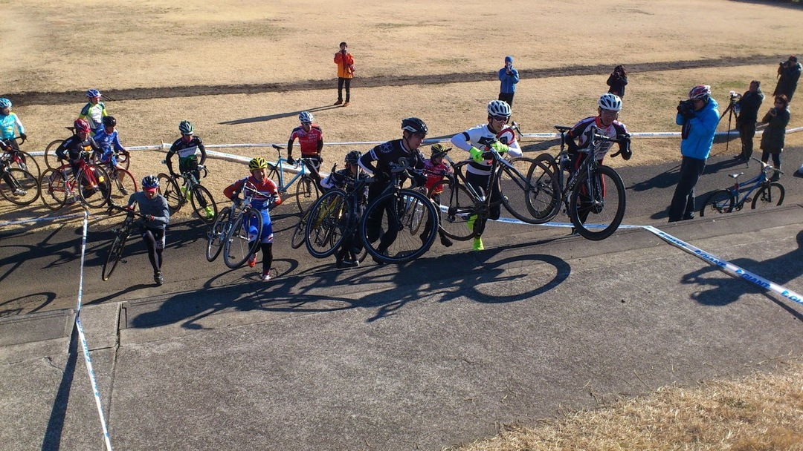
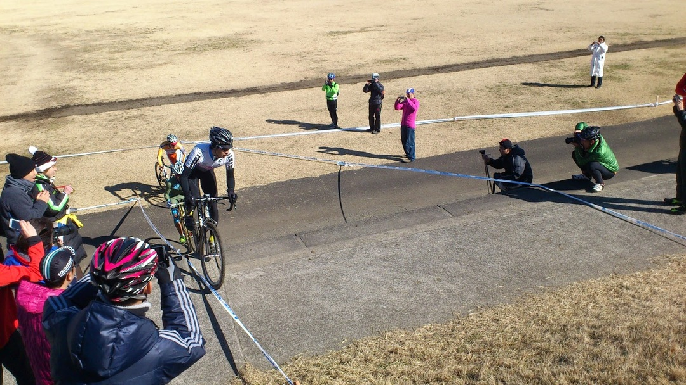

[湘南ベルマーレシクロクロス][1]に出場してきました！

初のシクロクロス参戦です、ただし使用車種はMTB、C3に出走。

試走が7:30出走が8:30という早いスタートなので

日の出前にいそいそと自宅を出て会場へ。

初めてシクロクロスに出たわけですが予想以上のコースのフリーダムさ

こーんな斜面を走らされたり

こーんな階段を登らされたり

斜面で折り返したり

こんなダウンヒルをさせられたり

終いにもう1回登り下りがあったり

ダウンヒルはMTBでも一瞬躊躇するくらいの斜度でした…

階段は試走時に端のスロープを利用して乗車で登る練習をしておきました。

走ってみてわかったのですが、こういったテクニカルなセクションではMTBが有利で、これらのポイントで主に順位を上げていっていました。

逆に後半に存在する平地ゾーンではシクロにいいように抜かされていく（´・ω・｀)

向かい風だし芝は見た目より深いしフラットバーにはなかなかきつい…

以下レースレポ。

スタートと同時に、せまいコースでいいポジションを取るためにスプリントがある。

いきなり階段登りのため案の定渋滞、当然端を上る余裕なし。

別クラスの写真ですがスタート直後の階段での様子。

その後一番最初の写真にある斜面を走る、ランニングで。

本来MTBなららくらく乗車できるのだがいかんせん芋洗い状態なので動きづらい。滑って転ぶ人も多数、まさに阿鼻叫喚。

数十メートル進むと少し楽になったので乗車、ガシガシこぎつつダウンヒルゾーンでMTBのメリットを活かして思いっきり最短ルートで突っ込む。このあたりになるともう人はまばら、後ろは渋滞しているが…

しかしダウンヒルのときペダルをしっかり嵌められなかったため、中途半端な体制になり、ケツをサドルにぶつけてシートポストが一番下まで下がる事態が発生＼(^o^)／

すぐ近くがシケインなので下車して少し長めに走ることにして走りながら適当に修正！

勘とはわりとすごいもので低めですがわりといい位置に戻せました。

ジグザグゾーンや2カ所目の階段では前が詰まっていたり前方で転倒したりする人がいて乗車でスロープを登る作戦は1周目では使えず。後半の平地ではいいように抜かれていく…

2周目でようやく階段スロープを登る、C3で乗車で登る人は少ないので観客から歓声、ガッツポーズでドヤ顔。いい気分だ…

結局2周回目から最後まではすべてスロープ乗車に成功。

登り切ったあと飛び乗るための再加速が無い上に、シクロクロスだと斜面での乗車にてこずりタイムロスをする人が多いため、ここを登りきれることは大きなアドバンテージになっていた。（前方に人がいるなら2〜3人までパスできる）

ただしシクロクロスに後の平地で抜かれるがな！

2周目終了時にボードの「3」の数字を見てあと3回もこの周回をこなすことに絶望…

心拍計は忘れたが間違いなく180〜200を前後しているであろう体。でもとりあえず踏まなきゃ…

3周目以降はある程度自分のまわりのメンバーが固まり、抜きつ抜かれつを繰り返す展開。

特筆すべき点はありませんね…得意セクションと苦手セクションがはっきりわかっているので、平地ではなるべく脚を温存して得意な部分で加速をかける。

ラスト1周に入る前に「12番手！」との声がかかる。

ジャンの鳴るスタート/ゴール地点を通過してからは貯めていた脚をつかってひたすら踏む。

ゴール前に捲るためには前半の得意なセクションで決定的な差を付けなければならない。

幸い視界の中に4人ほどいる。

最初の階段で一人、シケインで一人、2つ目の階段で2人抜く。そのあとの斜面を激踏みして差を広げにかかる。

最後だし平地でも脚をゆるめない、前からさらに一人降ってきた。

後ろを振り返ると2つ目の階段で抜いたうちの一人が来ている（しかも知り合い）

踏むもののあっさり平地区間でパスされる…(´・ω・｀)

残り500mほどになったところで最後のひと頑張り。ラストのアップダウンで少し間を詰め、ずっとミドルに固定していたフロントギアをアウターにしてロングスプリント。

ぐんぐん差が縮まる、相手は後ろを見ていない。

2〜3m差で差せませんでした（´ へ ε へ\`\*)

結果8位、絵的に負けているのでガッツポーズもできずww

なんていうかシクロは障害物競争？とか聞いてましたけども実際にやると戦争だこれは。

接触気にしないしインに切り込んできて前にでるなどやりたい放題。

最初の担ぎや押しで他人のチェーンリングやらがやたら当たったりしましたねー

楽しいけど怪我も絶えないでしょうなw

その後はC2,C1などを観戦。

全カテゴリー含めて知り合いも何人か出ていましたが、接触でスポークが飛んだりパンクしたりと実はほぼノートラブルで完走しただけでもいいのかもしれないと思ったり。

C1の人たちの走りの異次元っぷりに驚愕しました。スロープ登りはもはや必須テクとなっており普通に皆さんラインを選んで登っていきます。

そして定番のバニホによるシケイン越え！

観客も完全にこれを期待していますw　飛ぶごとに大きな歓声が！

こけたり滑ったり魅せ技があったりと見ているだけでも楽しいですシクロクロス！

周回レースなので何度も選手を見ることができますしね。

「お祭り」といわれる所以を頭ではなく心で理解しました。

MTBをかなりオールラウンドな形に組んでいくことにしているので、シクロクロスバイクを新たに組む予定は当分ありませんが、これからシクロクロスにも参加していきたいですね。

TOKYOシクロクロスにも出ますよ！

[1]: http://shonancross.net/
