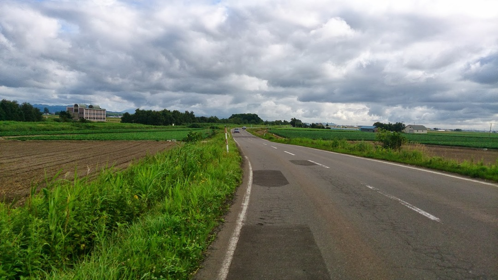
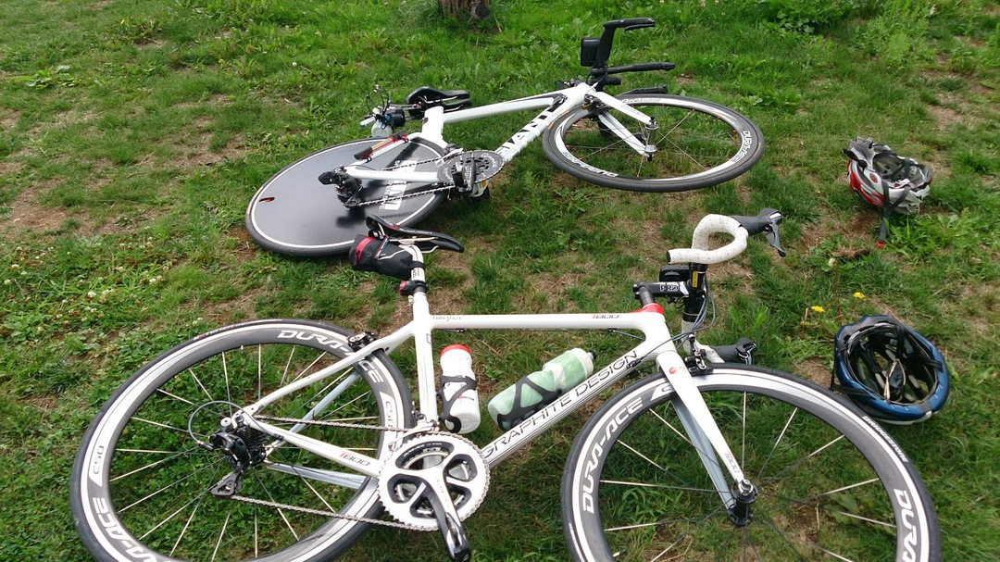

「先生、平地を走りたいです…」

北海道在住のフォロワーさんに良いところがあるとのことで連れて行ってもらいました

いわゆる広域農道で20kmくらい車通のすくない平地があるそうで…路面もGOOD

こんなかんじの道が延々 20km以上！

TTの大会開いたら人気が出そうなコースです

写真が少ないのはエアロポジションでテンション上がり続けていた影響で

道の駅で鶏の半身揚げを食し、T-800に載せて頂いたりしました。

GDRのロードに乗ったのは初めてですけど本当にしなるんですね。

その割には進むし不思議な感覚。9000のFDは神でした。
