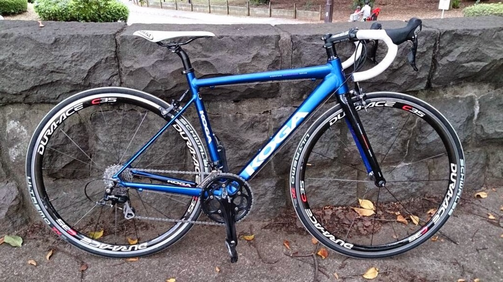

この三連休にアルp…ニコルユーロサイクル駒沢でKOGAのA-limitedの日本最速試乗（自称）を行っていたので衝動的に試乗してきました。

かつて存在したスカウンジウムフレームを彷彿とさせるレーシング系の軽量アルミだとかなんとか。なんとフレーム1090g…

今持っているバッカス01は1290gだということを考えると驚異的です。

試乗車は105にC35CLということでちょっと重さを感じましたがフレームだけだと軽い軽い。

最近のアルミフレームを見ているとCAAD10は過去のモノでTCR SLRとかGF02などより軽くて方向性のはっきりしたものが増えてきましたね

このフレームは青のアルマイト塗装が非常に綺麗です。ロードバイクでは珍しいですね

問題の乗り味…

KOGAといえばKIMERAのプロですら悲鳴を上げる超剛性がイメージにあったのでさぞかしこちらのフレームもカッチンカッチンだと思っていました。

だが乗り出してみると、意外にも加速力は素晴らしいですが脚に跳ね返ってくる感じはありませんでした。

細いシートステーはもはや最近のガチなアルミフレームでは常識と化してますね。

これで結構振動吸収性が高いです。

7900ホイールの性能がかなり高いのでそこらへんを差し引かなければなりませんが…特に弱点らしい弱点は見当たりませんね。

もっと軽いカーボンフレームは世の中にいくらでもあるし快適性もそちらのほうが（概ね）高いとは思いますが、レースに出たいけどそこまでお金を出せない、落車の可能性が高いレースに多く出る人にはいい感じの17万円弱というお値段ですし一定の需要はあるのかなと。

TCR SLRはフレーム15万円弱ですし、CAAD10はいくらだか忘れましたけど、この辺りをターゲットにしてどこまで対抗できるか気になりますね～

良いフレームなのは間違いないけれどもDi2内装できないのとこれを買ってしまうとアルミ3代目になるので自分はちょっと見送りでw
