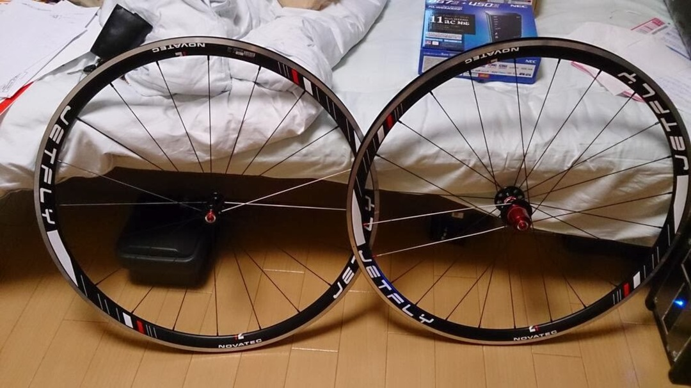
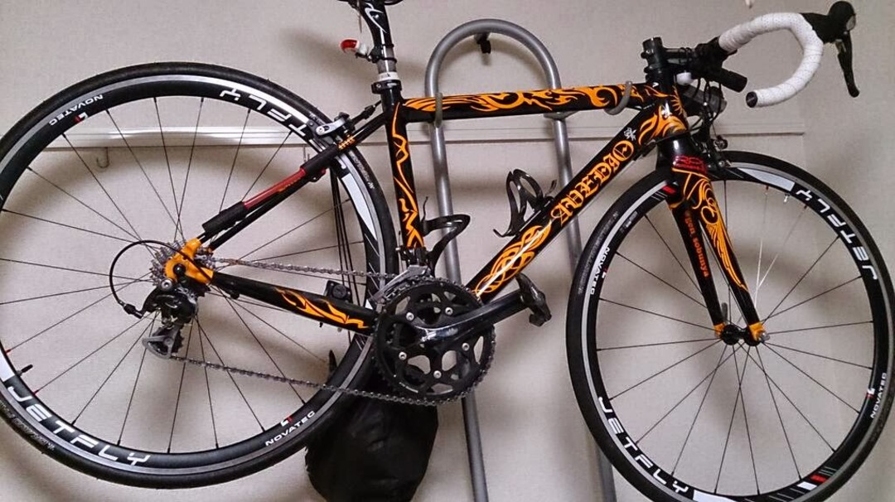

9070がほしい

9070がほしい

9070がほしい

冬ボは出る。内装？フレームに適当に穴開けるわ。

ただ9000ホイールを一緒に買うほどの財力はない…

手持ちの中華は10sまで…

コスパよくてそこそこエアロでできればチューブレス履けるホイールが…

あった

### NOVATEC JETFLY

11s対応、チューブレスレディ、32mmリム、公称1435 g

GP4000Sとビットリアの緑チューブ、6700スプロケを嵌めた上体で前後2400gでしたね…

220\*2+80\*2+205=…

見なかったことにしましょう、公称です公称。リムテープとか入れてないでしょう。

見た目そこそこ！

チューブレス化にはNoTubesのリムテープとチューブレスバルブが必要みたいなので、今のタイヤを摩耗させきったら試していきます。

アトハ電動コンポヲカウダケデスネ？
