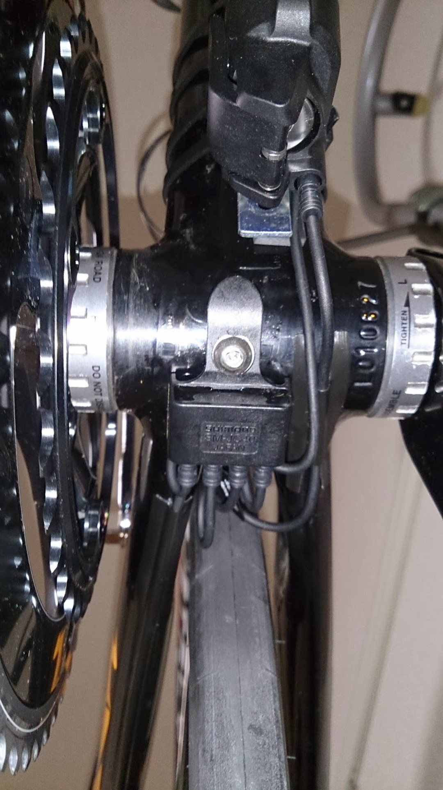
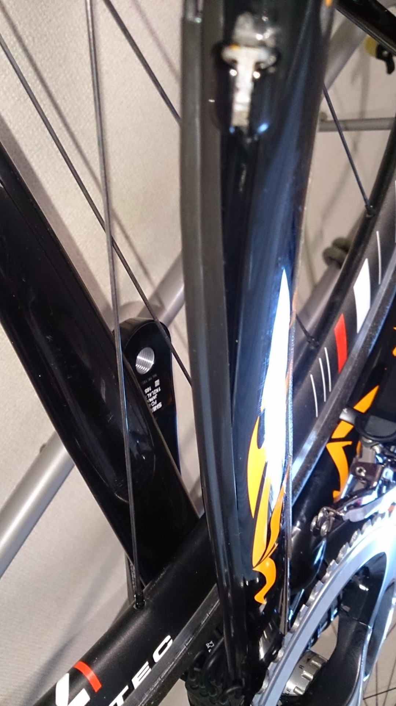
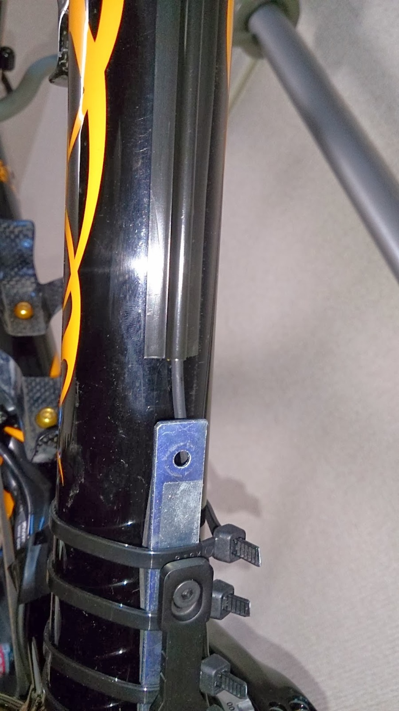
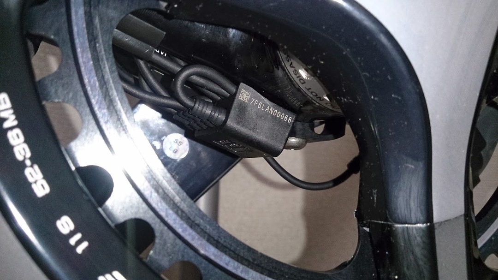

Di2組付け配線編その1です。

終わりません。

注文ミスってE-tube足りないwwwwwwwwwwwwwwwwww

今回、フル9070 ＋スプリンタースイッチを組むために

① ジャンクションA-B

② ジャンクションB-RD

③ ジャンクションB-FD

④ ジャンクションB-バッテリー

⑤ ジャンクションA-STI1

⑥ ジャンクションA-STI2

以上のE-tubeが必要になるわけでしたが、購入したケーブルセットは4本しか

ケーブルが入っておらず、⑤⑥ 番に利用するものを買い忘れてましたww

ちなみにハンドル幅400mmを利用している時、300mmのケーブルではジャンクションAまで余裕がないので、バラで購入する人はもう少し長いものを購入したほうがいいと思います。

今回は組める部分だけ仮組します。

スプリンタースイッチからSTIへの接続は、微妙にコネクタ規格が違い、直にジャンクションへは取り付けられません。

これがもしできたら色々発想が膨らむんですが…

ジャンクションBを裏に取り付け、ケーブルを這わせていきます。

RD部分やハンドルへの遊び量を決め、ケーブルカバーを貼り付け固定。簡単です、面倒ですが。

ワックスをフレームに塗布している方はしっかりパークリで落としてから貼り付けましょう。

わかりやすくフラッシュを焚いたのですが、実際は黒同士なのでそこまで目立ちません

余った部分はジャンクションBの中に仕舞えるようになっています。折りたたむ際のRがきついので断線が怖いですが公式組付けなので多分平気でしょう…

横から見るとこんな具合ですな。

タイヤとのクリアランスはしっかり確保してありますが、ぶっといカーボンフレームだと外装は厳しいかもしれません。

Di2は見た目の綺麗さからしても内装が正義ですね。

来週平日にならないとE-tubeが届かないので、今週末ロードはお休みです。

代わりにTTを組みます…ブレーキワイヤーとの格闘が待っています。
