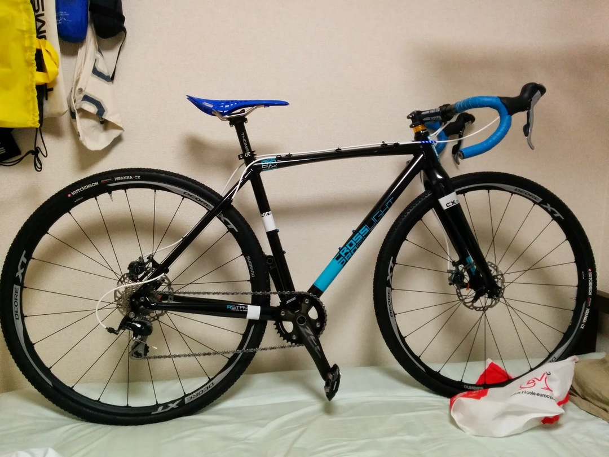
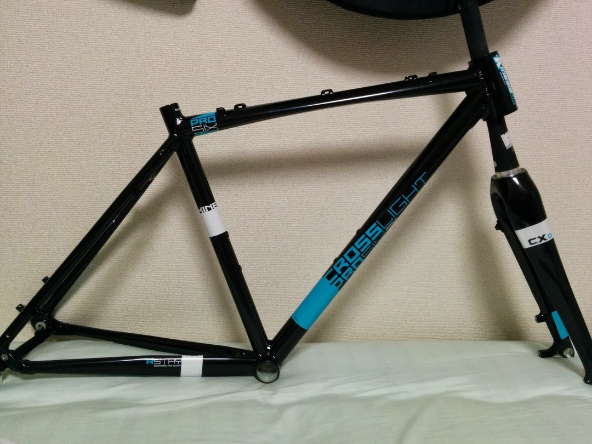
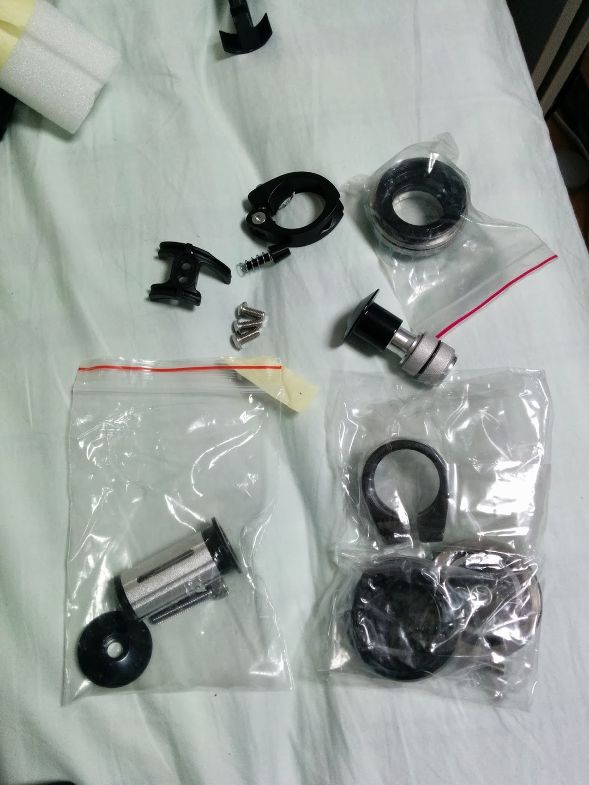
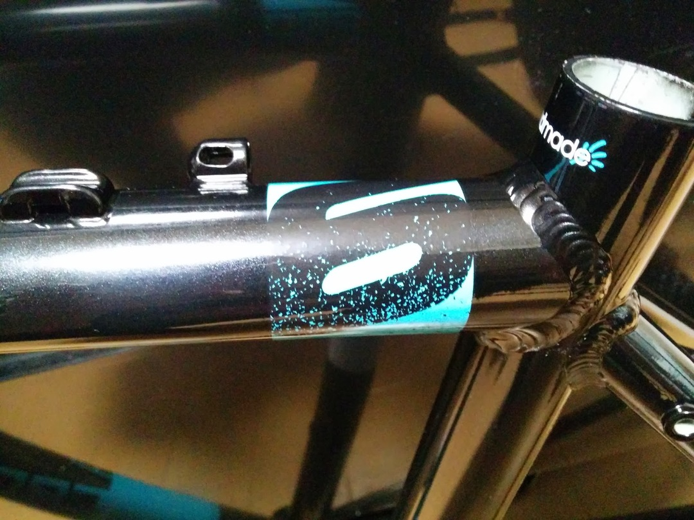
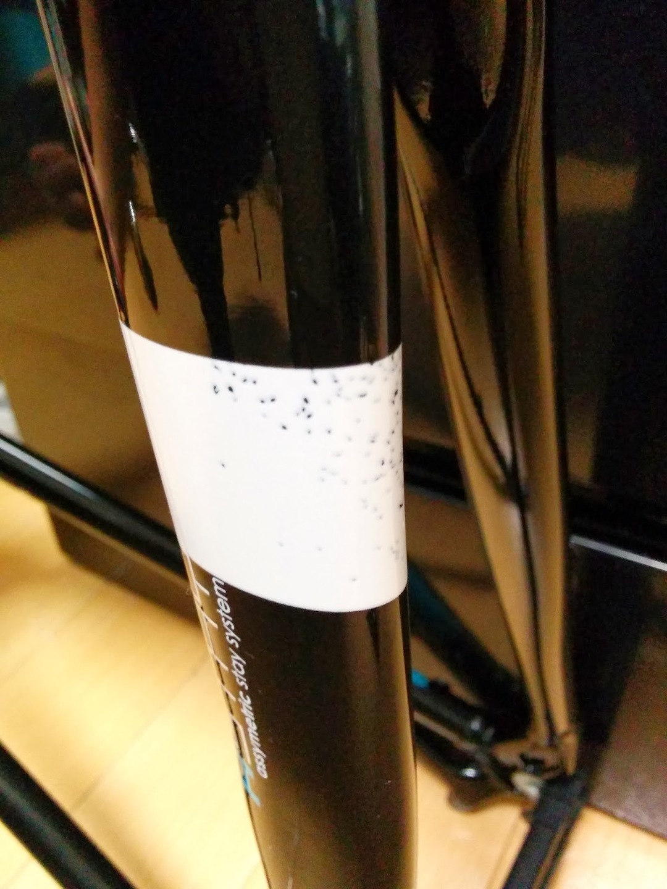
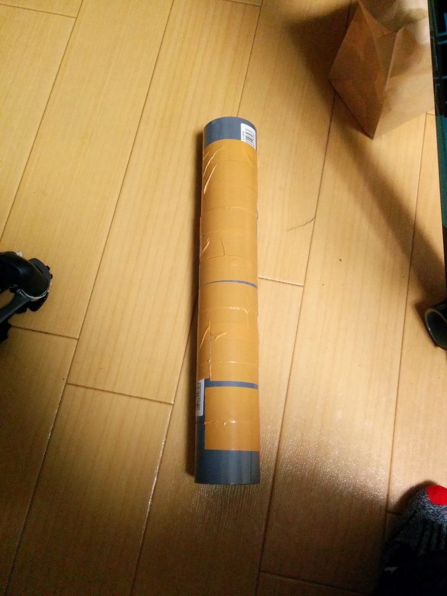
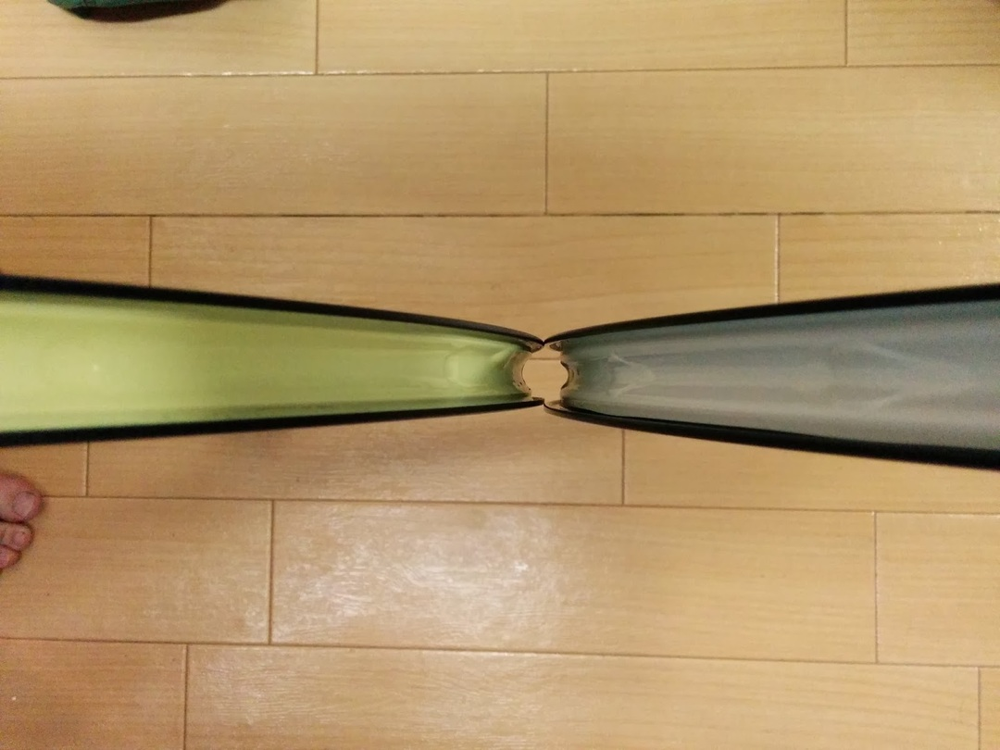

更新サボっている間に組みあがりました。

PBKでセールになっていたのを衝動でポチっと購入。

フレーム単体と付属品。ヘッドパーツ多すぎないか！？と思うも後で理由が発覚します。

### フレームの下準備

検品中に素敵な塗装クオリティを発見。B級品だったのかと思われますが、性能には問題ないはずですしどうせCXなので許容します。

トップチューブとチェーンステー。

ひどい。

ヘッドパーツは組まれていなかったので、まずクラウンレースをフォークに圧入します。

1.5テーパーヘッドなのでそれに合った工具を…1発のために買う訳ありません。

そこで用意したものがこちら。

ホムセンで買ってきたパイプジョイントをガムテープで巻いただけの工具？

1.5インチなので内径40mm ～ 45mmくらいあればよかったはず（正確な数値は忘れた）

パイプ厚があるほど使いやすいと思います。

この自作パイプとこれまたホムセンで買ってきたゴムハンマーで水平を出しながら叩き込みます。

すぐ斜めになるのでバランスを見ながら慎重に。圧入部にはグリスを塗っておきましょう。

夜にゴンゴン音を立てながら圧入完了。お次はホイールにとりかかります。

### ホイール・タイヤ準備

当初はなるべく安く済ませるために、29erのWH-MT66を使うつもりでした。シーラントでUST対応なのでチューブレス党員の俺でも安心です。

ハッチンソンのピラニア2CXを買ってきて取り付けます。

…安心ではありませんでした、ビードあがりません。というかスカスカ音を立てて空気が抜けていきますです。

最初はMTBとロードのリム幅違いではまらないのかと思いましたが、手持ちのJETFLYと比較してもそこまで変化ありません。

左がJETFLY ＋ Notubeテープ、右がMT66です。

リムウォール1枚分くらいの差がありますがこれが原因とは考えづらい…

よくよく空気抜けを観察すると、MT66のチューブレス構造に問題があるようです。

シマノのサイトを見るとわかるのですがニップル穴を塞ぐキャップの上からさらにシーリングをしており、ニップル穴のキャップ部分でどうしても段差ができてしまい、そこから空気が抜けてしまうようです。

上の写真でも段差ができていることがよくよく見るとわかるかと思います。

そしてXTホイールを速攻ポチ。

シーラントを入れて…あれ、入らない。

しかしMT66と違い、3気圧までは入っていますので全力でポンピングしますと「ﾊﾟﾝﾊﾟﾝ！」という勝利の音（チューブレスユーザーにはわかる）

しかしシーラントやら石鹸水がそれなりに飛び散ります。

ロード・MTB共にシーラントいらないチューブレスだと楽々ビード上がるんですがね…

JETFLYでのTL化でも泡吹きながらビードが上がったのでどうやらチューブレスレディはこんなもののようです。あまりスマートではないですね。今度はちゃんとしたチューブレスのIRC SERAC CXでも使おうかと思ってます。

### コンポ選び

MTBの経験で不整地行くのにフロント2枚いらないことは自明だったので、フロントシングルで行くつもりでした（軽量化にもなるし）

クランク選びが問題になるのですが、中古クランクアームに46Tチェーンリングを買うよりZEEクランクのほうが安いので即決でZEEをMTBのみならずCXにも使うことに。しかもシングル用なのでチェーンライン出やすいんです！歯が長めです！お得！

後のものはワイズ赤坂にて最安でかき集めました。無駄にGOREワイヤー使ってます。

ブレーキはスク水さんが余らせていたCX77をいただくことに。ありがたやありがたや。

サドルはAliExpressで偽スパイダーを。洗いやすそうですし。これについてはまた記事を上げます。シートポストはMTB乗り換えで余っていた27.2のトムソンエリートを。

適宜組み付けて完成！

明後日レースなのにまだシェイクダウンしていない…ぶっつけだ！
