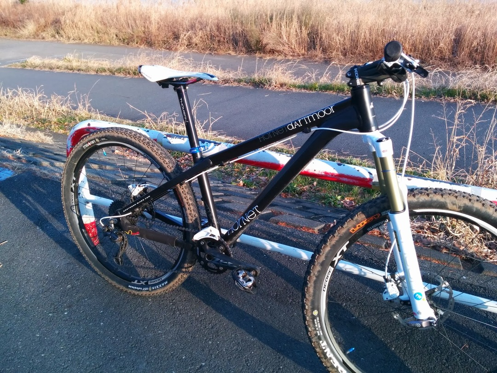

友人のやんぼーからMTBフレームを譲ってもらったため、念願のAMHTの150mmフォーク仕様になりました。

パーツ類はほぼBlastからの移植。

変更点はZEEクランクを利用してフロントシングルにしたのみです。

フォークはコスパに定評があるSRサンツアーのEPICONをチョイス。ほんとはフォークも一緒に譲ってもらったんですが、エア保持ができないほどガタがきていたので…

当然ですがXC寄りのBlastより重くなって11kg半ばというところ。

その代わりジオメトリも相まって下りの安定感は抜群です。

今年のCXは何レースかこいつで走りましたがそれなりに走ってくれます。平地と登りでは当然のようにシクロクロスバイクに置いて行かれますが…

2014年は王滝にも出場予定なのでもっとガンガン山を走って行きたいですね

コイルサスと違ってエアサスは効きを簡単に調節できるので自分好みにできて満足です。激下りだと今までフルボトムしてましたし…
