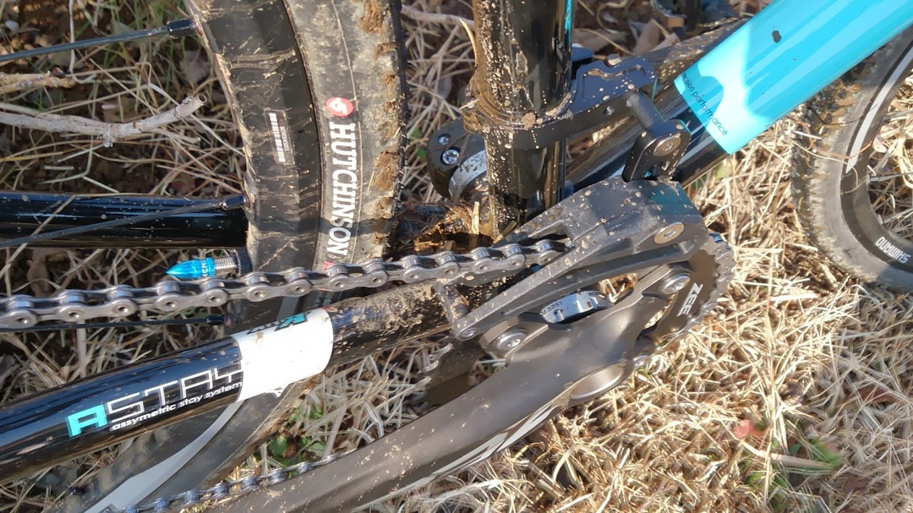

毎度おなじみ湘南シクロクロス第3戦。

昨年から数えて4回とも全て参加しております。

今までのMTBではなく、新たに組み上げたCXバイクで参加しました。

事前情報通り、3戦目は土手をほぼ使わずに完全にフラットなコース。

ただし、単純なストレートは少なく、コーナリング技術が試されるコースとなっていました。ストレートもシケインでスピードに乗らせないなどの工夫が有りましたね。

くねくねくねくね…登り下りがなくても楽しめるもんです。

いつもの知り合いと合流して試走。

CX特有の脚を回しながら曲がることを強く意識します。MTBだとタイヤグリップ任せでよかったのでついついサボってしまう

ゴール前の僅かな土手アップダウンがあるのですが、開成コース史上最も凶悪なコース取りになっており、2段目で飛びやすくなってました。

フラットだと侮っていると、エアかましてアスファルトをズザーだな…とか思ってました

C3の出走前、特に観戦スポットらしい場所もなかったのでC2の土手を見ていたら早速一人飛んでました、怖い怖い

2周目からトップを走っていたponchakさんを応援していたのですが、最終的に惜しくも3位。

そして自分のレース、午前C3スタート。

スタートが先着順なので、早めの準備でちゃっかり前を取り、渋滞を回避。

ですが地脚が足りずトップグループから徐々に離される…

MTBのベースがあるのでコーナーは同クラスでもそこそこ上手いと思うのですが、平地でなかなか踏めない。

そして途中周回、脊柱起立筋群に痛みが…サドルが高すぎた？

なんとか前を捉えようとコーナーを攻めていると、花壇付近・泥の乗ったアスファルトゾーンで落車して体におもいっきりダメージ。順位を2つ落とす…orz

今思うと脚を回しながら曲がっていなかった気がする、あれだけ意識していたのに完全に忘れていてダサい。

そして翌周回、下りでチェーンが外れる…シングル用チェーンデバイスはつけていたのですが、調整が足りなかったっぽい。ダサい。

結果13位。

MTBで15位近辺だったのにほぼ順位上がらず…

ストレートで踏める地脚やコーナリングの慣れなさを痛感。

もっと強くなりたい…
