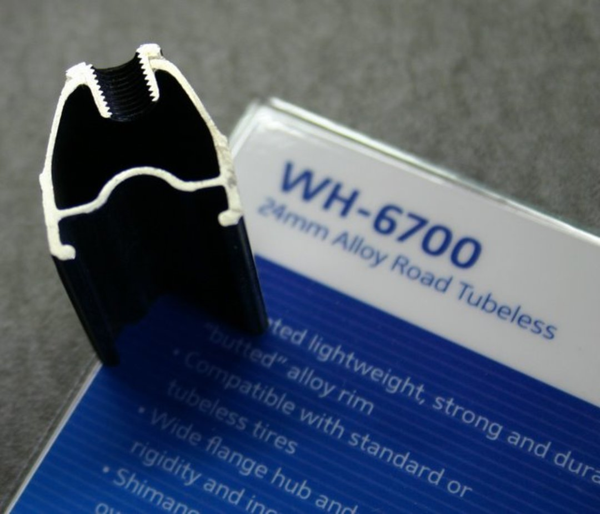
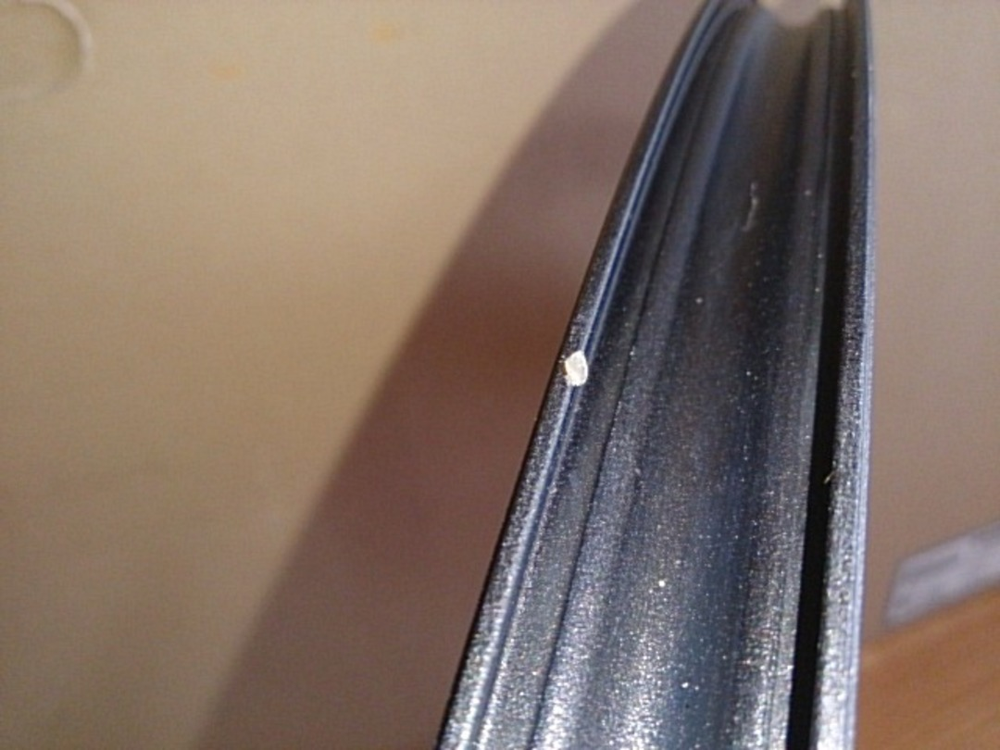

先日のレースでPiranha 2 CXをカットしてしまったのでIRCのSERAC CXチューブレスに交換しました（マッドじゃないほう）

まだ走ってはいませんが、装着の簡単さはチューブレスタイヤの評価の指針の1つになるかと思いますので一記事上げることにしました。

装着インプレといいながらまずピラニアCXの外すときの話からスタートです。

手で外れませんでした。いやほんとに。

非力どころか指の力にはそこそこ自信があるのにビードがホイールに引っかかったまま落ちません。カット現場でも結構苦労しましたがそれ以上に外れない…仕方ないのでハサミで切りました。

シクロクロスのコーナリングを考えるとこれくらい外れないほうがレース現場として安心なんですがここまで来るとさすがにやり過ぎ感が出ますw

外した後にリム形状をよくよく見ると、どうやらロード用チューブレスとややリム断面形状が違うみたいなのでその影響もありそうです。

こちらがWH-6700のカットサンプル、中央のくぼみ付近に注目です。

こちらがXTホイールの画像（<a href="http://blogs.yahoo.co.jp/guest_syu/10113189.html" target="_blank">拾い物</a>）

お分かりいただけただろうか…中央の凹み部周辺の出っ張りがMTBホイールだと高いのである…

このせいで外れにくかったっぽい？29erホイールに700c突っ込んでるのでまぁこんなこともあります。

＜装着比較＞

ようやくながら本題です。

結論から言ってしまうと、ビードの上がりやすさ・ハメやすさともにSERAC CXの圧倒的勝利です。

ピラニアの時はホイールに片側嵌めて一日待って形を慣らして翌日はめ込み、フロアポンプを渾身の力で高速ピストンしてビード上がりました。

セラクCXは普通に嵌って普通にビード上がりました。簡単すぎる…

それに加え、片側をはめ込んだ際にピラニアCXはロゴ位置を調整できない程きつく設計されていたのに対してセラクCXはロゴ位置調整をスルスルできるほど緩く驚きました。

タイヤ内径のきつさがビードの上がりやすさというわけではないということですね。

パッケージを解いた時もセラクは明らかに癖が弱くてすぐ嵌りそうな印象でした。ロードのチューブレスも簡単装着だしIRCの方が精度いいっぽいです。

（そもそもピラニアCXはチューブレスレディですが気にしないことにします）

チューブレスレディを謳っているものはこれでタイヤとホイール1つずつ使用してみたわけですが、共に装着にちょっと手間取るので、シーラント無しでも動作するチューブレス対応製品をちょっとだけシーラント入れて使うのが一番扱い易いですね。簡単なパンクならふさがりますし。

なんだかIRCのステマみたいになってしまいましたが、チューブレス使うなら是非おすすめします。

円高も終わったので競合品に比べて価格もお手頃になりましたし、試してみるのもいいかもしれませんよ？

<Amzn asin="B0BSF6FBYJ" />
