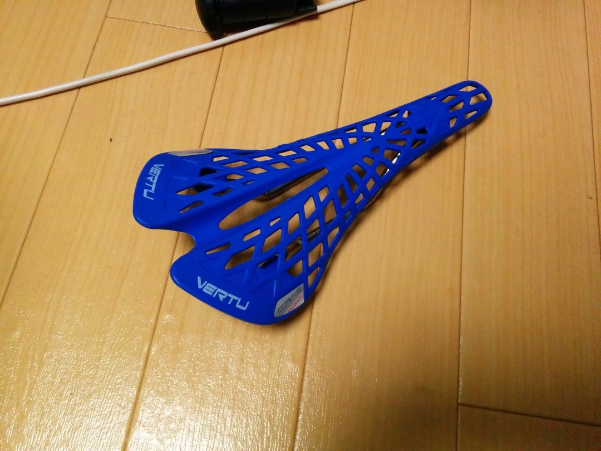

CX用にAliExpressで色合せで偽スパイダーを買いました。

1600円也

乗り心地はかなりイイ。ハンモックみたいな感じとはこれのことか。

ケツにも合ってるしGOOD

CX4レース後（3ヶ月後）

リアのレール固定部分からお亡くなりになられました。

CXで酷使しましたからね…

値段を考えれば買いだめして使ってもいいかもと思えるレベル

色も多いのでカラーコーディネートにも使える。ケツに合えばなかなかいいのでは…

代替に買ったVELOのサドルが合わなくて泣いてるのでオーダー入れるか…
