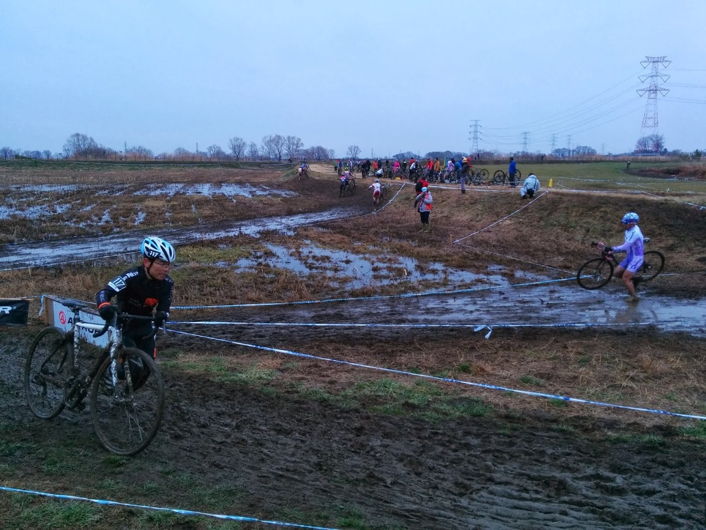
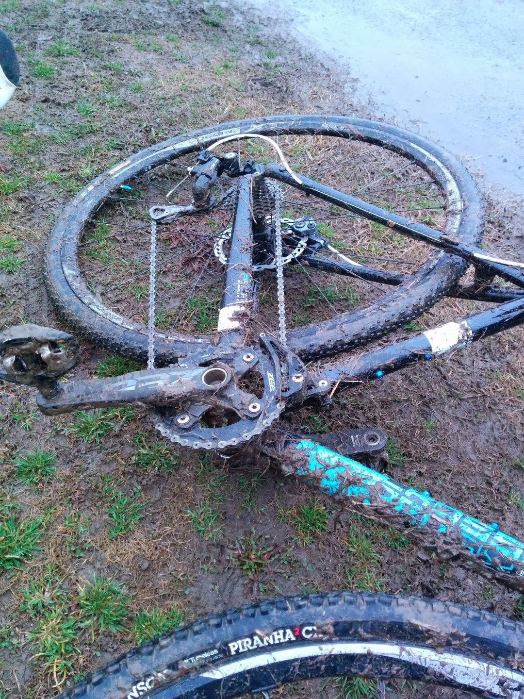
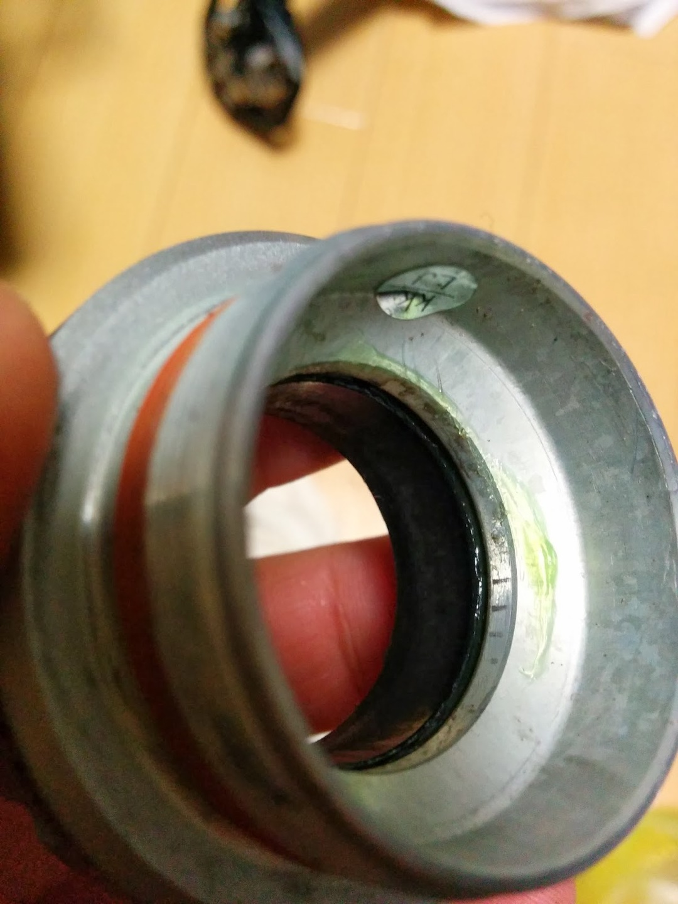
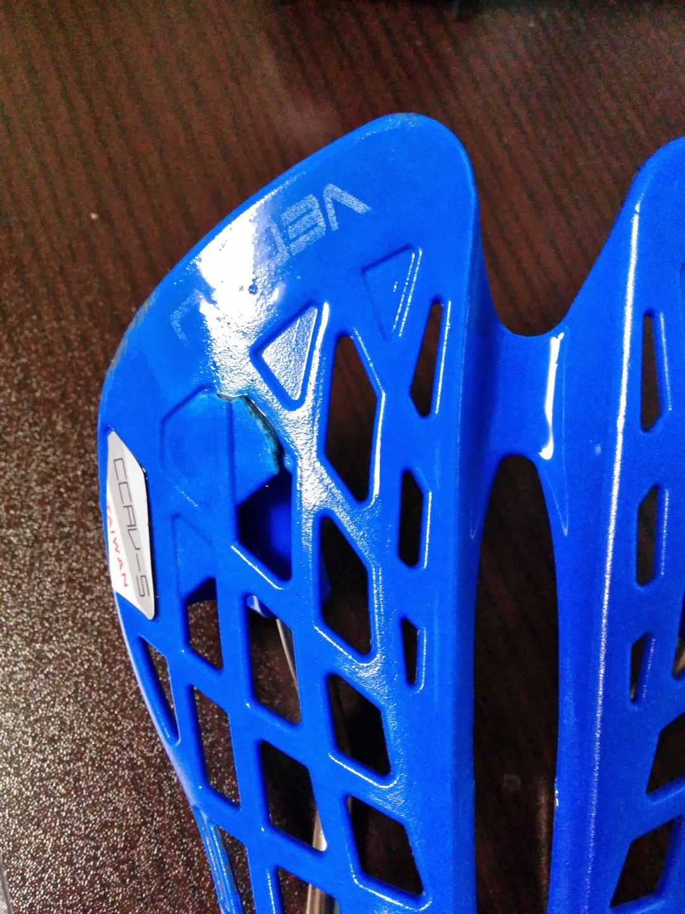

「MTB持ってくればよかった…」

これがコースを一目見た時の心の声である。

泥泥アンド沼。

時間に余裕がなかったのに試走はゆっくりとコースを覚えながら一周のみ。

↓ その結果がこちら ↓

ちなみにこれ、結構頑張って洗ったあとです。

今シーズンで2年目となるシクロクロスだが、ここまでの泥レースは初めて。

JE-1・エリートやJE-2のレースを見ながら担ぐ場所と走る場所を慎重に覚える。

JE-3Aのレースはなぜか午後にセッティングされているので、入念にイメージを練る。

泥コンディションに加えて非常に寒く、アップでローラーに乗っても全く体が温まらない。

出走前のレースで怪我人が出たらしく、スタート寸前までジャケットを着ていたらいきなり45秒前からカウントスタート。

慌ただしく上着を脱いで臨戦態勢へ、一列目スタートは貴重なので活かしていきたい。

スタートでは知り合いのやまちゃんの後ろで2番手をゲット！

しかしシケイン祭りを越えた後のキャンバーで上手く走れず減速。1周回目を終える頃には4番手。

2周目では体力も減ってきている他、全くうまく走れずコケまくる。

それもそのはず、午前中のイメージと違い、中途半端に沼が乾いて泥が粘土のようになっているのだ。ズルズル滑るし突っ切ることも無理なので担いで走るしか無い。

この辺りの切替がうまくいかなかった。今更だがもっと空気圧も低くて良かった。

最終的にコケてコケて8位まで落ち込んでフィニッシュ。

レースはパッとしなかったものの、洗車スキルが大幅に上がった。

レース現場ではまず泥だらけのシューズごと溝にどぼん。

同じく溝にたまった雨水で自転車を洗いに洗い、帰宅。

まだまだ泥が残っているので夜の帰宅にもかかわらずそのまま洗車スタート。クリーナーとバケツ湯を使ってブラシでおおまかに洗い、バルコニーに放置。

翌日。乾いた泥を落とし、残った泥はまたお湯で落としていく。95%ほど落としたら残りはユニットバスでシャワーを全開！

この時ほど水圧の高いシャワーを喜んだことはないw

ウェアに関しても当日にバケツで泥を落とし、シャワーを強く当てて中に残留している微粒子のような泥も落としていく。

泥をあらかた落とした後、シーズン最後なので軽くオーバーホール。

泥の中を走り、水に沈め、高圧シャワーをぶち当てたにも関わらず、シマノのマウンテン用BBとマウンテン用ホイールのにベアリング部に新品デュラグリスの色が残っている。

優秀すぎるぞシマノ。

中華サドル（偽スパイダー）は3レース＋わずかな練習を終えたところでご臨終となっていた、1600円だしこんなものだろう。オフシーズンはママチャリ化するのでそのまま使っていこうと思う。
