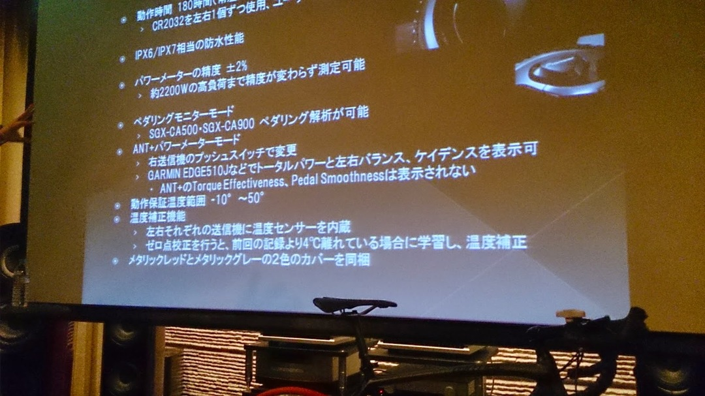
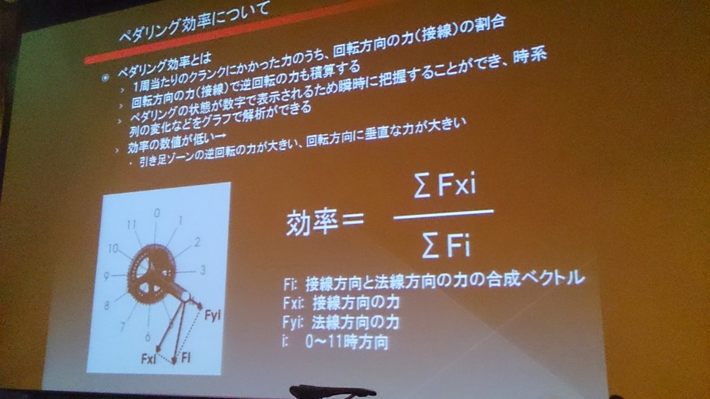
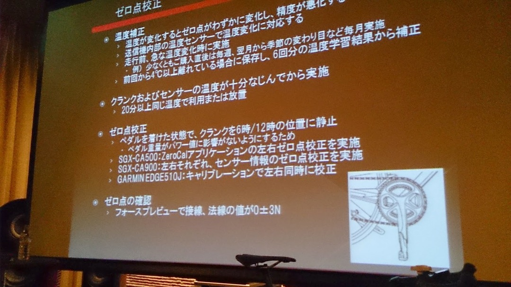
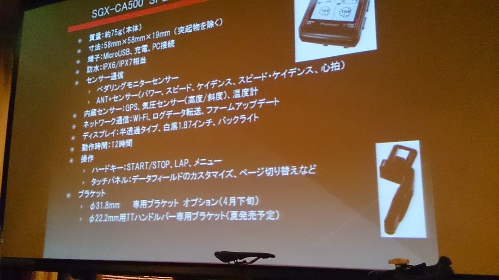
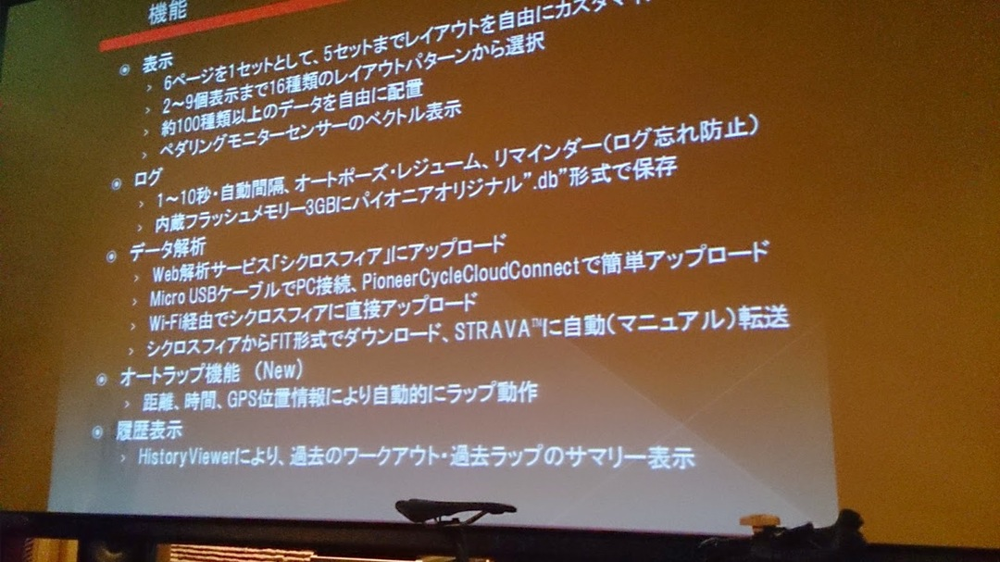
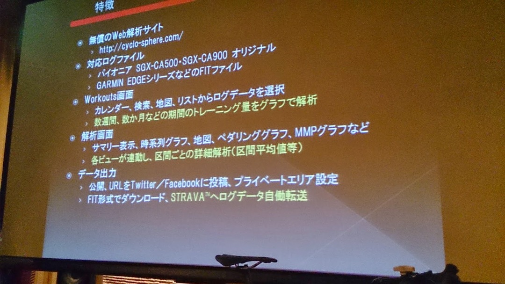
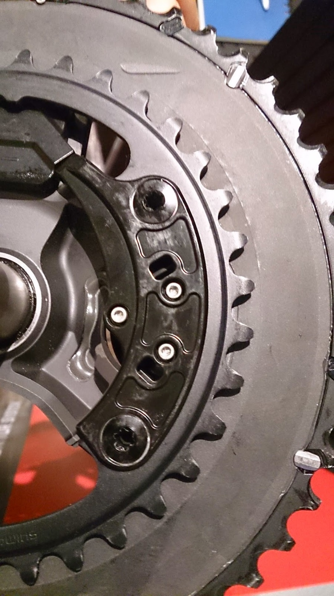

運良く当選したので蹴るのも悪いと思って参加してきました。

詳細は[こちら](http://pioneer-ginza.jp/event_report/2014/03/329.html)

珍しく長い記事です。

流れとしては

1. 商品説明

2. 講演

3. 体験＋歓談

ちゃんと情報を調べてるつもりでしたが商品説明でもいろいろ新鮮な情報が。

撮影禁止とは言われていないのでスライドをパシャパシャしてました。

### **製品説明**

前モデルより防水等級が上がったらしい、正式名称は SGY-PM910H。

製品自体はパワーメーターという呼称で、サイコンや WEB 解析サービスを併せて”ペダリングモニターシステム”となる模様。

ペダリング効率の算出式。

ここで気になったのはあくまでこのシステムで測る事のできる「効率」は機械的なもので入力したパワーのうち接線方向へどれほど力を入れているかという指標でしかないようです。

人体的な意味での効率ではないので単純にこの数値を上げようと頑張るとドツボにハマる可能性が高いですね。

念のため講演された方にも伺いましたが「すごく効率のいいペダリングだが身体的に効率が悪い」ということにならないようにねーとのこと。

プロ選手でもこの「ペダリング効率」が低い人はいるようです。ただ引き足の重さを 0 にしているのは効率のいい人と共通だとかなんとか。

校正について。運用の話なので買ってからでいいですね…

自動で温度補正してくれるようです。

)

サイコンについて。12 時間駆動ですね…Edge500 より短い。\
TT 用ブラケットは嬉しいですが純正以外のチェーンリングだと正確性が保証できないとのことなので、非真円系のチェーンリングを使ってる人は別の手段を考えたほうがいいかもしれません。

WiFi でログデータを転送できるのは便利でしょうね。それと GARMIN と違って MicroUSB なのでスマホをケーブル共用可能なのも遠征の充電時、地味に便利です。

防水性が高いのだからついでに Qi に対応してケーブルレスで運用できれば…と要望に書いておきました。

)

)

ログデータは独自形式ですが、解析サイト（シクロスフィア）にアップロードしたあとは FIT 形式で DL 可能なので GARMIN コネクトなどに登録可能です。そして何より…

シクロスフィアにアップロードした後、STRAVA に自動転送可能

家に戻らなくても WiFi でスマホからアップロードすればあれよあれよという間に STRAVA に登録できるわけです。

もしかして STRAVA マニアにとって垂涎の機能なのでは…

あとこのサイト、GARMIN でも利用可能みたいです。\
ログデータの解析に特化しているようなので他社パワーメーターのログでも遊べるかもしれません。そして自動転送。

### 講演

「ペダリングの現実と錯覚」と題して、プロの自転車コーチである須田晋太郎氏による講演会とシステム搭載自転車でのペダリング体験会を行います。

結構長いお話だったので要点だけ。\
一言でまとめると「感覚での調子の良さ」と「客観的なスピード」についてといったところ。

冒頭は、「速く走る為に何をすべきか？」という問いに対して、ペダリングというスキルを磨くことで今ある力を余すこと無く使えるようにする。といったものでした。\
然るべき後に体を鍛えると。

ペダリングを上手くすることでパフォーマンスを倍近く向上することもできるとかなんとか。\
自転車を前に進めるという行為の中に存在している要素のうち、速くする要因より遅くなる要因を潰していることで速く走るというもの。

遅くなる要素をひとまず下に列挙。

- 機材による抵抗 → 技術の進歩で高い機材と安い機材の差が無くなってきた上、割とみんな BORA とか普段使いしちゃうでしょ？ということで影響が少ない
- 空気抵抗 → フォームとか（結構大きいはずなのですが説明飛ばされた…）
- 身体的な抵抗 → 柔軟性など（影響が最初から少ない）
- 運動技術による抵抗 → ペダリング

一般的には調子がいい時「ギアがよく掛かる」「踏めている」という表現をする人が多いが、ペダルから反力を受けているということは無駄な力をかけている可能性が高い。

誤解を恐れず言えばペダルを強く踏むことで自転車の推進力が単純に向上するわけではない（下死点で下向きにおもいっきり踏んでも進まない。そして踏んでる「感覚」はしっかりある）

プロが上記みたいなこと言ってるけど動きを分析してると全く逆のことをしていることも多いのであんまり信じるな！ともおっしゃってましたｗ

ペダリングをちょっと考えたことのあるレース派の人には何を今更～みたいな内容もありました ~~が聴衆がパワーメーター未経験だったりレース参加してなかったりと「なぜ来た」というｹﾞﾌﾝｹﾞﾌﾝ~~ \
話自体は興味深いものでした。

### 体験・立ち話

機能としてはサイクルモードで試乗した時から変わっていなかったので割愛。

多分シマノペダルが付いてるだろうと当たりをつけてシューズを持って行ったら大当たり、ビンディングで試せました。ただサドル高は出せなかった…\
ちょっと頑張って回していると 250~300W/60~70%あたりを行ったり来たり。

実物の裏側。プレートを使ったボルト留めになってます。

取り付けが実物合わせなのは全く変わっていない様子。他人の話を横聞きすると BB386 のフレームは厳しい事が多いとか。それと BB 下ダイレクトマウントブレーキのフレームには使えないようです、MADONE 全滅。（間違ってたらすいません）

~~ちなみにベルキンが使ってるけどオルトレ XR の市販フレームには付かないかもしれないらしい！！！！！！！！~~

データの使い方について講演していた方と立ち話をしたところ、ペダリング効率はやはり走行中に見るものではなく（トレーニング強度の指標としてパワーだけ見ることはあるとして）ライドから戻った後、心拍や勾配、シチュエーションなどをログから考察して自分に足りない技術を把握するのに使うことが最も良いだろうとのこと。

解析の無いパワーメーターは高いおもちゃです！ｗｗｗ

前述した通り、ペダリング効率は絶対的な数値指標ではないですが、有意差が出るものではあるので走りを分析できる新しい要素として考えるのがいいだろうということです。

また、クランク型とハブ型の W 数は違って出るという話も聞けました。あと、チェーンを掃除すればパワータップの数値はでかく出る、つまり走りの効率が上がるらしいですよ！！！！！！！\n クランクの歪計測についても上下だけでなく左右も拾ってしまうのでは？と聞いたら「ソフト側で処理して補正している、らしい。」「一番金をかけてる部分らしく、詳細を教えてもらえないので噂レベル」とのことです。\
（前述のクランクとハブの差も補正してるかもしれないとか）

結論としては、シマノ 4 アームクランクユーザーにとっては現状最も安い（多分）パワーメーターですのでもし自分が導入する際は第一候補になるでしょう。心拍ベースの解析すらやめた自分にはそもそも「高いおもちゃ」以外の何者でもなさそうですが…

非真円ユーザーや一部フレームユーザーにはやさしくないものの、普通の ANT ＋サイコンでパワーや左右差は受信できるそうなので Edge ユーザーにも優しい本体です。
ブラケットの裏に Di2 ジャンクションが付けばもっと良かったｗ

逆にクランク型なので二台以上で使いまわすには向いていないようです。\
マグネットや BB ユニットなどは単体販売するとのことですが取り付けはなるべく販売店で正しく行ってほしいとのこと。

珍しくシマノ以外の国内パーツで注目を浴びているのでもっと頑張って欲しいですね！

<LinkBox isAmazonLink url="https://www.amazon.co.jp/dp/490531500X/" />

<LinkBox isAmazonLink url="https://www.amazon.co.jp/dp/4583103778/" />
