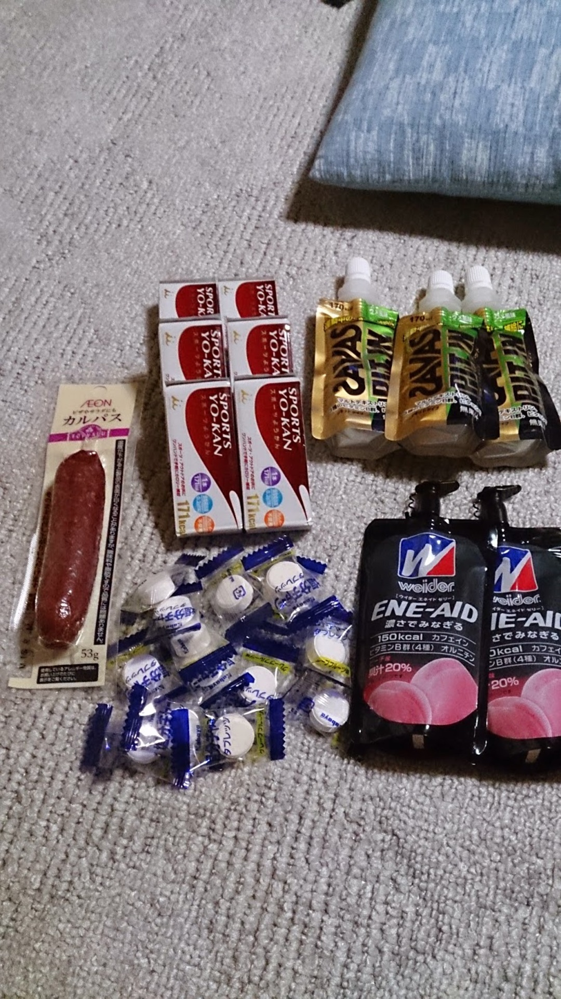

MTB を組んだけど本格的に乗らないのはもったいない！とのことで王滝にエントリーしていた。

ゆずってもらったサスは完全にガタがきていたので<a href="/2014/01/24/mtb-dartmoor-horne.html" target="_blank">EPICON に交換済み</a>

金曜未明に川崎を出発。

まったり下道で昼ごろ松原スポーツ公園に到着。

ハンガーノックが心配だったのでひたすら前々日から飯を食い続ける戦略。

カーボローディング大事！以下今回の栄養チャージ。

## 補給

### 金曜の夕飯（素材）

- パスタ 180g
- 卵 3 つ
- オリーブオイル少々
- ご飯 1 杯
- 豚肉 100g

推定 1700kcal

### 土曜朝食

- シリアル＋ヨーグルト

推定 500kcal

### 土曜昼食

- コンビニパンとか 100kcal くらい

### 土曜夕食

- 前日パーティーの揚げ物とか
- 宿の夕ごはん（ご飯は 2 杯＋カレーご飯 1 杯）

推定 1500kcal

### 当日朝食

- 宿の朝食

推定 600kcal

### レース寸前

- おにぎり\*1
- SUPERVAAM 一袋
- コーラ

400kcal くらい

### 補給食

- スポーツ羊羹\*6=1060kcal
- ウィダーエネイドゼリー\*2=300kcal
- ザバスピットインゼリー\*3 ＝ 510kcal

合計 1870kcal

水分はハイドレーションで真水なので塩タブレットを装備。カルパスは精神的な辛さ軽減を狙ったもので、栄養価は無視。

不味い補給食は食べない！という精神のもと日本メーカーの補給食に統一。

補給戦略はバッチリだが、機材は DJ 系 HT に ZEE のフロントシングルというナメっぷり。

初めてなのでおとなしく出走も後ろのほう。スタート後、軽い上りでスイスイポジションを上げていく。

最初に 10km 近く登るわけだが、終わるまでに大集団から離れて DH をしたかったのでペース早めで踏んでいく。

想定通り周りに数人しかいない上体で最初のダウンヒル区間へ突入。

機材的にも下りは得意…のはずだが思ったようにペースが上がらず抜かされることも…コーナーでかなり減速しないと滑って倒せない。

空気圧が高過ぎることに気がつく。チューブレスなのでパンクリスクはそこまで高く無いと判断し、1.5 気圧くらいまで落とす。

先ほどまでとうって変わって振動が減り、コーナーも倒せる。

下りは必ずと言っていいほどパンクしている人が何人もいたが、結局自分はノーパンクだった、すごいぞチューブレス。20km を過ぎたあたりで異変に気づく。

「脚がない…」

下りで腰を上げてバランスを取ると太腿に意外と負荷がかかる。

ガレガレの下りである王滝路面と相まって体へのダメージが大きい。しかもフレームはかったい HT。

リラックスして下っていても振動はごまかせない。

第 1CP は水分補給だけしてさっさと出る。

第 2CP までの間はよく覚えていない。すごく辛かった…

下りで痺れた痛みが脚にきており登りのスピードが上がらない、そもそもフロントシングルなのでギア比にも限界がある（でもスク水さんの SS よりギアは軽かったらしい）

第 2CP で倒れこみながらカルパスをぱくぱくして回復に努める。

30 分毎に補給食をこまめに摂り続けているおかげでエネルギー不足という感じはないが、

とにかく脚が辛い。

重い体を起こして出発。

出発した直後は痛みも引いており、いいペースで登れる。

しかし下りきった瞬間痛み再発。ペース落ちる。

第 2CP 後のガレ場は本当につらくて押してもあんまりスピード変わらないので押していく。

本当に「王滝とバイカーズ終わったら MTB やめてもいいなぁ」とか考えてたｗ

第 3CP、パワーバーをもらう。いらないので背中に入れて終わったあとに試食するかと考える。

水をもらって再出発。ここからは 42km コースなどと合流するため、難易度がガクっと落ちる。こういう道がずっと続いて 100km ならよかったのにｗ

辛い辛いと思いながら最後の下りになった瞬間元気になるのは人の性。

長くブレーキをかけると機材にも握力にもよくないので、要所要所でしかブレーキを使わないのがロードでも MTB でも信条である。

これを守るだけでなぜか結構下りで人を抜ける。

第 3CP 後に抜かれた人の半分くらいを下りでパスしながら 7h17m でゴール！

序盤ペースを上げなかったらもう少し早かったかもしれない。

第 2CP で休みすぎたかもしれない。7h 切りで 120km への挑戦権がもらえることは知っていたのでちょっと残念。

写真の内容の補給を 30 分毎に一つ食べる補給は大成功。

羊羹は多すぎたかもしれないのでジェル増やしてもいい。

体重がそこまで減らなかったのでカーボローディングはやり過ぎた感じもある。

しびれの軽減にはカーボンハンドルとかを導入してもいいかもしれない。

終わったばかりの頭でそんなことを考え続ける。

そして IYH へ？

ちなみにパワーバーをレース中 2 本もらえたが、ゴール後一口食べて捨てた。

ごめんなさいパワースポーツさん、でも不味いんです。

ウィダーとザバスのジェルは美味しく食べれたのでオススメです。

不味い補給食は補給の遅れにつながるので美味しいことは重要です。

<Amzn asin="B00LO88HPC" />
