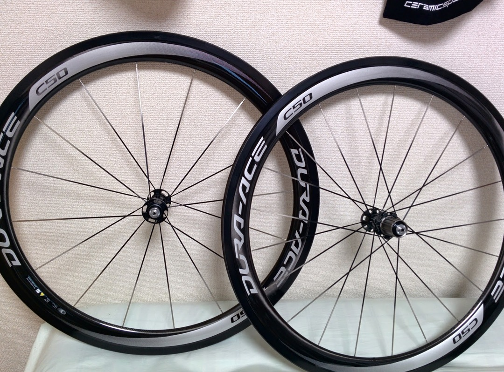

### IYH

ご存知の通り、5/1 出荷分からシマノホイールが値上げされました。

値上げ幅が結構エグい感じで大きい物で 25％UP とか…

某激安通販では 10 万円以下のホイールが全滅とかいう噂も。

手持ちの JETFLY は 11s 対応ですし前後で 1450g 程度ですしわざわざ C24 とか買う必要もなかったんですが…

残業疲れの頭で

「ゆくゆくはディープ欲しいし…とりあえずポチって在庫無かったら諦めってことにしよう」

などという意味のわからない思考のもと C50TU をポチ。

結果

こんにちは、全然売り切れてませんでしたね～

タイヤ買ってないのでこちらも幅広リムに合うよう 25c の PRO4 をぽちっと。

Continental 信者なので普段は Sprinter をチョイスするのですが、22c しかなかったので…

ラテックスに不安を覚えつつも評判は良さ気なので使ってみます。

### PRO4 取り付け

折りたたんでいないパッケージなので、配送の箱がやたらでかい。

開けてみると、パッケージ時点でフンドシ部分が中心になっておらずセンター出しに苦労しそうな雰囲気がプンプン…

案の定、テープ無しで嵌めてみると片側に寄っておりスキンカラーが片側からしか見えない状態。

空気圧を上げてセンターを直しても空気を抜くと癖が付いているせいか元に戻ってしまう。Sprinter は嵌めただけでセンターほぼ出てたのにな…

センター出した状態で一日置いて癖をマシな状態に戻してからテープ貼り開始。

ビニールを剥がす際に空気圧落とすとどうしても少しセンターがズレてしまうのでビニール剥がしたあと空気圧上げ、タイヤだけにテープを密着させて無理やりセンターを出す。

バイクに取り付けてみると、幅が広い分ブレーキの引きしろがほぼ無くなる状態に。

レバーの遊びは大きく取るのが好みなのにここまでカツカツになるということは、人によってはワイヤー緩めないとそもそもホイールが入らない可能性もありますね…

結局ブレーキ調整するので同じことかもしれませんが。

重量は以下の通り。

9000C50+PRO4 25c：F990g,R1160g

JETFLY+RBCC23c：F950g,R1100g

全体重量としては 100g 位前後で重くなりました。

ただ、RBCC tubeless の 23c→25c で片側 40g 重くなることを考えるとタイヤの重さが差のほとんどを占めており、ホイール自体の重量はほぼ変わらない計算。

となると重いデュラハブを持つ C50 のほうが外周の重さは軽い可能性が？と思ったりしますがその分スポークが少ないので実際バラしてみないことにはわかりませんね。

### 試走

中原街道アップダウン＋ヤビツ 1 回

踏み出しの感覚をそこまで変わらず。可もなく不可もなくといった重量なので想定通り。

25c の PRO4 は流石の乗り心地で全く文句なし。チューブレスから乗り換えても快適感ほぼ変わりません。

ホイールとしては、ディープらしく下りやヒルクライム中の平坦ぽい区間で乗せたスピードを維持するのがとても楽。平坦も 35km/h 維持が楽々だったので効果はあるのかなと。

また、想像以上に横剛性があるので、エアロ効果と合わせて下りが楽しいホイールということが発覚。

ブレーキ面も滑らかで、レバーを握った時のフィードバックで高精度であることを伺わせてくれます。（中華はブレーキの効きとフィーリングがスイストップ黄色でもなかなか酷かった）

JETFLY がリム継ぎ目でコツコツ来る残念リムだったのでレバーを引いた分だけぬるっと効いてくれるのはとてもいい感じ。

特別軽い訳ではないので登り用！って人には全くオススメできませんがロングのお供とか高速レースには良さ気です。

登坂で勝負の決まるレースはそもそも自分の勝てない奴なので高速レースに特化する目論見にはぴったりでした。

欠点は輪行したくないってことかな。

ENVE1.45 を某所で組めば登れてスプリントできるホイールがほぼ同額で作れたかもしれないことは言わないお約束だ！

<Amzn asin="B007Q62ALI" />
