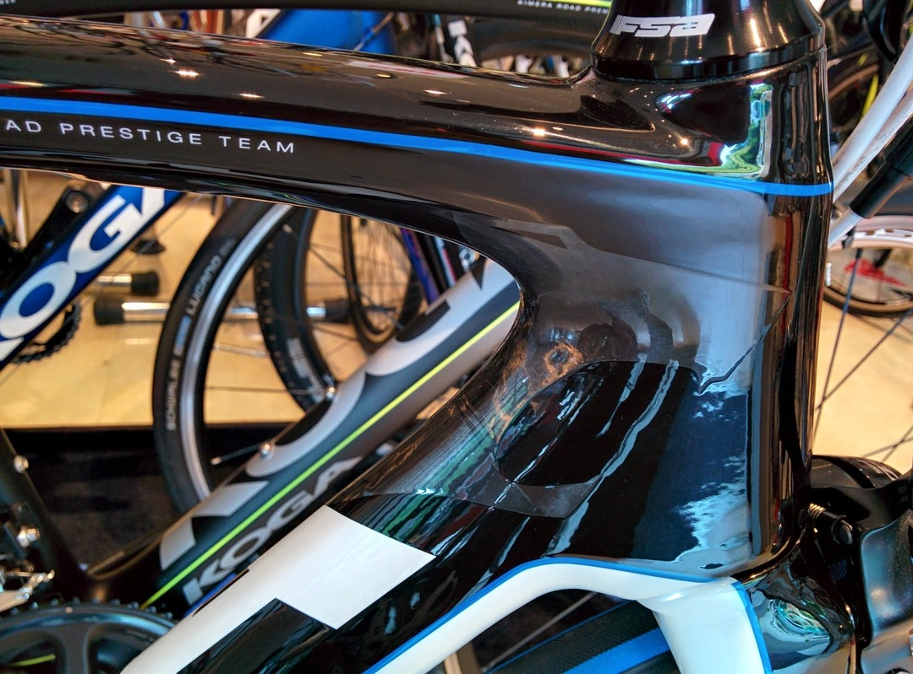
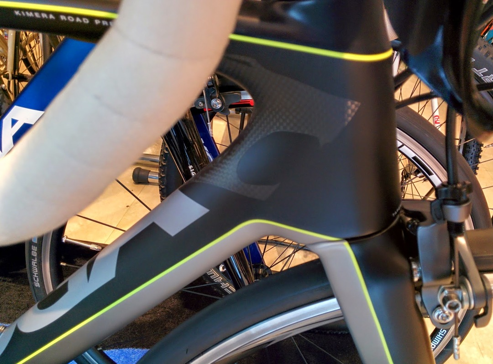

レース用のフレーム選びは意外と難しい。

平坦特化の自分としては、落車を考えるとラグジュアリーな値段のフレームは手が出しづらい、出せてせいぜい20万ちょっと。頑張って20万後半。

ただし、低価格になってくると最も重要な剛性が落ちてくる。自称スプリンターでこれはいただけない。

更に電デュラ使用者としての制約。

今は手持ちのフレームに無理やり付けているが、内装のほうが電動ならストレスフリー（絡まってテープが剥がれたりしない）

バッテリーの位置は好みだと思う。自分の慎重だと前三角にバッテリーマウントされるとボトル配置がつらそうなので敬遠の対象になる、バイバイFOIL。

充電はこまめにしたいので内蔵バッテリーは性格的にやめておいたほうがいい気がする。

ついでにシマノ純正BBしか使えない宗教なので（メンテ嫌い）、圧入全盛期の中BB86しか選択肢に入らない。

上記を考慮すると、そんなに選択肢は無くて

・GIANT TCR Advanced(SL) or TCR SLR

・ARGON18 Gallium

・FUJI SST

・CANYON Ultimate CF SLX

・Lapierre Xelius EFI

上記くらいしか残っていない。

2014のキメラはバッテリー内蔵が前提であるうえ、ブレーキもダイレクトマウントで新規購入が必要なので、「縁がないかなぁ」なんて考えていた。

試乗でTCR AdvancedSLを越える乗り味のフレームに同価格帯では今まで出会わなかったこともある。

<a href="http://www.uci.ch/includes/asp/getTarget.asp?type=FILE&id=NjczMDE" target="_blank" rel="noopener">CANYONからAeroadがモデルチェンジしてAeroad CF SLXになるというんでそっちがかなり気になっていた。FUJIからもTRANSONICという新型も出るらしいし。</a>

エアロロードで剛性高くてDi2内装で安いならいいよな～思ってました。

この2メーカーはチェーンステー裏かBB裏にバッテリーマウントするし。

そんな中で「異次元だからマジオススメ」と唆されて

<a href="http://www.nicole-eurocycle.co.jp/" target="_blank" rel="noopener">アルパカサイクル</a>  の試乗会に誘われてやってきた。

ひとまず見た目。

剛性バカのKOGAらしくマッチョなチューブ。

そしてカタログ写真ではわからないヘッド付近のキメラマーク。

デザインはかなりGOOD

Premiumから乗ってみる。

コンポは68アルテにRS31。空気圧はちょっと低めで6.5気圧くらいかな、タイヤはシュワルベのRUGANOだった。

乗ったらすぐわかる。乗り心地がとてもいい。

空気圧のせいかと思ってちょっと高めの段差を乗り越えてみるけどリアの衝撃が明らかに少ない。

ブレーキをBB下にすることでシートステーに仕事をさせているんだろうけど、予想以上の振動吸収性。

かといってふにゃふにゃではない。

友人の前モデルに乗らせてもらった時のような大きな乗り物に乗っている感覚はないものの、安定感はかなり高い。

パーッとスプリントしてみると、脚に跳ね返ってくる感覚がほとんど無いにもかかわらず、加速は一線級。基準にしていたTCR系並に走る。

ダイレクトマウントの出来はかなりよくて、2本ボルトだからかガッシリとしたアーム剛性がある効き方。

めっちゃ加速するのに乗り心地は良くて脚にも来ない。完璧なのか？と思わせる。

お次はPrestige。

懐かしの57系コンポに（ブレーキは5810）ホイールは7900C35CL。

フロントの振動吸収性がPremiumより良い感じ。他はほとんど性格が同じ。

加速が本当に少し鈍かったり少し脚に来たりするのは重量とか5本クランクのせいか？

スプリンター的にも加速感問題なし。

街中なので高速ダウンヒルは試せないが、KOGAだし剛性大丈夫でしょう。

デメリットはやはり規格面にある感じ。シマノとのイイ関係のせいか最新規格目白押しである。

某所で内蔵バッテリーとダイレクトマウントブレーキ（9010)前後を買ったら4万弱…

手元に残るパーツとはいえ結構かかる。

フレームの性能としては、次世代に進んだと思わせるレベルのフレーム。

誰にでも合うのでは？と思わせてくれる。

メンテ性やシマノでしか使えない規格の相性はトレードオフかな。

買ってしまいたい感じがあるフレームだった。
