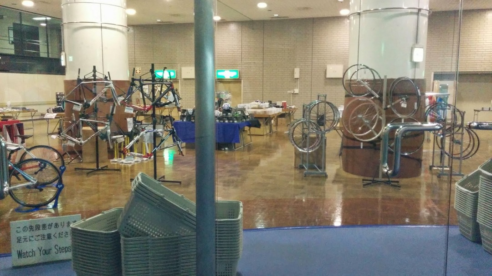
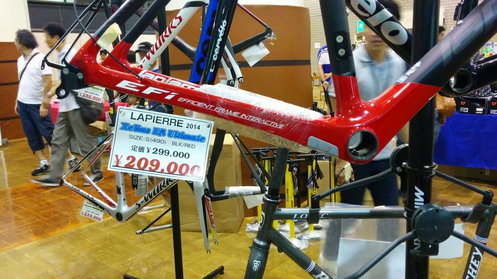
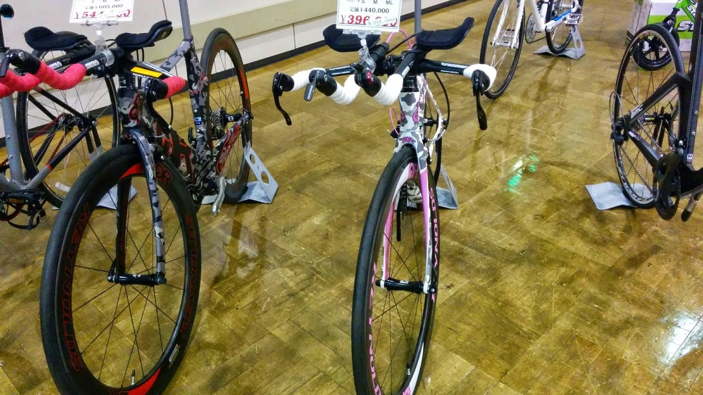
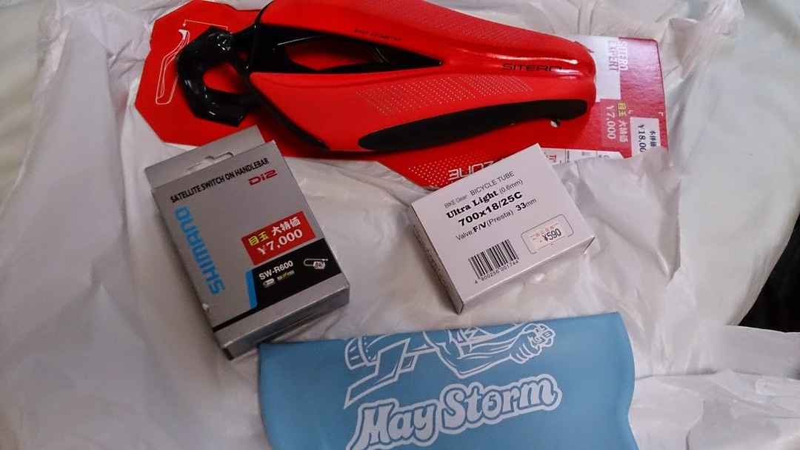

タキザワのガレージセールに行ってきました。

お目当ては大物のロードフレーム。

バッカスは良いフレームですけどいかんせんDi2対応フレームでないので

バッテリーやらケーブルの取り回しがイマイチです。

それにそろそろカーボンロードに乗ってみたいというのもあって

30万ほど軍資金を用意して参戦。

条件は20万前後、剛性高めでシマノBB使えて（妥協してPF30）Di2内装。

バッテリーはできれば外付け。

タキザワ扱いだとLappiere Xelius EFI、デダチャイのSUPERSCURO RCに着目。

（出ないだろうけどBMC SLR01を狙って）

10時スタートなので9時位に着くよう出発、ダッシュに遅れて先に買われるという事態は避けたい…

並びに来たら中が見えた。

Lappiereのフレームが2つ、ゼリウスとディスク/カンチ兼用CXであることはわかった。

この時点でフレームが少ないのと、明らかに自分サイズのフレームがないので完全に嫌な予感しかしない。

開場後、即フレームを見に行くも完全なる敗北。自分のサイズはほぼなかった。

頭を切り替えてセール品をとりあえず漁る。

XSがこの値段なら即購入だった…

用具に関しても結構安いが、基本的に消耗品ばかり。

シューズは充実の品揃えでした。

あとはEA90SLXが4万だったり、SHIV PROのRIVAL完成車が16万だったりとお値打ち品はそれなりにあった様子。

本気で大物を買い付けるなら前橋のガレージセールか、新年初売りじゃないとダメかも。

見る機会の少ないQUINTANA ROOとかもあった。

これはカラーで売れ残ったんだろうな…

そんな中、以下の写真の通りの戦果。

TTサドルお試しにSIETRO（文の帽子もイメージして）

Di2サテライトスイッチ（ほしいと思っていたし）

チューブ（夏休みのツーリング用に）

＋おまけのスイムキャップ

TTのグレードアップもあると思えばなかなかの戦果？

バーテープも赤を買っておけば良かったとちょっと後悔。

フレーム買う気満々だったので、実弾とテンションの行き場を失っている中、

アートスポーツもガレージセールをやっているとの情報、即参戦！

…するも、特にロードフレームでめぼしいものはなかった。

都内のワイズも回ったものの空振り。残念。

LOOK675も要件を満たしていることが分かったのが収穫か？　ロードフレーム探しの旅は続く…
