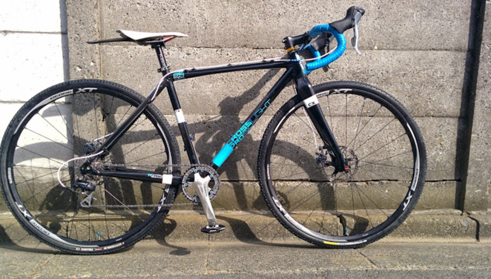
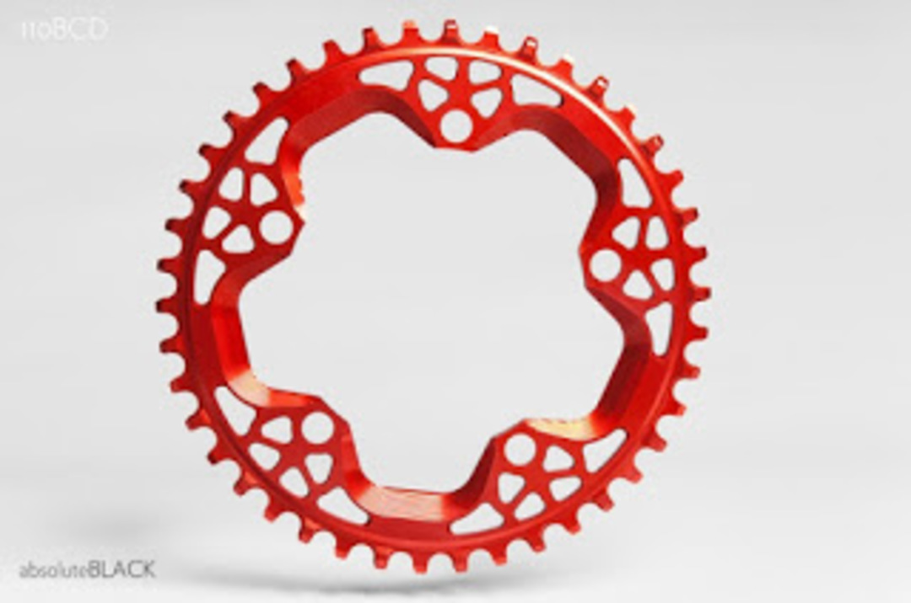
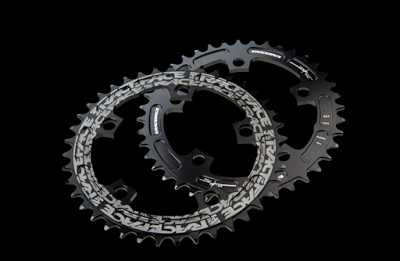
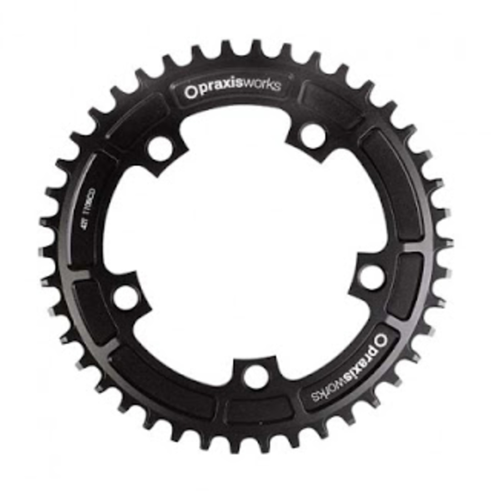
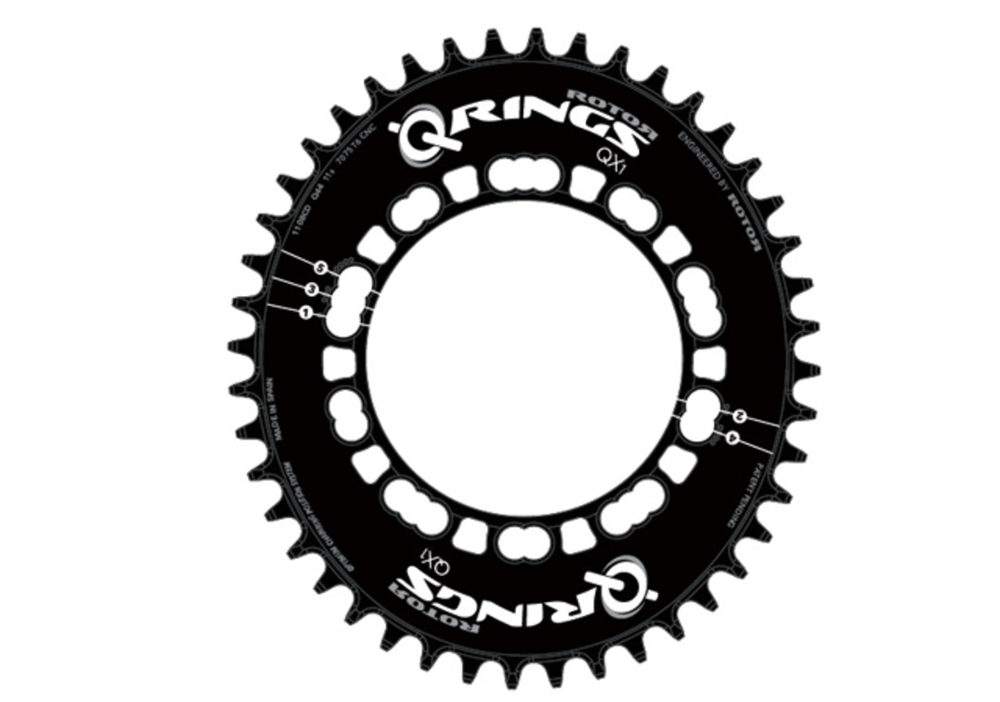
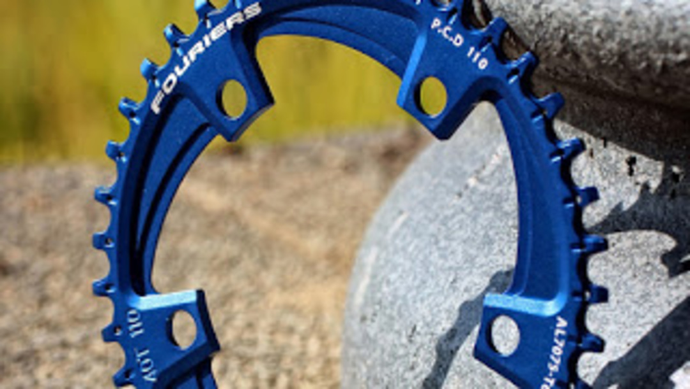
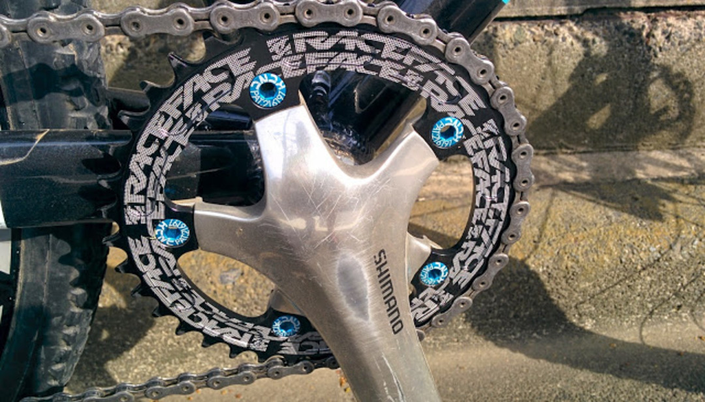

ジャパンカップシクロクロス前にフロントをシングル化した。元々の目的は、ZEE クランクの採用で Q ファクターが広がりすぎたのでロードクランクで是正するため。  
ついでにチェーンガイドをフロントに付けていても、チェーンは落ちるときは落ちるし落ちた時の復帰が非常に遅くなるので、チェーンガイドいらずと噂のナローワイドチェーンリングを導入することにしてみた。

最終的には RACEFACE のものを選んだわけだが、当初の選択肢は以下の通り。

### 比較

#### Wolftooth

<LinkBox isAmazonLink url="https://www.amazon.co.jp/dp/B00MYJ3MPU/" />

言わずと知れた老舗。

シクロクロス界でナローワイドといえばこいつ。（時点で SRAM CX1）内外価格差がほとんどなく概ね 12k 円程度。  
迷った中で唯一 110PCD で 36T をラインナップしている。

現在では SHIMANO4 アーム対応版、かつチェーンライン補正付きとアップデートされている。

#### Abusolute Black

「CX 　ナローワイドチェーンリング」でググったら出てきた。  
これでもかという切削痕、エロい。赤と黒のラインナップ有り。同じく 12k くらい。某店で扱ってたけど在庫がわからないのでパス。

公式サイトでも売ってるけどね…

#### RACEFACE

MTB 用だけかとおもいきや CX 用も出してました。  
国内価格 7k くらいだよ！というタレコミだけで購入決定するも、代理店に在庫なし入荷未定。

しかたなく海外通販。当時は 7k くらいだったけど、2020/1 現在廃盤？[Amazon はまだ在庫あり](https://amzn.to/362kOwE)

カラーは黒のみ。

#### Praxis Cyclocross Narrow / Wide Chainring

PCD110,130 共に 40/42T。

<a href="http://www.trisports.jp/?q=catalog/node/7605" target="_blank">
  トライスポーツ取り扱い
</a>
なので在庫さえあれば入手性は良いはず。

#### ROTOR QCX1

※2016/1 追記

楕円 × ナローワイドシングルチェーンリング！　　
PCD110 のみ、38T~44T まで幅広くラインナップ。公式では対応クランクが指定されているので注意。

#### FOURIERS NARROW-WIDE SINGLE FRONT CHAINRING

※2016/1 追加

PCD110/130,38T~42T をラインナップ。  
歯の根本にある泥抜き穴が最大の特徴。効果があるかは未知数だけども…

### 使用感

入手性と値段で RACEFACE のものを購入。チェーンボルトは KCNC の 6.5mm がちょうどいい感じでした。

CNC のチェーンリングボルトが軟すぎて取り付け時に１つナメて怒り心頭に達するも 1 つくらい緩くてもなんとかなるでしょとの発想で無視。クランクはカラー的に ROTOR 3D とか使いたいところですがコストの問題で中古の R600 を拾いました。

取り付けの注意点は特になし。アウター部分に取り付けできっと合ってるはず。FD もチェーンガイドも取っ払うと見た目が非常にすっきりしていい感じ。  
ほんとにこれでチェーン落ちないのか？と不安になる見た目である。

### チェーン落ち

3 レース走って普通に走行している限りはチェーン落ち 0 でした。ジャパンカップ CX・茨城 CX・STARLIGHT 幕張の 3 戦で、外れたのは派手に前転してバイクをふっ飛ばした 1 回のみ。（幕張でした）

ジャパンカップと茨城はフラットなのでテストとしては優しいコースでしたが、風雲たけし城を要する幕張の急勾配でも外れなかったので、チェーンリングの性能だと確信。~湘南 CX（開成公園）の下りで外れまくった ZEE とは大違いだ！~

### ギア比

フロント変速しなくていいので変速周りのトラブル軽減が見込めますが、CX によくある突発的にきつい上り勾配や下りに突入する時は一気にギアを変えられないのでそこの辺りは考えて変速する必要があります、トレードオフ。

レースの終盤に思考力が落ちていてもリアだけならなんとかなる。コースによってギア比を変える戦略もアリなフロントシングルですが、「フロント 38T にリア 11-28T で日本のコースで走れないところなどない」とのお言葉をスク水大先生より頂いたので従うことに。幸いまだ困っていません。

フロントを大きくしたほうが僅かながらパワー効率はよいのでパワーあるひとはもうちょい大きいギアを選んでもいいかも？

### 最後に

ロードも TT も Di2 にしてたけどフロントシングルだと Di2 欲が湧かない！！！！  
素晴らしい！！！

代わりに油圧ディスクブレーキ導入しようぜ！！！！

【2016/08/31】

ごめんなさい、Di2 にした上に油圧化しました。

機材欲には勝てなかったよ…

詳細は<a href="/2016/08/st-r785mtbcx.html" target="_blank">こちら</a>

<LinkBox isAmazonLink url="https://www.amazon.co.jp/dp/B00MYJ3MPU/" />
