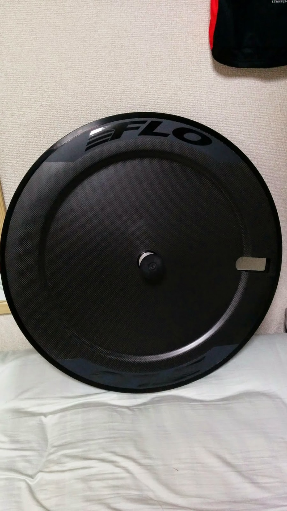
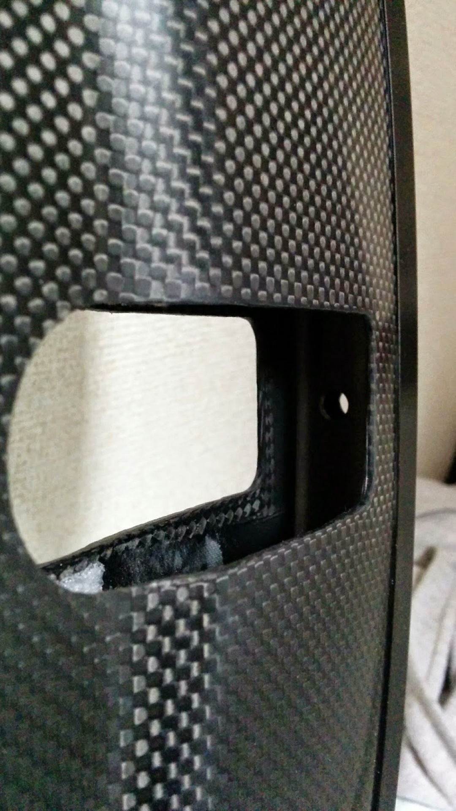
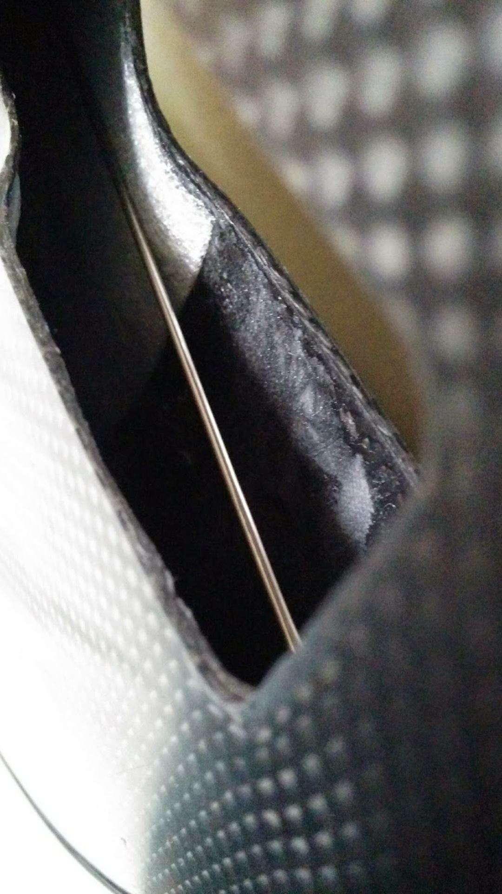
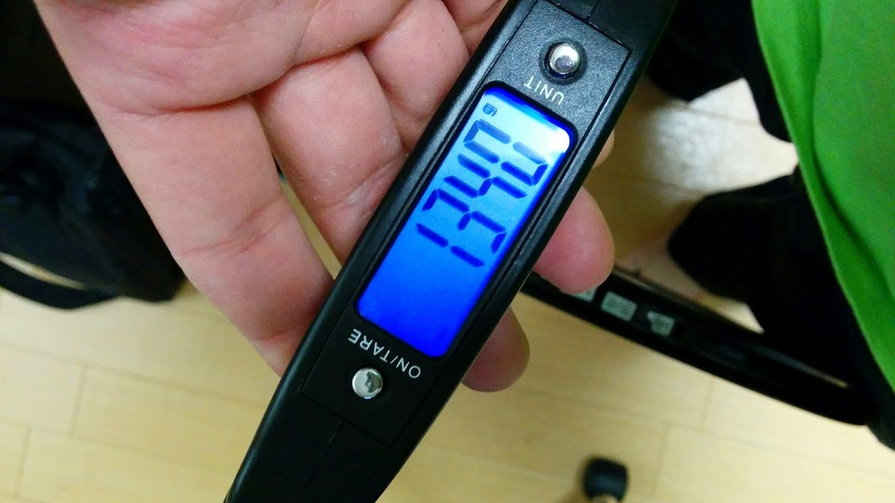

### 激安ディスクホイール現る

泣く子も黙る激安カーボンホイール通販 <a href="https://flocycling.com/" target="_blank">flo cycling</a>のディスクホイールを入手しました。

本体 599USD ＋送料 60USD ＋消費税。

<a href="http://rennmultisport.com/cgi-bin/store/commerce.cgi" target="_blank">
  RENN
</a>
とタメを張る激安っぷりである。

商品ページはこちら

<LinkBox url="https://flocycling.com/collections/60-a-c" />

RENN が発泡ウレタンにカーボンシートを被せた構造となっているのに対し、

FLO disc はスポークホイールにカウルを被せた構造となっている。

よって**振れ取りができる**。

また、notubes のテープを使って**チューブレス化できる**。

チューブレスタイヤは、現存するタイヤ構造の中で<strike>最も転がり抵抗が軽いため、</strike>

<strike>TT におけるメリットとなりえる（たぶん）</strike>

→ [高圧下では、ラテックスチューブ＋クリンチャーや軽量ブチルチューブ＋クリンチャーのほうが転がり抵抗を軽減できるようです](http://www.bicyclerollingresistance.com/specials/schwalbe-one-tubeless-clincher)

また、24.4mm リム幅となっており昨今の**幅広リムで 25c タイヤと相性が良い**（はず）

**エアロ効果**は FLO が一番ウリにしている部分である。

ウネウネした形状が横風に効く（らしい）

実走行はまだだが、まずは構造を確認する

### ホイール形状

パッと見はなかなか普通。HED のディスクホイールと似た形状をしている。ブレーキ面は黒いが、アルミクリンチャーリムである。

前述の通り、公称でチューブレスレディ。

### ホイール構造

スポークホイールにカウルを被せた構造。バルブ穴周りの補強や壁はなし。

スポーク剥きだしで潔い。

チューブレスバルブの取り付けが心配だったが、楽そうで何より。

往年のコスカボのディスク版と言ってよい構造。

カーボンホイール特有の剛性はなさそう。

### 重量

一応測ってみる。リムテープレス・10s スペーサー有りで 1340g

ディスクホイールでも重い部類であるが、アルミクリンチャーホイールとしては及第点？

### 楽器としての性能

ディスクホイールの特徴といえば、その走行音が挙げられる。

ｺﾞｳﾝｺﾞｳﾝという反響した転がり音が相手を威嚇する。

中空構造のため、その点は期待できる。

更に、flo disc は構造上、別の使い方で音を鳴らすことも出来る。

何も聞かず動画を見てもらいたい。

Good。

反響音がかなり大きそうだ。

速報のため、走行インプレは後日。

### 追記

同封品はクイック・Continental の 20-25c チューブ・リムテープである。

メンテナンス方法については、発送後にハブの分解方法からスポークの調整方法までメールで展開されるため、心配無用であることを付け加えておく。

#### 2015/02/13 修正

転がり抵抗に関する記述を修正

インプレッション記事は[こちら](/2015/05/12/flo-disc-whee.html)

<Amzn asin="B000O1P7CG">
