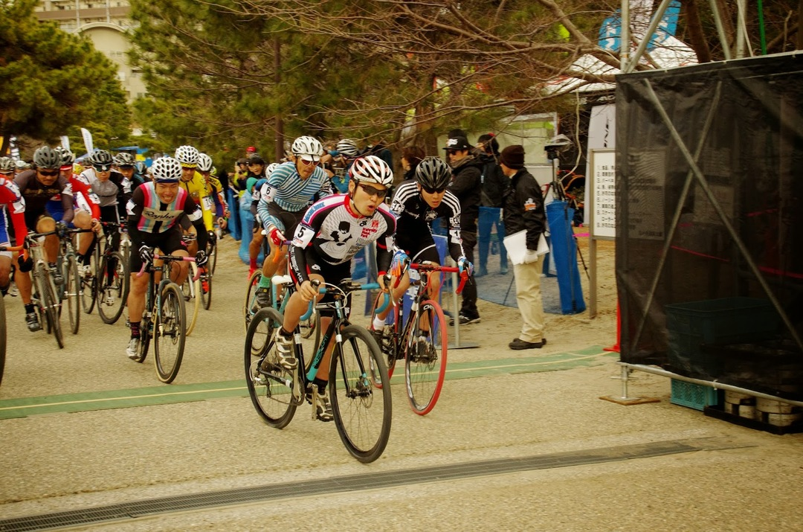
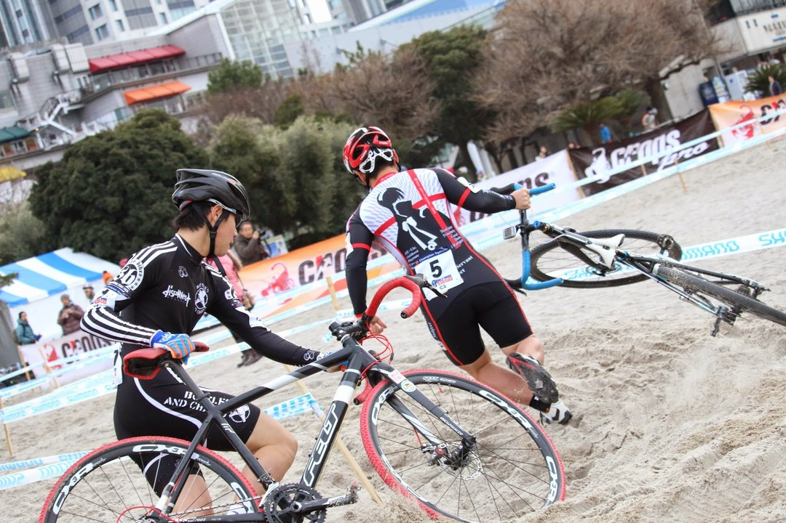
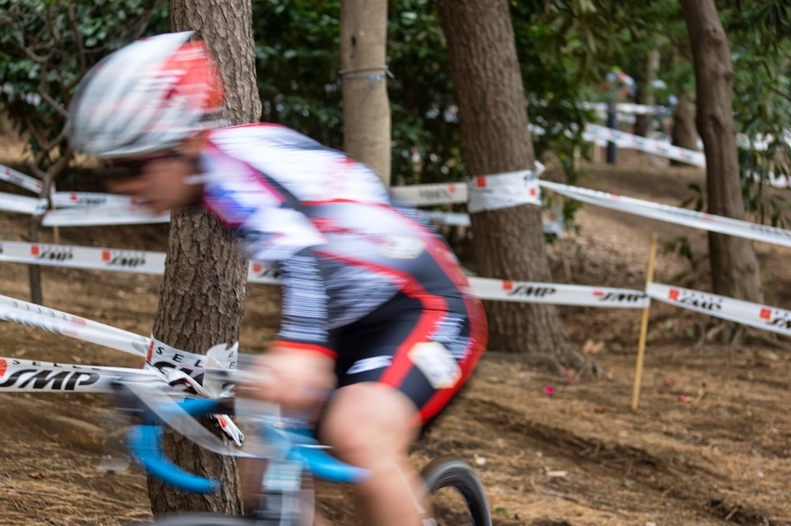

砂のスラロームはやめてください、死んでしまいます。

お台場の砂場。昨年はエントリー峠の前に敗退。

一昨年に MTB で出場してなんとなく砂の乗り方は掴んでいたので、直線ならなんとかなると思っていた。

そう直線なら。

まさかの砂浜に大量のコーナー。

CX 車で乗れるわけなし。

それでも砂区間を諦めることは即敗北になるので、湘南海岸でみっちり砂トレをしてきた。

お台場の砂より数段深くサラサラした湘南海岸は辛かったが、いい練習になった。

C2 のメンツをみると、ジュニアが別カテゴリになっていないため、世界選手権帰りの 2 名が堂々と名を連ねている。ついでになぜか宮澤さん…

ひとまずエントリー競争を勝ち抜き 1 列目をゲットしたので、ホールショットを取ってランニングで引き離す方針。

ジュニアカテゴリ 4 ～ 5 人はともかくとして、昇格ラインが 3 人ぽいので表彰台をあきらめて昇格を狙いに行くことに。

試走した限りでは、直線の砂は乗れることがわかったので、ラインをしっかりチェック。

目論見通りホールショットを決める。

砂区間のランニングに入る。

後ろに聖くんの存在を感じながら世界選で見たバイクぶん投げターンを真似してスタコラサッサとランで逃げる。（しかし自転車乗ったらすぐに捕まった）

シングルトラックも木を掴んでターンしたり色々遊べるレイアウトでした。

砂浜はライン外れたら降りざるを得ないが、持ち方を工夫することでかなり速度が変わるようだった。

自転車が沈まないようにサドルに手を添えて走っていたのだが、どうも最高速度が遅く、何人かにランで抜かれてしまう。

両手でブラケットを握ったほうが、前傾になった分呼吸はやや厳しくなるがスピードが出せる。乗る練習ばかりして砂を走る練習を疎かにしていた…

ラン区間が増えて、心拍数は前回走った時よりはるかに高い数値を叩き出す。

血の味や胃液の味という懐かしい味も思い出すことができた。

結果として 12/57 位。ファットバイクに抜かれたのはちょっとくやしい。

2 日目はひたすらビールとレースを楽しんだ。

世界レベルの走りは本当にすごい。すごい以外の言葉が出てこない。

ファットバイク無双するようなコースレイアウトは CX としてどうなの？という議論もあるが

エリートの走りの前には霞んでしまった、スキルがあれば良いと。

それと、体を動かす基礎体力。ランニングはやっぱり運動の基本。

2 回ほど、砂浜での 180 度ターンを成功させてそのまま走り抜けられた周回があったが、

乗りこなせた時の気分は最高だった。

ラストラップで走りこなせたということは、集中力を高く保っていればこなせるレベルだったという証拠。安定したライディングスキルを出せるようにするのも課題として見えてきた。

文句をいいつつ、とんでもない辛さを体験しつつも、来年も出るのだろう。

今年の CX レースはあと 2 戦。

<LinkBox isAmazonLink url="https://www.amazon.co.jp/dp/B00QHS8BQE/" />
