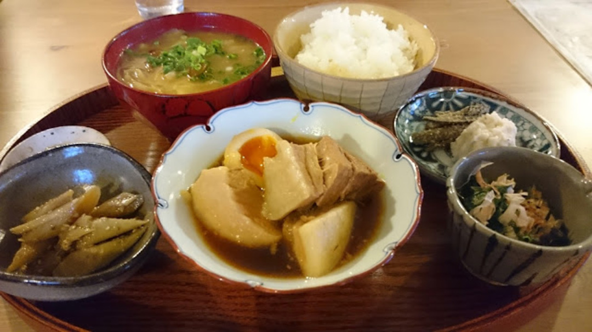

レースレポなんて需要がないという事に気がついたので、機材と飯にフォーカスしていくことにしました。

第一弾レース飯は陸の孤島こと群馬CSC。

赤谷湖付近まで降りてようやくコンビニがあり、温泉街の飯屋はほぼ無い上に夕方で店を閉めるというひどい環境。

そんな中、見つけた当たり店がこちら。

<LinkBox url="https://tabelog.com/gunma/A1003/A100302/10015723/" />

予約すれば18:00以降でも席を用意して頂けます。

地元の食材をふんだんに利用した定食がウリ。角煮や豚のしょうが焼き等、肉が豊富で

レース前後に最適です。ごはんもお代わりOK。

写真は豚の角煮定食。

日替わり小鉢はその日仕入れた食材で変わるとのこと。  味噌汁は具だくさん。隠れてる味噌だけでご飯1杯いける旨さ。

角煮はもちろんトロットロでレース後の体に染みわたる。  各メニュー 1000円前後。

デザートとして出来たてかりんとう饅頭を150円で頂けます。  コンビニ飯で素泊まりするならこちらへどうぞ。
