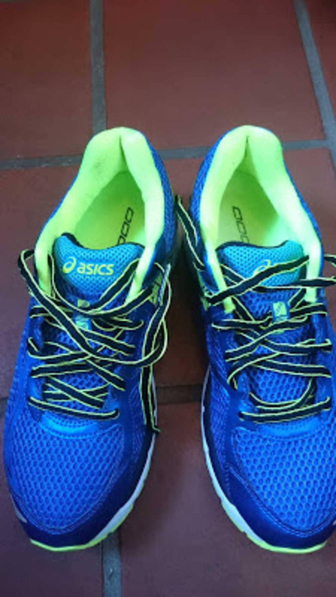
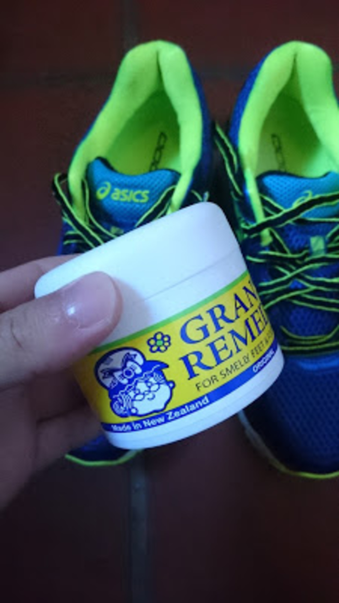

C2のシングルリザルトが定位置になってしまって、昇格まであと1人というところで逃し続けている。

JCX中井ではキッチリとペースを刻んで最後追い込んだのに差されて4位。

ペーシングとか技術ではなくベースの脚力や体力を改善しないといけないなと悟った。

レースの後、そのままスポーツショップへ向かってランシューを新調。

前のものが5年以上使ってボロボロであったため、クッション性が段違いにアップした。

お台場に向けてランを強化していく。自転車乗るよりランをやったほうが体も絞れる。

ランシューに限らず、シューズ運用には欠かせないのがこいつ、「グランズレメディ」

乾燥・消臭・除菌をこなしてくれる、オフィスで使う革靴もこれさえあれば臭いとおさらば。

欠点は靴下と中敷きに白い粉が付着することだが、シミになるわけでもないしそもそも見えないので問題なし。

<Amzn asin="B01C3QVA6G" />
