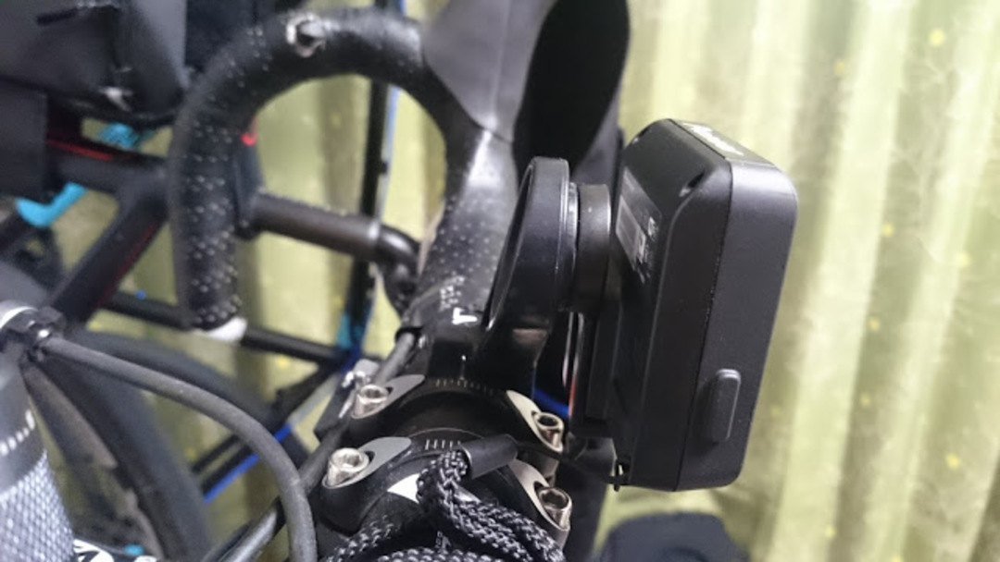
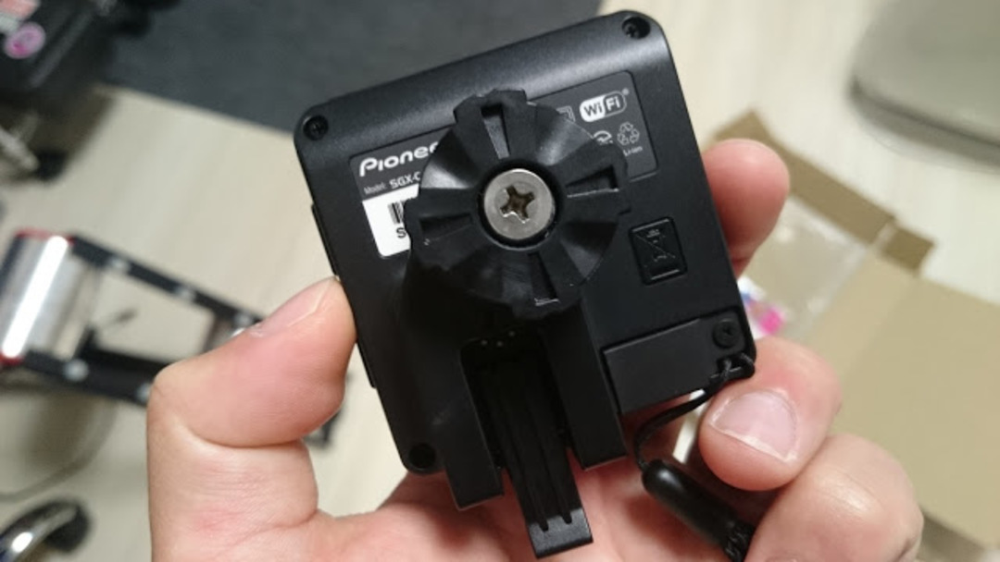
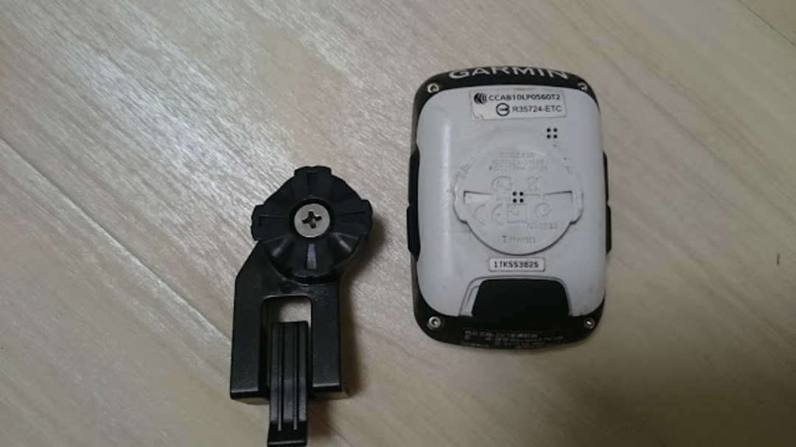

### サイコンを SGX-CA500 に変更

今まで、サイクルコンピューターは[GARMIN Edge500](http://www.amazon.co.jp/gp/product/B007PNKROY/ref=as_li_ss_tl?ie=UTF8&camp=247&creative=7399&creativeASIN=B007PNKROY&linkCode=as2&tag=gensobunya-22)の台湾版を使っていた。ペダリングモニターを使っていたのだが、Zwift をやる関係上、ANT+でパワーを取得しなければならなかったからだ。

ペダリングモニターモード（ペダリング効率を測るモード）だとパイオニアの独自規格となるので、PC にパワーデータを転送できなかった。

ところが、2015/12/24 のアップデートで状況が変わった。

> ペダリングモニターの ANT+パワーメーター送信 (ベータ版)
> ペダリングモニターから受信したペダリングパワーを、ANT+で規定されているパワーメーターフォーマットに変換し SGX-CA500 から送信する機能を追加しました。
> [SGX-CA500 ファームウェアアップデートのお願い](https://cyclo-sphere.com/notice/20151224/ja)

ペダリングモニターモードのまま、センサーではなくサイコンから ANT+形式でパワー値を取れるようになった。つまりペダリングモニターしながら Zwift が可能になった。

これで購入を即決断。

### パイオニア専用マウント →GARMIN マウントへ変換する

この記事の本題。サイコンを変えても 3 台の自転車にひっついているサイコンマウントは GARMIN 用のまま。

純正のマウントは 4000 円近くするので、なんとか既存のマウントを流用したい…

そこで、REC-MOUNT の[GM-SGX2](http://www.amazon.co.jp/gp/product/B00MUNVW52/ref=as_li_ss_tl?ie=UTF8&camp=247&creative=7399&creativeASIN=B00MUNVW52&linkCode=as2&tag=gensobunya-22)を利用した。

本来は SGX-CA500 を REC-MOUNT の製品に装着できるようにするもの。GARMIN 用ではないので、写真の通り、形が微妙に違う。

このままだと、上下の爪に邪魔されてマウントに入らないので、ニッパーで爪を削り飛ばし、ヤスリで整える。

**※2016/10/26 追記**

タレコミによると現行品は爪が 2 つになっており、わざわざ加工しなくてもいいらしい

下が加工後の状態。

左右の爪だけの状態になっていることがお分かりいただけるかと思う。

ちなみにこれ、結構シビアで完全になめらかになるまで削らないと手持ちの[BAR FLY](http://www.amazon.co.jp/gp/product/B00843DVCY/ref=as_li_ss_tl?ie=UTF8&camp=247&creative=7399&creativeASIN=B00843DVCY&linkCode=as2&tag=gensobunya-22)には入らなかった。

冒頭の写真が装着後の状態。

かなり厚みがあるのでエアロ効果は低くなったかもしれない（笑

### SGX-CA500 自体のインプレ

#### GPS

Edge500 に比べると格段に GPS のつかみが良くなった。みちびき対応のおかげらしい。

信号ストップや再スタートの際もほとんどタイムラグ無くオートスタートが発動してくれる。

#### パワーメーター

どのサイコンでもパワー値の反映には時間がかかると思うが、こいつも例に漏れずタイムラグがそれなりにある。ローラー以外で注視することはないので問題はない。

それよりも、ゼロ点校正が非常にスピーディーになったことが素晴らしかった。

メニューをポチッとしたら数秒で完了している。Edge500 でクランクを空転させないといけなかった（しかもよく失敗する）ことを考えると大きな進歩だ。

#### UI

端的に言って悪い。感圧式タッチパネルなのだが、スクロールのつもりがタップになることもしばしば。

タップしても動作が重いのも気になった。Android ベースの OS なのだが 2.3 あたりをベースにしているんじゃなかろうか…という推測。Android アップデートを頼む。

ST-9070 を使っているしワイヤレスユニットが欲しくなるくらいタッチパネルを使いたくない。サイコンくらいの画面サイズだと物理スイッチのほうが便利だとなぜ各社わからないのか。

#### Wi-Fi アップロード

Edge510 以降を利用している人ならわかると思うが、非常に便利。アップロードメニューを選択すると自動で未送信のワークアウトを認識し、WiFi を ON にしてアップロードしてくれる。アップロードしたら Wi-Fi はオフになるし優秀。

サイコン単体でファームウェアアップデータが可能になっていることも、Edge500 ユーザーからすると点数高い。

### サイクルコンピューターとしての SGX-CA500

普通のサイクルコンピューターとしては少し操作に難がある。

非ペダリングモニターユーザーは、[Edge250J](http://www.amazon.co.jp/gp/product/B015IW5SKG/ref=as_li_ss_tl?ie=UTF8&camp=247&creative=7399&creativeASIN=B015IW5SKG&linkCode=as2&tag=gensobunya-22)の方が使いやすいと思う。Bluetooth も使えるし。

逆に、ペダリングモニターと組み合わせるのであればベストと言っていい。

これがないと効率やベクトルデータは保管できない。今はこれらのデータを活用するノウハウができているとは言いがたいが、将来的に価値が上がるかもしれないし、蓄積しておくに越したことはない。

何よりサイコンから校正やファームウェアアップロードがサクサク行えるのが非常に良い。

[シクロスフィア](https://cyclo-sphere.com/)の使い心地については後ほどレポートしようと思う。

<LinkBox isAmazonLink url="https://www.amazon.co.jp/dp/B01874O84Y/" />

<LinkBox isAmazonLink url="https://www.amazon.co.jp/dp/B00MUNVW52/" />
