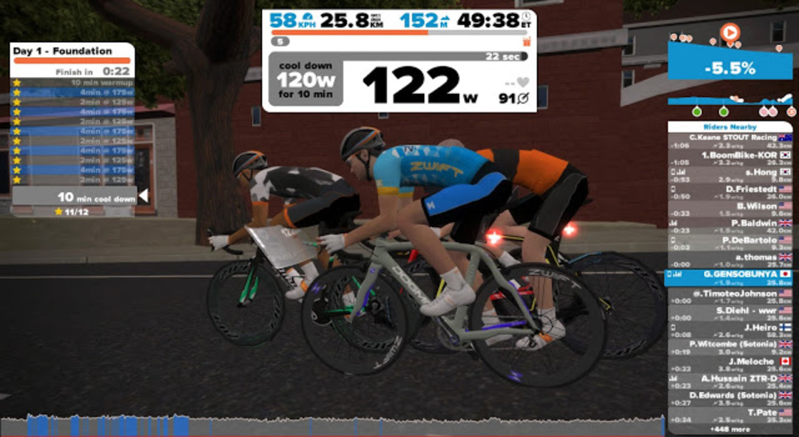

本記事は下記の続きです。

<LinkBox url="https://blog.gensobunya.net/2016/01/21/zwift0-ftp-testshorter.html" />

### 拍子抜け

やる気出してページを開いたらすごく簡単なメニューが出てきた…

2 日目はちょっと歯ごたえありそうだけど 3 日目と 4 日目はまた簡単なメニュー。

ひとまず 6 週間やりきることが目標なので音楽聴きながら 50 分回す。

ケイデンス維持とペダリングを綺麗に意識しながら音楽聞いていたら汗もほとんどかかずにあっさり終了。

ワークアウト中は自分の目の前に画面が浮かぶ演出が入る。

しかもきっちりパワー値まで反映されていてムダに手が込んでいるなーと。

それくらいしか考えていなかった。

<LinkBox isAmazonLink url="https://www.amazon.co.jp/dp/B0050GL5GM/" />
