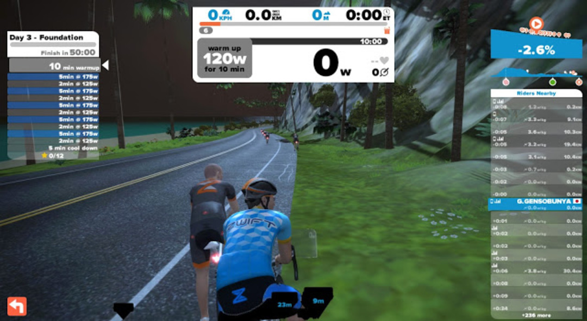
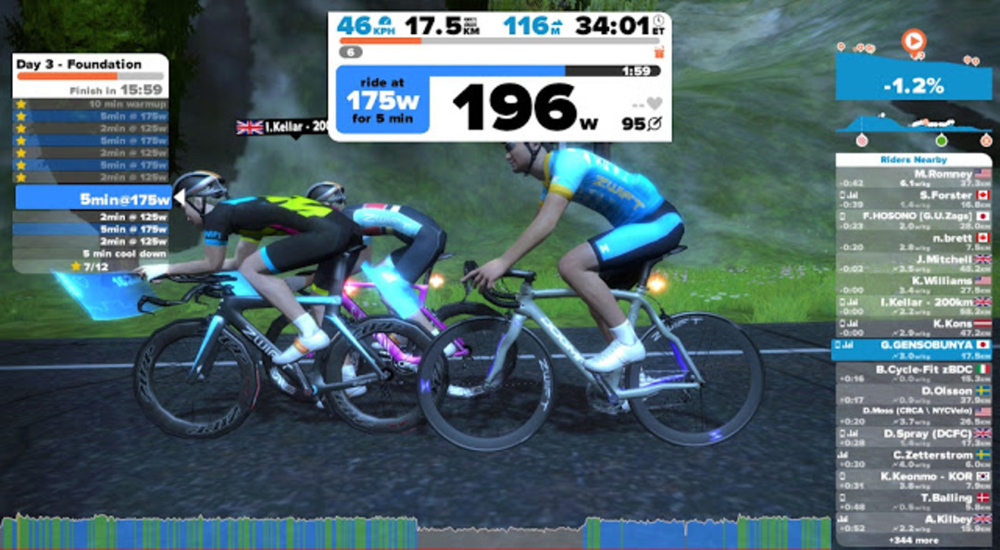

### Foundation

内容は 1 日目と同じです。

ペダルを PD-9000 +4mm に変更したのでポジション確認がてらダラダラと Twitter のタイムラインを眺めながら実施。

ワークアウト野郎多すぎ問題。他人の W 数も見れるのね。

Aeroad はどうやったら手に入るのでしょうか…

ローラーばかりだとスキルが疎かになりがちだけど、週末 CX をやっているので上手くバランスが取れている感じ。

CX は強度はあるけど時間が稼げないので痩せない、冬は寒いから外で長時間乗りたくない、という冬太りサイクルから脱出できたのでそれだけでも Zwift に感謝である。

<Amzn asin="490531500X" />
