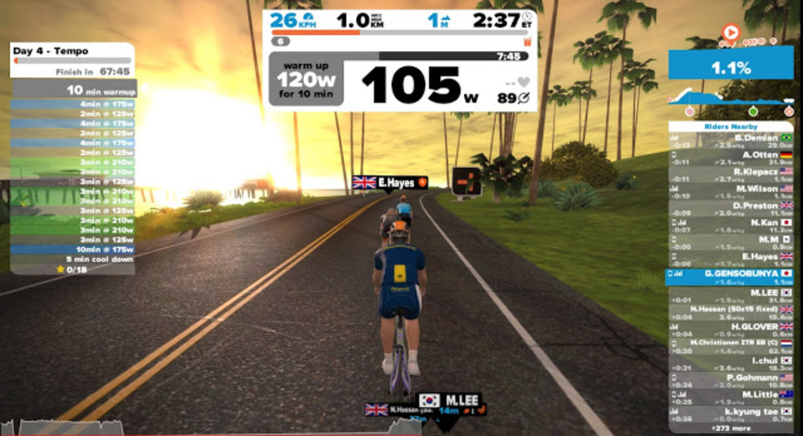
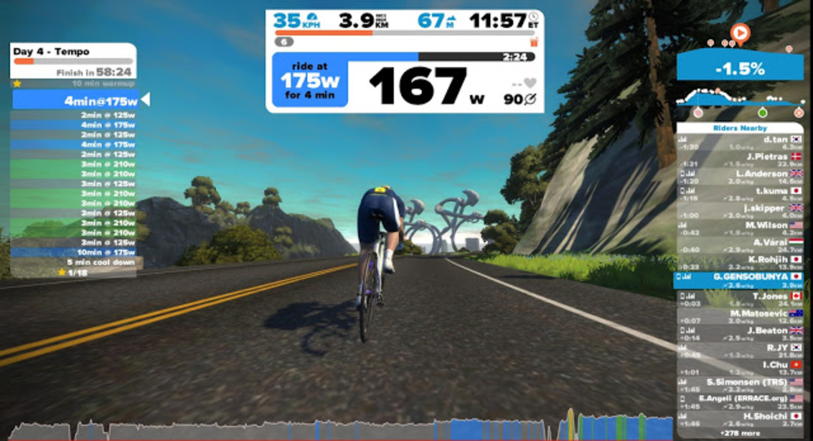

### 1 週間目、終了

1 週間目は 4 日目のテンポ走で終了。

Zwift の week workout は 5 日で 1 週間とカウントしている。そして 1 週目の 5 日目は&#8221;Rest&#8221;。つまり休息日なので 4 日目で終了。

平日は Zwift でトレーニングして土日はリアルで乗り込めということなのだろう。

自分は月曜日から始めたわけではないので明日も実施しますけど。

金曜は飲み会だからレストです！

View はこのカメラモトから撮っているかのような角度が好み。

210W を 6 分なんて余裕だと思っていたら思ったより辛くて自分のショボさに泣きたくなった。

同じパワーを 6 分続けると飽きがくるかとおもいきや中々どうして画面を見ているとマンネリ感が無い。流石にラストの 10 分変化無しは辛かったが、音楽をかけておけば十分対応できる範囲。

ダンシングできない分、1 時間経過したあたりで尻が痛くなるけどこれは流石にどうしようもないかな。

<LinkBox isAmazonLink url="https://www.amazon.co.jp/dp/490531500X/" />
