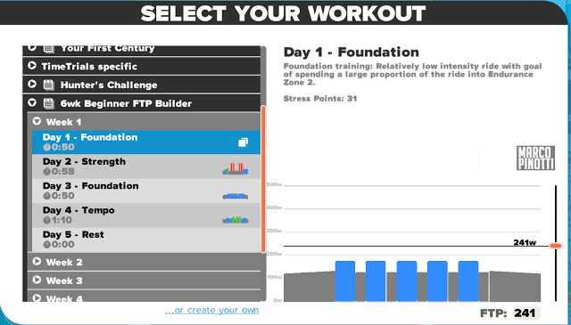

## パワーメーターのオモチャ化

パワーメーターを持っている人は、当然パワートレーニングの存在も知っている。

一般的なパワートレーニングをやろうと思うと下記の工程が必要になる。

1. メニューの情報を手に入れる
2. 自分の FTP を知る
3. FTP からパワーゾーンを割り出す
4. メニューに自分のパワーを当てはめて時間割を作る
5. トレーニングを開始する
6. パワーと時間をモニタリングして負荷を調整する（ワークアウト本番）

正直に言うと、1 人で全部やるのは面倒くさい。

自分は「2」しかやっていなかった。（ログから GarminConnect が 20 分平均を出してくれただけ）

特に実走行中にパワーをモニタリングしながら調整するのは事実上不可能と言ってもいい。

必然的にローラー上で行うことになる、ローラーはつまらないのでもっとやりたくなくなる。こうしてパワーメーターがおもちゃと化す。

### Zwift の真価

バーチャルサイクリングソフトの Zwift、遠隔地の仲間と走行会を行える以外にも、レース派にはうれしい豊富なワークアウトメニューが備わっている。

これまたパワートレーニングなのだが、一般的なパワートレーニングと違って、前項で挙げたパワートレーニングの過程をすべてソフト側でやってくれる。すごいぞ Zwift！

Zwift の導入については[以前の記事](/2015/10/01/zwif-3.html)を参照。

### まずは FTP 計測

まずは己を知らないと話が始まらないので、FTP 計測を選択する。

実走行とローラーだとパワーの出やすさも変わるそうなので、ローラー上の基準を作るのが目的。

冒頭の画像の通り、FTP tests>FTP test(shorter)を選択してコースイン。

現在の FTP がわかっていれば、右のつまみで変更するとウォームアップ時のパワーが自分の FTP に応じたものとなる。247W にしてコースイン。

精神的な変数を最小限にするため、コースはフラットなものを選択した。

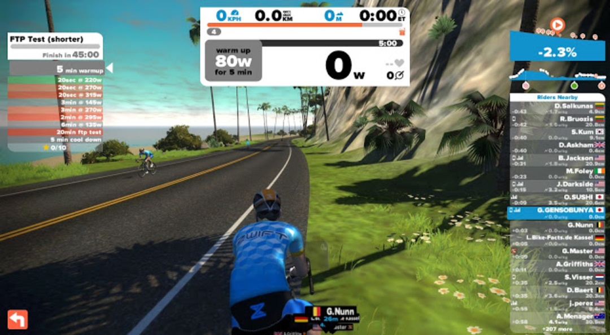

左にこれからのメニュー、中央には現在のパワーと目標ワットが表示される。

いちいち FTP 計測のアップ作法を覚えなくとも、Zwift が勝手に指示してくる。

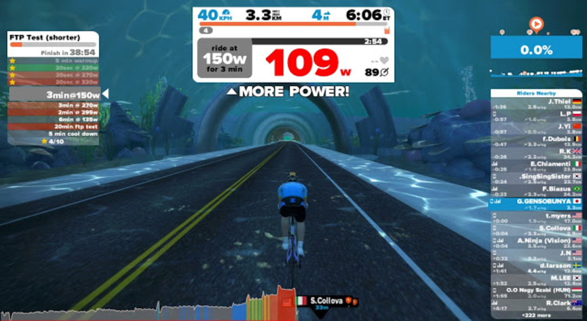

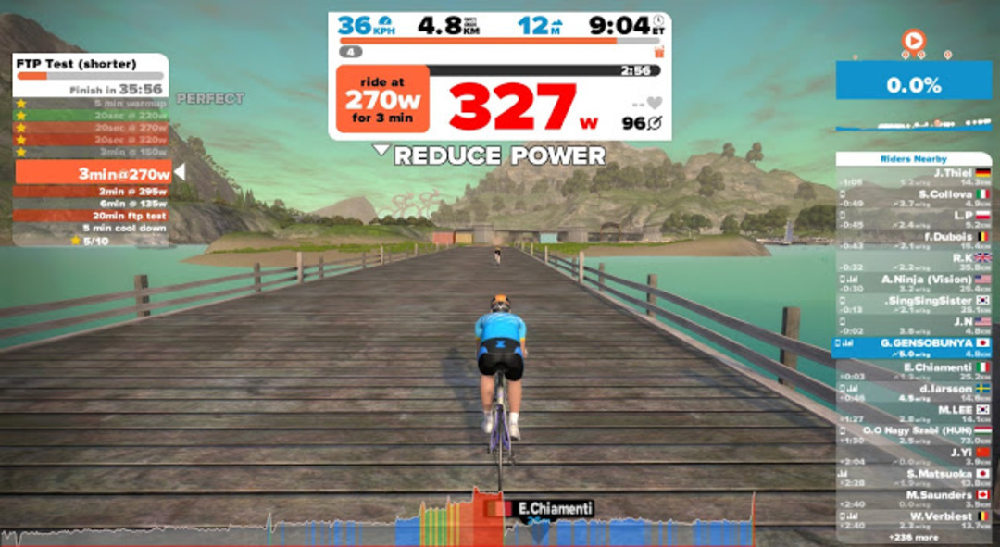

パワーが足りないと「More POWER!」、パワー出しすぎだと「Reduce POWER」と煽りが入る。

人間は今やることに集中すれば OK。

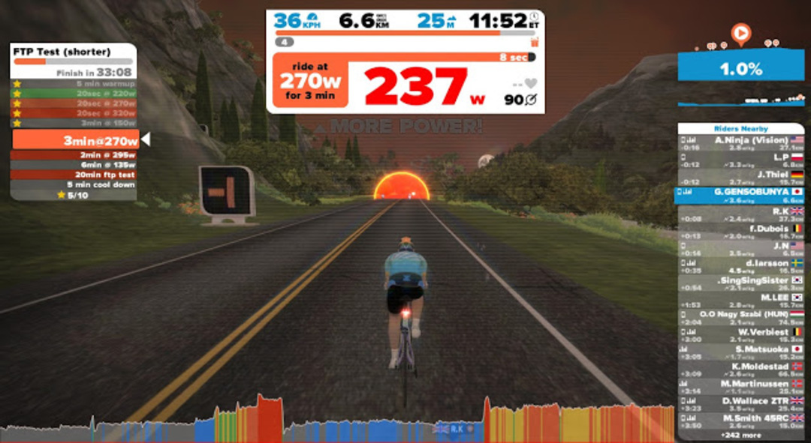

メニューをちゃんとクリアすると左側のリストに ★ が入る。

課題が入れ替わる場合、コースにも視覚的に表示される。

筋肉を暖めたら 6 分レストしてスタート。

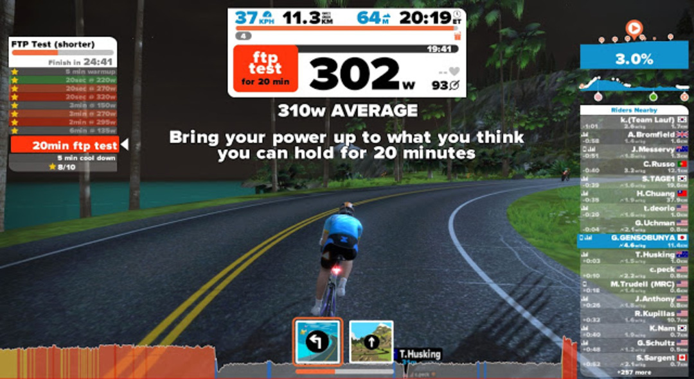

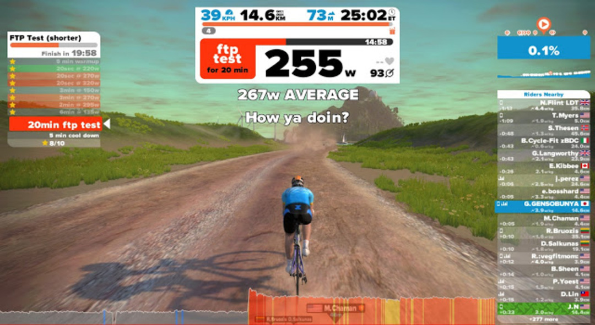

5 分経過、「調子はどう？」。

疲れました

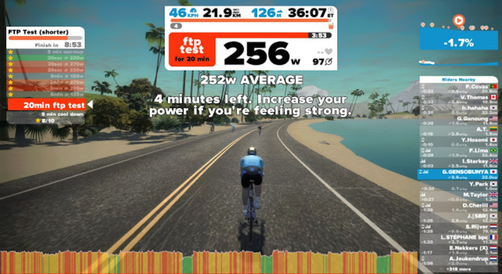

残り 4 分、下の部分にパワー分布が出ている。オレンジが FTP+10%くらい？黄色が FTP ゾーン、緑が FTP-20%くらい。タレてるのがまるわかり。

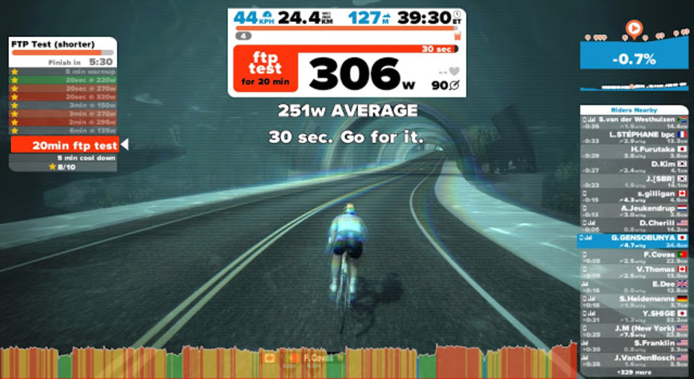

最後の方は画面がホワイトアウトしかける演出、こんなんしなくても死にそうです。

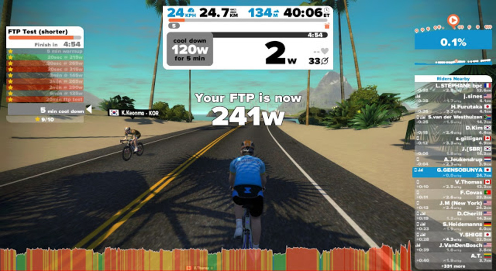

ハイ終了～。20 分平均パワーに係数を掛けるところまで勝手にやってくれます。

実走から算出した FTP より低いですね…

20 分平均パワーはライド完了画面で確認できます。

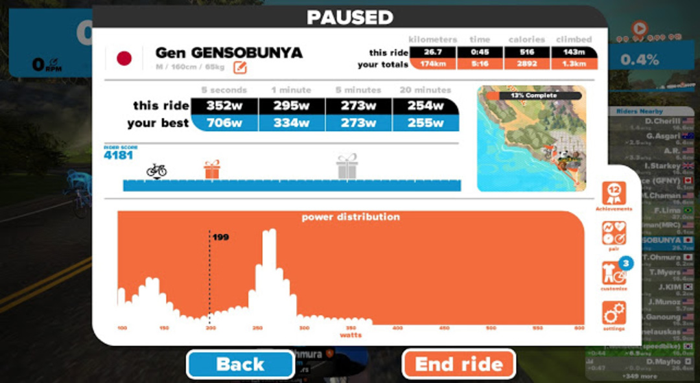

今回のテストは Zwift 上のベストパワーでもなかったようだ…

### バーチャルパワートレーニングコーチとしての Zwift

何はともあれ、パワートレーニングの「メニュー作成」「モニタリング」「パワー切り替え通知」「叱咤激励（おまけ）」までやってくれると、人間は指示通り動くだけで良くなるので非常に労力が削減できる。

月額 10 ドルでこのサービス、結構お得である。

次からは 6wks FTP builder を一通りやってみる予定。

<Amzn asin="490531500X" />
