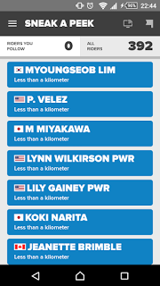
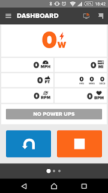
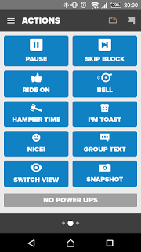

## スマホは Zwift コントローラー

**この記事は古くなったので 2017 年の情報をもとに記事を書き直しました**
**新しい記事は[こちら](/post/2017zwift-mobile-link.html)**

Zwiftはただ走るだけではなくチャットをしたり「RIDE ON!」（要するにいいね！）したり、Watopia内なら分岐選択をしたりできます。  
キーボードやマウスでもなんとかできるのですが、ローラー乗りながら操作するのは面倒。

これがあればPCと同じネットワーク上にあるスマートフォン・タブレットからZwiftの各種操作を行えます。  
Android、iOSどちらでもOKです。

### セットアップ

そんなに大仰なものでもないのですが、コントローラーとしての利用条件は以下の通り。

1. PC上でZwiftが起動している
2. PCとコントローラーにする端末が同一ホームネットワーク上に存在する

どちらかが欠けていると、オンラインのユーザーを表示する画面のままです。①② の条件を検知すると、走行画面（サイコンみたいな画面）になります

要するに、PCが接続されているルーターにスマホorタブレット側がWiFi接続していれば認識します。Zwift起動して20秒ほど待ちましょう。認識できなかったら、Windowsの人は、ネットワーク設定が「プライベート」もしくは「ホームネットワーク」になっていることを確認しましょう。「コントロールパネル＞ネットワークと共有センター」で確認できます。

変更方法はググれ。

### 画面解説

#### 最初の画面

- 矢印長押…Uターン
- 停止ボタン長押し…ライド終了画面

#### ACTIONS

左は分岐選択エリア、右はそれ以外での画面です。

- GO STRAIGHT…まっすぐ
- TURN RIGHT/LEFT…曲がる
- PAUSE…ワークアウト一時停止
- SKIP BLOCK…（使ったことありませんが）次のワークアウトセグメントへワープ？
- RIDE ON…いいね！
- BELL…ベルを鳴らす（音だけ）
- HAMMER TIME…文字通り声を出す（意訳「踏み続けろ！」？）
- I&#8217;M TOAST…文字通り声を出す（「脚売り切れたよ」？）
- NICE!…文字通り声を出す
- GROUP CHAT…チャット文字入力
- SWITCH VIEW…視点変更
- SNAPSHOT…スクリーンショット撮影（My documentZwiftへ保存）

<Amzn asin="B00CM381SQ" />
