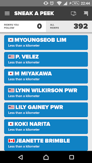
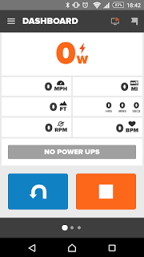
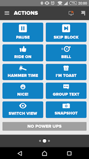

### スマホは Zwift コントローラー

**この記事は古くなったので 2017 年の情報をもとに記事を書き直しました**
**新しい記事は[こちら](/post/2017zwift-mobile-link.html)**

Zwift はただ走るだけではなくチャットをしたり「RIDE ON!」（要するにいいね！）したり、Watopia 内なら分岐選択をしたりすることができます。  
キーボードやマウスでもなんとかできるのですが、ローラー乗りながら操作するのは面倒。

そんな悩みは下記のアプリで解決。

<LinkBox url="https://itunes.apple.com/jp/app/zwift-mobile-link/id934083691" />

<LinkBox url="https://play.google.com/store/apps/details?id=com.zwift.android.prod" />

これがあれば PC と同じネットワーク上にあるスマートフォン・タブレットから Zwift の各種操作を行うことが出来ます。  
Android、iOS どちらでも OK です。

### セットアップ

そんなに大仰なものでもないのですが、コントローラーとしての利用条件は以下の通り。

1. PC 上で Zwift が起動している
2. PC とコントローラーにする端末が同一ホームネットワーク上に存在する

どちらかが欠けていると、オンラインのユーザーを表示する画面のままです。①② の条件を検知すると、走行画面（サイコンみたいな画面）になります

要するに、PC が接続されているルーターにスマホ or タブレット側が WiFi 接続していれば認識します。Zwift 起動して 20 秒ほど待ちましょう。認識できなかったら、Windows の人は、ネットワーク設定が「プライベート」もしくは「ホームネットワーク」になっていることを確認しましょう。「コントロールパネル＞ネットワークと共有センター」で確認できます。

変更方法はググれ。

### 画面解説

#### 最初の画面

- 矢印長押…U ターン
- 停止ボタン長押し…ライド終了画面

#### ACTIONS

左は分岐選択エリア、右はそれ以外での画面です。

- GO STRAIGHT…まっすぐ
- TURN RIGHT/LEFT…曲がる
- PAUSE…ワークアウト一時停止
- SKIP BLOCK…（使ったことありませんが）次のワークアウトセグメントへワープ？
- RIDE ON…いいね！
- BELL…ベルを鳴らす（音だけ）
- HAMMER TIME…文字通り声を出す（意訳「踏み続けろ！」？）
- I&#8217;M TOAST…文字通り声を出す（「脚売り切れたよ」？）
- NICE!…文字通り声を出す
- GROUP CHAT…チャット文字入力
- SWITCH VIEW…視点変更
- SNAPSHOT…スクリーンショット撮影（My documentZwift へ保存）

<LinkBox isAmazonLink url="https://www.amazon.co.jp/dp/B00CM381SQ/" />
