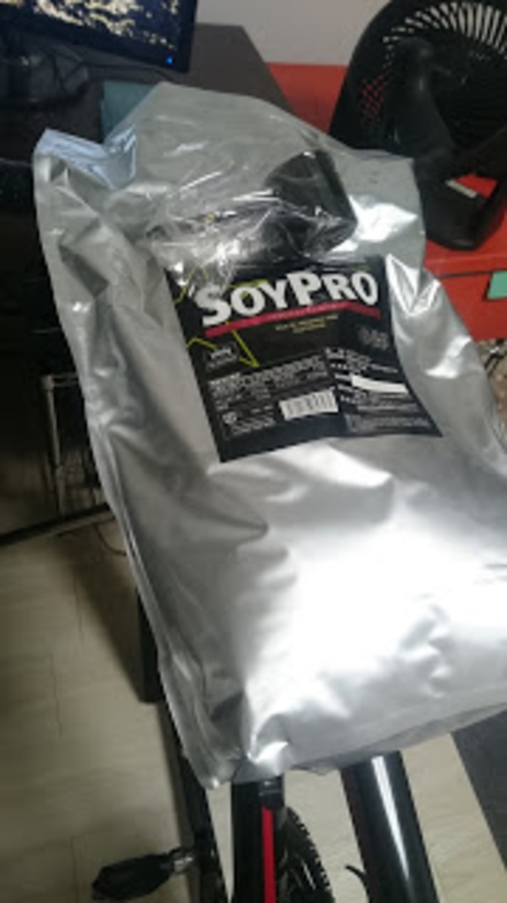

### タンパク質摂ってるぅ？

ある程度の強度で自転車に乗っているなら、補給食の重要性は当然のように知っていると思う。  
ただ、走り終わった後のリカバリー食について無頓着な人は多いのではないだろうか。

他の競技を経由してきた人はトレーニング後に筋肉の超回復を促すため、「トレーニングが終わったらプロテイン」「糖分の速やかな摂取」というのは半ば常識になっている人もいるだろう。
※おおよそ体重(kg)\*1~2g のタンパク質を摂取することが望ましい、らしい。運動直後にはタンパク質よりも先に果糖を摂ると回復が早まる。

心拍がメインのエンデュランス系競技とはいえ、自転車でも筋肉を酷使しているのだから超回復の原理でパフォーマンスが向上する。

運動後 30 分以内がゴールデンタイムと言われており、栄養の吸収効率が高まっているそうだが、直後でなくても問題ないとの研究もあるので、ひとまず必要な分のタンパク質を摂取することが重要となる。  
何がいいたいかというと、必要なタンパク質を摂るには肉ばっかり食った場合夕飯が 1500kcal コースなのでプロテインで低カロリーに補給しろってことです。

足りてないんだから黙って飲もう

### プロテインの質について

一口にプロテインと言っても、Amazon で<a href="http://amzn.to/211hwjZ" target="_blank" rel="noopener">「プロテイン」を検索</a>すると種類が多く、値段もピンキリ。

一見さんにとりあえず買えと言っても厳しい物があるので、選定する上での基準を示していきたい。

#### タンパク質含有率

プロテインを比較する上での絶対的正義。

プロテイン付属のスプーンによって 1 杯の量が変わるので、100g あたりで比較したい。当然、含有率が高いほど高級品であり、値段が高くなるので個人の価値観で選択してほしい。  
タンパク質以外に何が入っているのかというと、ほとんど炭水化物なので糖質制限をしているのに含有率の低いプロテインを飲んだりすると本末転倒なんてことも。

ホエイプロテインの場合、80%越えてると優秀です。安いなら 75%程度のものが狙い目。  
ちなみに下の製品は 90%

<Amzn asin="B00PQ308L2" />

#### BCAA・アルギニンなどアミノ酸類

タンパク質以外の添加物だが、特定の効果を強調するために入っている。  
アミノ酸は種類によって働きが変わるが、狙った通りの効果を得るためにアミノ酸を直接ぶち込んでいる。ついでにアミノ酸の状態で摂取すると吸収も良い。

米を食べるより砂糖を直接食べたほうがすぐエネルギーになるのと同じ。  
これらが添加されている製品はドカンと値段が上がる。正直プロテインに混ぜるよりも単体サプリメントとして買った方が安いのでプロテインに入れる意味はあまりないと思う。

#### ミネラル・ビタミン類

主にダイエット系プロテインに含まれている。  
食事の代替品を狙っている場合は、栄養バランスを整えるために添加されている。

当然単体サプリのほうが安いので以下略。

<Amzn asin="B00IEA57F6" />

### プロテインの種類

吸収率について言及しているのは、「血中のアミノ酸濃度が高い状態だと、筋肉が超回復する」という原理があるためです。  
すぐ吸収される場合、血中アミノ酸濃度はすぐに高まるのですが、低下するのも早くなります。筋肉が損傷している状態で血中アミノ酸濃度が低い状態が続くと、筋肉そのものを分解してアミノ酸を作り出します、おお怖い。

#### ホエイプロテイン

最もポピュラーなプロテインで、牛乳が原料。  
吸収効率が良く、運動直後の摂取に向いているらしい。おいしいプロテインはだいたいこれ。製品が多い分質もピンキリなので成分表示をよく見ること。
乳糖不耐性の人はお腹を下すこともあるらしいので注意。精製率を上げると改善される場合がある（WPI, WPH と呼ばれるもの）

#### ソイプロテイン

大豆を原料としたプロテイン。　　
比較的ゆっくりと体に吸収されるほか、代謝を高める効果が有る。味はひたすら大豆。精神力を要求される。豆乳好きならおそらく問題ない。　　
値段の割にタンパク質含有率が高いことが多く、タンパク質量のコストパフォーマンスに関してはトップ。

#### カゼインプロテイン

牛乳が原料だが、吸収が穏やかなプロテイン。　　
純粋にカゼインだけのプロテインは少ないので、ホエイプロテインと混ぜてあることが多い。あんまり市場で見ない。

### どれ買えばいいんですか

ようやく本題。
吸収効率を考えると、ホエイプロテインとカゼインプロテイン（またはソイプロテイン）を買って、運動直後にホエイ、寝る前にカゼインプロテインを摂るのが理想的…　　
ですが、吸収効率は水じゃなくて牛乳を使って溶かすことで低下させることができます。寝る前は牛乳を使って溶かせばいいので、ホエイ 1 種類でも大丈夫。　　
ついでに言えば重要な事は血中アミノ酸濃度を高い状態で維持することなので、ボディービルダー並のコントロールが必要でなければ、ソイプロテイン一本でも大した変化はないと思われます。

要するに、含有率と値段と味（重要）だけみてれば OK！  
Amazon で買えるコスパの良いプロテインを幾つか紹介しますが、プロテインに関しては<a href="http://www.1protein.com/" target="_blank" rel="noopener">1protein</a>や<a href="http://jp.iherb.com/" target="_blank" rel="noopener">iHerb</a>などの直輸入サイトもおすすめです。

**2017/04/02 追記。**

[Myprotein](https://px.a8.net/svt/ejp?a8mat=3N3PXV+GF7GHE+45DI+5YJRM)という PBK の兄弟サイトが颯爽と登場。激安です。

紹介プロモコード「AJPC-R3」を利用すれば初回注文 25%オフとなります。 インプレは下記記事参照

<LinkCard url="https://blog.gensobunya.net/2017/04/my-protein.html" />

#### ビーレジェンド

<Amzn asin="B0060GI8DE" />

お安いホエイプロテイン代表選手。味によるけどタンパク質含有率は 74%前後。

味が多く、泡立ちが少ないので飲みやすいです。

#### SAVAS ホエイ 100

<Amzn asin="B00IEA5210" />

昔は比較的高くて選択肢に入らなかったのですが、円安で海外製品が高くなったので、相対的に優秀な部類に入ってきました。タンパク質含有率は 72%程度。

#### ボディウィング　ソイプロテイン

<Amzn asin="B00BT7PMTW" />

ボディウィングと同じく、ひたすら大豆の味がする。フレーバーは文字通り匂いが付く程度。アイキャッチ通り、これを買ったわけだが牛乳を混ぜたら少しはマシな味になった。

脅威のタンパク質含有率 90%。
