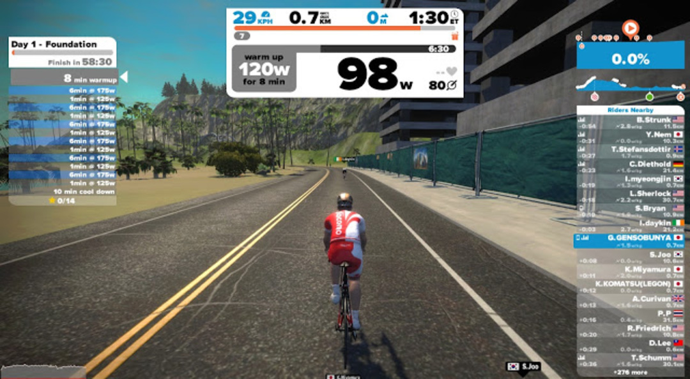

### 3 週間目スタート

シクロクロス東京は楽しかったけど、砂浜ランによるダメージを残して行きました…

体がボロボロだけどこういう時こそアクティブレスト。ちょうど良くメニューは楽ちんなFoundation。

### 同じメニューを繰り返す意外なメリット

ハッキリ言ってFoundationは強度がとても低い。

しかし、今日はその強度が低いはずのメニューがとてもつらかった…

体感時間がすごく長い、ケイデンス90-100を維持するのでいっぱいいっぱい。狙ったパワーバンドもズレる…

遠征して砂レースして翌日も応援で暴れているのだから当たり前といえば当たり前なんだが同じメニューでの体感強度で体調を測れるという学びがあった。

この練習のおかげで翌日はフルレストすることに決められた。

<Amzn asin="B07FZHFLD6" />
