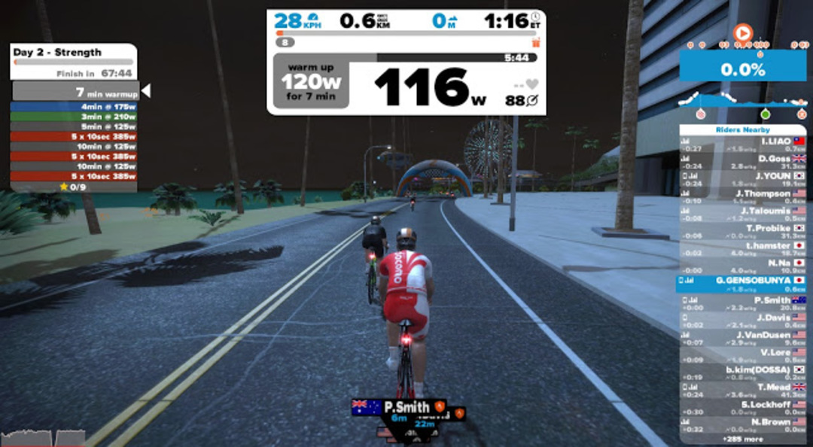
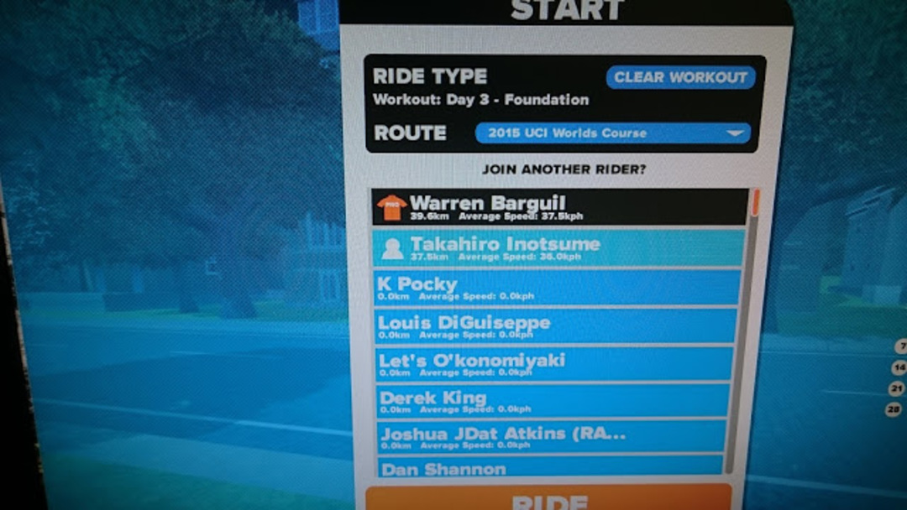

### 気分転換

docomo ジャージにしてみました。

プロモコードは Docomojapan

Strength の 10 秒パワーは低ケイデンスだったことに今更気がついたので今回はちゃんとアウタートップで回してみた。

OmniumTrainer だとアウタートップでも指示通りの 40RPM にはならないなぁ。

### プロとの邂逅

Day3 の Foundation 始めたら、プロロードレーサーのワレン・バルギルを発見。

ワークアウト優先なので一緒には走らなかったけど、ファンサービスではなく結構いいペースで飛ばしている模様。

ワークアウトはネタが尽きたので、以後は何か変化があった時だけ記事書きます。

<LinkBox isAmazonLink url="https://www.amazon.co.jp/dp/B0050GL5GM/" />
