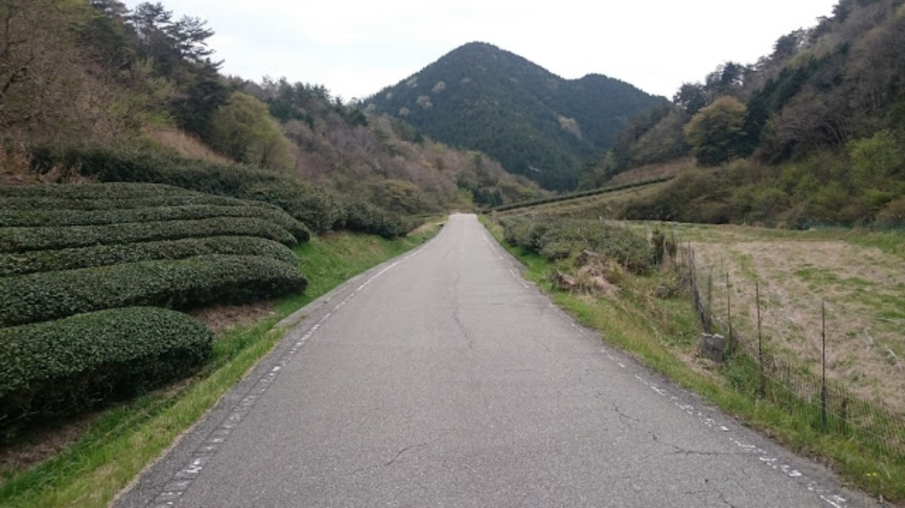

### 故障

景気よく GW の報告でもしたい時期だが、GW を目前にして膝を痛めてしまったので基本的にはゆったりペースのツーリングがメインとなってしまった。

山岳ライド中、左膝の外側が痛くなり強く踏み込めなくなり、最後に登るつもりだった六甲山をキャンセルして家までショートカット。

整形外科や整骨院にかかるタイプの怪我は、対症療法は行うことはできるが根本的な原因は自分で探すしか無い。

直近で始めた筋トレのメニューが悪かったのか、体のバランスが崩れたのか、セッティングの問題なのか…自転車以外にも生活が原因の可能性だってある。

### 原因特定

こういう場合は客観的な指標で見るのがいいと思い、ペダリングモニターのログをひとまず振り返ってみることにした。

関係のありそうな項目を指定し、直近のログを一覧化してみる。

（発症した日は 4/23）

これを見ると、2 月末当たりからパワーの左右差（平均パワーバランス）が悪化していることが一目瞭然。

概ね ±2%の間で推移していたバランスが、突如 4~5%のズレを伴うようになっている。ここで何をしたか思い出すと、ペダルを+4mm 軸のものに変更してクリートセッティングを変えた日だった。

と、いうことは原因はクリート位置である可能性が非常に高い。

膝の痛みが収まるのを待ってクリート位置を直しながら乗ったのが 4/29 以降のログ。

~~ログ上の左右差が 0 になるまでセッティングを追い込んだ。~~

数値のブレが無さ過ぎてメーターの精度に疑問が残ってしまったが、それはそれ。

結果として膝の痛みは再発せず、自転車上では痛みは感じないレベルまで回復。

その後、日常生活動作で起きていた痛みも無くなったので、2 週間で全治。

5/16 追記

左 PM の電池が切れていたのでバランスが 50：50 になっていただけでした。

痛みは消えましたがペダリングバランスは直っていないようです(´・ω・｀)

今回の出来事は改めて数値の客観性を実感する機会となった。

普段から注意深くデータを読み込んでいれば痛みの出る前に対応できたかもしれない。

パワーデータは練習の効果測定や、能力測定に利用するものだと思っていたが、また 1 つ使い道を見つけることができた。

ちなみに、膝痛の直接原因代表格である腸脛靭帯炎は腰や尻の筋肉の緊張から起きるので対症療法としてはストレッチや筋膜リリースが有効。

<LinkBox isAmazonLink url="https://www.amazon.co.jp/dp/B01A8DSS3E/" />
```
