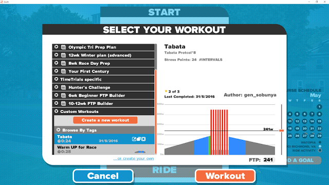
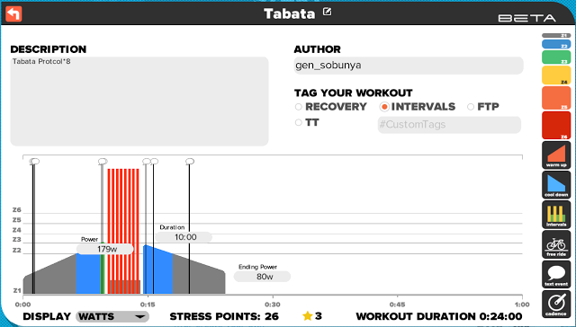
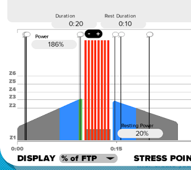
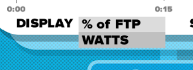
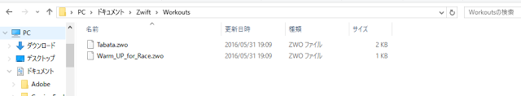

### ワークアウトエディタ

Zwift のワークアウト機能では、自分でオリジナルメニューを作成することも出来る。

デフォルト状態で大量のメニューが用意されていることが Zwift の良いところなので、必ずしも使う必要はないのだが、自分でメニューを決めたいパワートレーニング上級者には嬉しい機能だ。

ワークアウトエディタで現状できることは以下の通り。

1. メニューのパワー値・時間・インターバルタイム・ケイデンス指定
2. ワークアウト中メッセージ表示
3. ウォームアップ・クールダウンの自動設定
4. ワークアウトファイルの書き出し
5. パワー値メニューの FTP 比変換

### 操作説明

操作は直感的でそこまで難しくはない。

基本的には右の部分から実施したいパワーゾーンをドラッグ＆ドロップで左のエリアに持ってくるだけでメニューがどんどん組み上がる。

持続時間やパワー値は、クリックすると修正することができる。

ウォームアップ・クールダウンは「開始パワー」「終了パワー」、インターバルは「回数」「メニュー時パワー」「レスト時パワー」「メニュー時間」「レスト時間」を指定可能。

指定項目さえ入力すれば、あとは良いように設定してくれる。

ケイデンスだけは例外で、右のケイデンスボックスを既に設定されている区間に重なるようにドラッグ＆ドロップするとケイデンスが設定可能となる。

テキスト表示は表示開始時間と表示するメッセージの入力（制限がきつい）が可能。表示時間はいじれない模様。

設定を変更しなければ、W 数ベースをメニューを組むことになるが、**実は「自分の FTP 比」でメニューが記録されている。**左下の&#8221;DISPLAY&#8221;のプルダウンで FTP%表示に変更可能。

作ったワークアウトは &#8220;My documentZwiftWorkouts&#8221;内に.zwo でメニューごとに保存される。

他人が作った zwo ファイルでも、このフォルダ内に置けば Zwift 起動時に読み込んでくれるはず（試していない）。

前述の通り、FTP 比で記録されているので、他人でも簡単に流用できる。

この機能を使えば、パワートレーニングに詳しい人が作ったメニューを仲間内で簡単に試せる。

今回作った Tabata と、レース前のウォームアップメニューをアップロードしたので、好きに使ってみて欲しい。

- [Tabata](/zwift_workout/Tabata.zwo)
- [レース前ワークアウト](/zwift_workout/Warm_UP_for_Race.zwo)

<LinkBox isAmazonLink url="https://www.amazon.co.jp/dp/B00J87AN1M/" />
