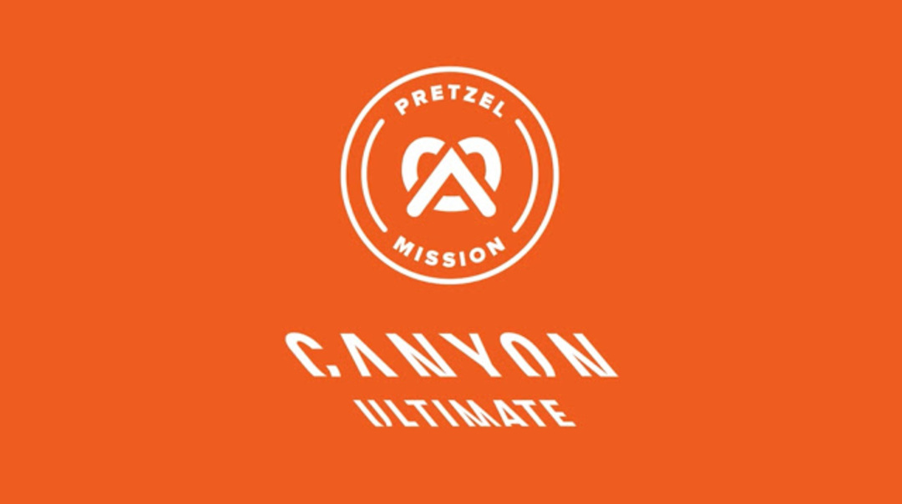
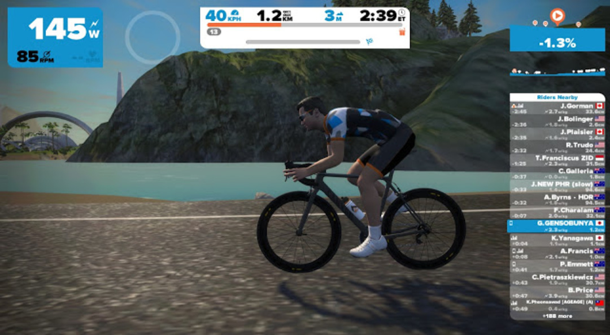
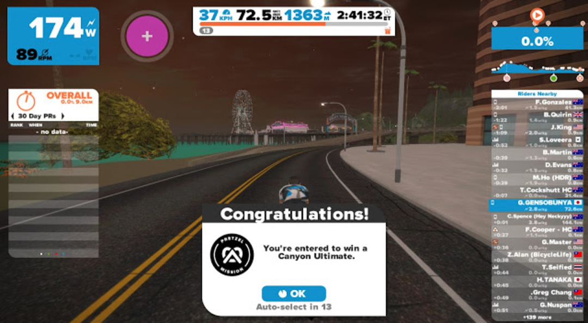

### 走るだけで最高グレードの完成車が！

<a
  href="https://www.facebook.com/gozwiftjp/videos/1560064750963064/"
  target="_blank"
>
  Zwift で特定のコースを完走すれば Canyon の Ultimate CF SLX8.0 が手に入る
</a>
と聞いて早速チャレンジしてみた。

### Pretzel とは？

Zwift のバーチャルコースである、Watopia の全ルートを順行・逆行全て走破する 72km のコース。

コースは複数分岐しているので、一筆書きの要領で全コースを走ると走行ログがプレッツェル（お菓子の名前）のようになることが由来だと思われる。

実際のログは上記のとおりだが、ギリギリでそう見えなくもない。

ちなみに、獲得標高はバーチャルとはいえ 1300m を越えるハードなコース。

2 時間半くらいか？と当たりをつけたが結局 2 時間 40 分かかってしまった。

### 参加方法

ログイン後、ワークアウト選択画面の脇にチャレンジを選択する画面が出てくる。

抽選に関する規定に同意すれば自動的にコースがセットされるのでそのまま RIDE ON!

※当然世界選手権コースでは選択できないので注意

ちなみに、チャレンジ中は Zwift 内で Ultimate に乗ることができる。

チャレンジの進捗状況は上部の経験値バーの下にゴールまでの割合を表示する部分があるので、残りの距離が視覚的にわかるようになっている。

ワークアウトとは違って、ログアウトさえしなければいくらでも休憩できるので耐えぬく精神力さえあれば完走はそう難しくはない。

ゴールすると、権利を得た旨の表示が出てくる。

ローラーマニアの人はご存知かと思うが、同じコースプロファイルで実走行は問題なくとも、ローラー上ではケツが悲鳴を上げる。

くれぐれも休憩をしっかりとって参加しよう。

<LinkBox isAmazonLink url="https://www.amazon.co.jp/dp/B00JJH2ISW/" />
