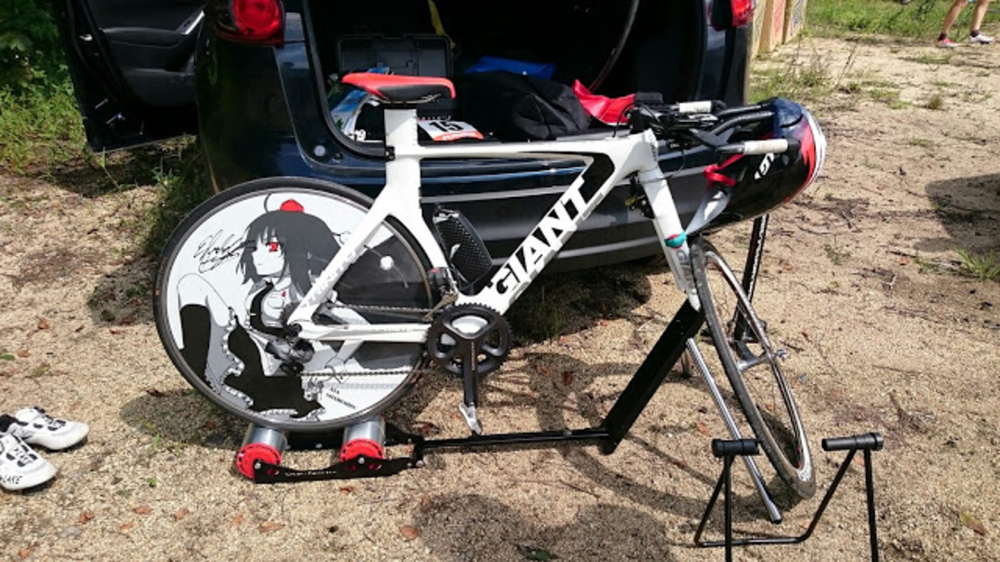

### ローラーの選択基準

固定ローラー、3 本ローラー、最近流行りのハイブリッド型やダイレクトドライブ型、ダンシング可能なキネティックや GROW TAC の 4 本ローラーなど様々なローラーが世の中に出てくるようになりました。

昔は「脚力アップなら固定」「スキルアップに 3 本」で区分されていましたが、今はスマートローラーやハイブリッド型を始め、「トレーニングとしての＋ α」や「折りたたみやすさ」「自転車への負担の軽さ」「静かさ」なども評価軸に上がってきます。

そして、昨今のディスクロード化や、シクロクロスの流行で新しく出てきた問題点がエンド幅です。リアハブ軸を固定する固定ローラーはもちろん、ダイレクトドライブ型やハイブリッド型でも問題になってきます。

### FEEDBACK Sports Portable trainer

今年中にディスクロードの切り替えを検討する中で、ローラーも冒頭の<a href="http://sim-works.com/sportcrafters" target="_blank" rel="noopener">Omnium Trainer</a>から FEEDBACK Sports の[FEEDBACK SPORTS Portable Trainer][1]に変更しました。

元々 Omnium Trainer を選んだ理由は「持ち運び時・展開時のコンパクトさ」でした。

シクロクロスで何度も遠征をするので、大きな荷物になるのは面倒だったことと、<a href="/2016/03/zwift.html" target="_blank" rel="noopener">以前の記事で紹介した</a>ようにより Zwift にハマるためのツールとしての選択です。

結果的に、固定ローラーや負荷付き 3 本ローラーを遥かに上回る静粛性を手に入れられたのでかなり満足の行く買い物でした。

当時はミノウラのハイブリッドローラーもありませんでしたしね。

切り替えのきっかけは、ディスクロードの規格です。

公式には 9mmQR のみの対応で、現物合わせで 15mm スルーアクスルでの利用が可能なことは確認していましたが、ディスクロードの主流となった 12mm スルーアクスルに Omnium では対応しきれる自信がありませんでした。

[MINOURA ハイブリッドローラー][2]も検討しましたが、負荷装置の音が大きすぎることと、リモート操作ユニットのせいで持ち運びが煩雑になるのでボツとしました。

Omnium→Portable の切り替えで変わった点は大きく 2 つ。

フォークマウント部の構造と脚の展開方法です。ローラー構造は、Omunium のパテントを使って作っているため完全に一緒。

メンテスタンドで培った複数のエンド幅に耐えられる構造を採用しているため、QR/12mmTA/15mmTA に対応可能です。

殆どの自転車はこれでバッチリ。Boost 規格採用の MTB は知りませんが…

脚はねじ込み作業が必要だったものから、折りたたみ式に変更されたので大幅に組み立て時間が短縮しました。これも遠征が多い身としては嬉しい点。

逆に、Omuium の利点として、専用パーツをほぼ使わずにホームセンターで利用するような汎用品で構成されていることが挙げられます。ローラー部以外はほぼ DIY で修理可能かと思われます。

また、若干ですが Omunium のほうがコンパクトに利用することができます。Portable は脚のパーツが大きいので、Zwift をするときのモニター距離は遠くなりました。

走行感はほぼ同じです。

脚がしっかりしている分 Portable のほうが若干軋む感覚が少ない程度。

持ち運び時には大きなツールボックスと同等レベルのサイズまで小さくなるので、車の中でも場所を取りません。

走行音も静かですので、家の中でも遠征先でも使う忙しいレーサーには非常におすすめです。

<LinkBox isAmazonLink url="https://www.amazon.co.jp/dp/B01AHXWAOI/" />

[1]: http://www.amazon.co.jp/gp/product/B01AHXWAOI/ref=as_li_ss_tl?ie=UTF8&camp=247&creative=7399&creativeASIN=B01AHXWAOI&linkCode=as2&tag=gensobunya-22
[2]: http://www.amazon.co.jp/gp/product/B0147VWKDW/ref=as_li_ss_tl?ie=UTF8&camp=247&creative=7399&creativeASIN=B0147VWKDW&linkCode=as2&tag=gensobunya-22
