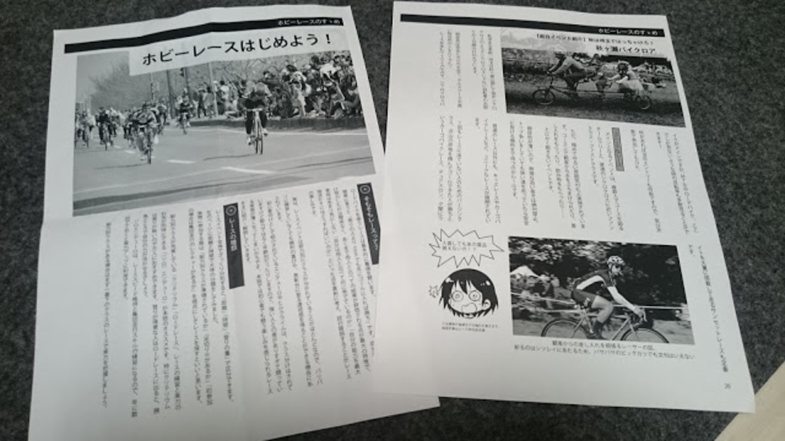
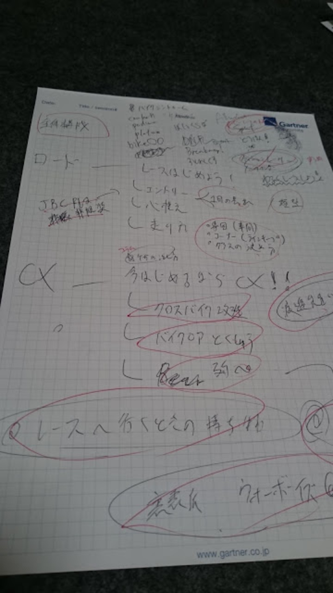
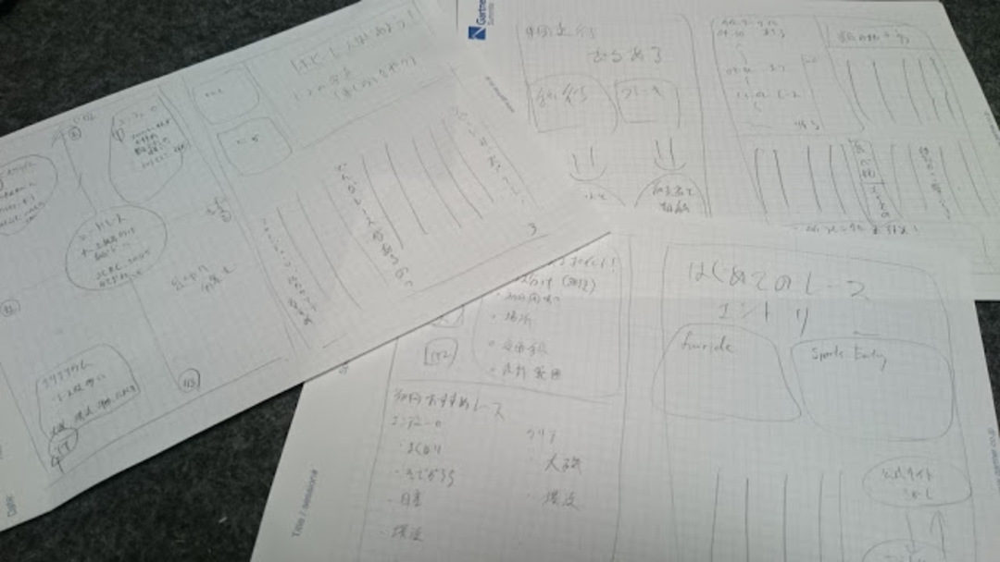
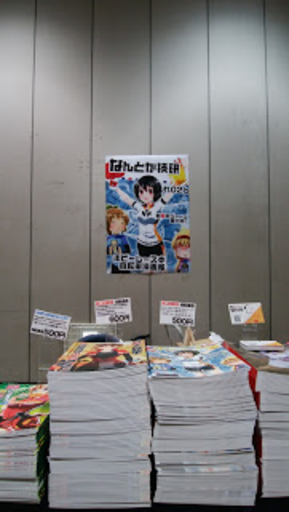

<h3 style="clear: both; text-align: left;">
  初めての同人誌、初めてのサークル参加
</h3>

コミックマーケット 90 に自転車レース同人誌「ホビーレースのすゝめ」を作って参加した。

元々は、「自転車ブームから定着した人がこれだけいるのに世の中にロングライド系同人誌しか存在しない！もう俺が作る！」という思いから出発し、たくさんの人の手を借りて無事頒布にこぎつけた。

あまりレースに参加しない人に向けて、レース探しからエントリー、当日の動き方をはじめとして、レース特有の「ラインキープ」などの単語解説と簡単な戦略指南をまとめている。

前半は「How to ロードレース」、後半はひたすらシクロクロスの楽しさを綴った。

ちなみに COMIC ZIN で絶賛委託販売中なので、コミケに参加せずとも入手可能。気になったら是非注文して欲しい。

<LinkBox url="http://shop.comiczin.jp/products/detail.php?product_id=28903" />

備忘録的な意味も込めて、漫画ではない雑誌体（評論島系）の同人誌作成方法を紹介する。

あくまで自分が体当たり的に作った際の記録なので完全に我流。コミケの申し込みは割愛。

### テーマ作り

「同人誌を作ろう！」と思った時点で、自分の中で強く発信したいことがあるのは間違いないだろう。逆に、これがないなら作るのはやめたほうがいい。作った本で訴えたいことは最初に決めておけば、後々細かい表現や添削で迷った時の指針になるのでテーマは最初にきっちり決めておく。

自分の場合は「ホビーレースの楽しさ、競い合う楽しさをもっと知って参加してもらう」という点にフォーカスして、レース未経験者もしくはチームでエンデューロに出た程度の「他人と競う」という経験が少ない人をメインのターゲット層として設定した。

ちなみに、ここで印刷数の上限がほぼ決定すると言っていい。

ついでに印刷所のホームページに行き、早割の〆切を確認して、以後のステップに関してスケジュールを立てよう。

### プロット作り

いわゆる「章立て」の段階。

テーマがいかに優れていても、表現がボロボロだと台無しになってしまう。先立って決めたテーマとターゲット層に対して「どういった順番」で「何を」説明するか、ここで決める。

見ての通り流動的作業なので、メモ用紙にガリガリ書いている。この段階でタイトルも決定した。

### ページ設計

章立てが決まった次は、ページレイアウトを決めた。

テーマごとに何ページ使うか、写真や図解をどのように配置するか。これらを使うならどんなイメージの写真や図になるのか、この時点で全部決める。

これもメモ帳に手書きでサラサラと書きながら、章ごとのボリュームや言葉だけでは伝わらない部分をどう表現するか決めていく。ここで大まかなページ数が決まってくる。

大体同人誌は 30p 前後で 500 円が相場である。100p を越えるようなシクロポリス・ロングライダースのような&#8221;厚い薄い本&#8221;だとまた変わってくるが、個人で全て執筆するなら 30~50p 程度が限界だろう…

### 本文制作

ここまで決めた設計に従って、ひたすら本文を書き綴る。

特に難しいツールは使わず、みんな大好きサクラエディタでゴリゴリ本文執筆。

ある程度本文が出来上がったら、文字数の感覚を見るため実際のページテンプレートを作成して、1 ページあたりにどれくらいの文字数を書けばいいのか把握する。

幸い、ジャージをデザインするのに Illustrator CS6 を購入していたのでソフトに苦労はしなかった。基本的に入稿は Adobe 系ソフト（Photoshop,Illustrator,InDesign）などが減速だが、どの印刷所も Word でつくった PDF などに対応してくれているので、持っていなくてもなんとかなる。

「トンボ」や「塗り足し」を含む、原稿ファイルの作り方については印刷所によって微妙に差異があるので該当 WEB サイトの解説を良く読もう。

原稿用語や安い印刷所についてはググればいくらでも出てくるので割愛。なお料金が安いところは自分で完全な状態の入稿ファイルであることを保証する必要があるので注意（校正はやってくれない）。

テンプレートは、開いた時の左右ページで別々に作る。本の「ノド」と上下左右の余白を取って、ページ数の入力場所を取る。

組み方は自転車同人誌によくある 3 段縦組みにした。基本フォントサイズは 10pt だったが、もう少し小さくてもよかったかもしれないし、上下の余白はもっと取るべきだった。ちなみに同人誌のデファクトスタンダードサイズは B5 である。

これさえ最初に作っておけば、本文はテキストエディタからコピペで流し込める。らくちん！

写真をモノクロ加工したり、文字倍率を調整したり、文字の回り込みを設定したり刷る必要があるが、Illustrator の使い方紹介ページを見たほうが詳しいのでこれも割愛。

表紙は別ファイルできっちり凝ったものを作る。今回は表紙を外部委託したが、自分で作るなら先に作るべき。詳しくは入稿で。

### 入稿

決めた印刷所のルールに従って原稿を作ったら、部数を決めて入稿する。

表紙だけ安い印刷所で印刷し、本文をモノクロ印刷で頼むと表紙と本文を同じ印刷所で頼むより安くしたりできるが、事務作業は複雑化する。

また、早割は絶対の正義なので絶対に〆切は守る。2 割引・3 割引が普通の世界なので、損益分岐点に大きく影響する。弱小サークルでも出費は少ないほうが嬉しいにきまっている。

〆切絶対！

「最初は二桁」という先人の有り難い言葉もあるが。完売して赤字という事態を避けたかったので、私は余ることを前提にﾋﾟｰｰ冊刷った。

ちなみに当然のように余りました、ZIN が委託を受けてくれて助かった。

配送先にコミケのスペースを指定すると、当日自分のスペースに出来上がった本が置かれているので非常に便利。

### 宣伝・頒布当日

初参加にはありえん部数を刷ったので、当日までひたすら宣伝する。WEB カタログはこまめに更新し、Twitter は連日スペースの宣伝と進捗ツイートで埋まる。フォロワーの方すみませんでした。

初参加のくせに運だけで壁スペースをゲットしたので、表紙を流用して A0 サイズのポスターもノリで作った。3000 円くらいでかなり目立つことができるので非常にお得。

兎にも角にも知ってもらわないと始まらないので、宣伝が超重要。

特設サイトと WEB カタログと SNS。ネットの知り合いには全員告知。

当日は余裕が無いのでずっと自スペースに張り付き。お釣りと水分と食料を忘れずに。

宣伝が功を奏したのか、思ったより多くの方に手にとってもらうことができた。

完売こそしなかったものの、満足する売れ行きであっという間に当日を終える。フラッと寄って試し読みして買っていく人、宣伝を見て購入を決めていたであろう人、裏表紙に衝撃を受けて買っていく人、色々なパターンがあったが自分が制作したものの価値を認めてもらえているという実感が疲れをふっ飛ばしてくれた。

残った本は ZIN に送ってコミケ当日は終了。焼肉食って、新幹線乗って、泥のように寝た。

翌日は仕事だった。つらい。

<LinkBox isAmazonLink url="https://www.amazon.co.jp/dp/4837308058/" />
