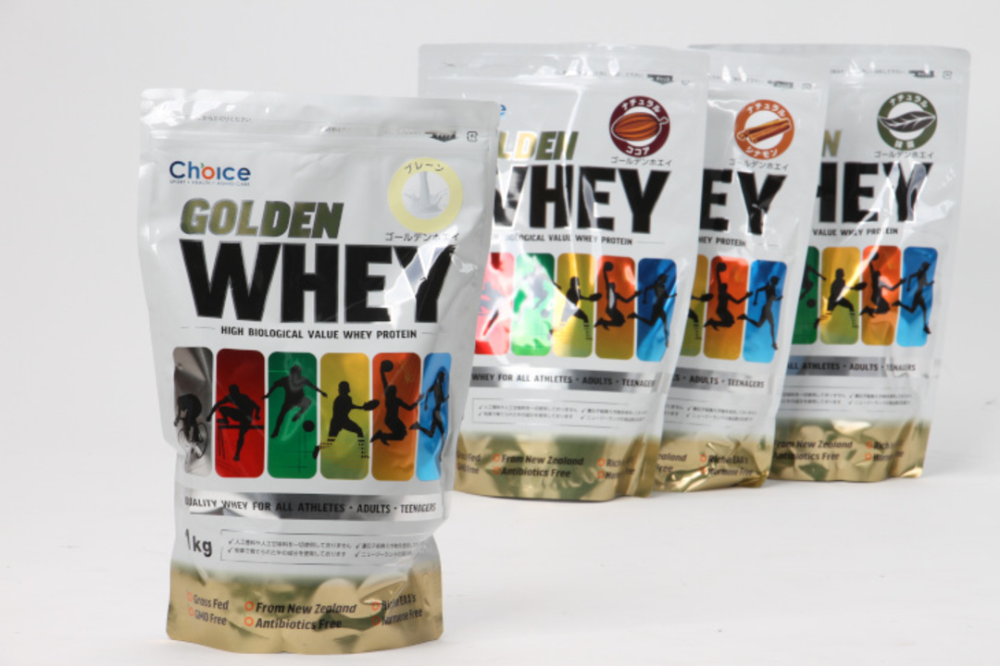
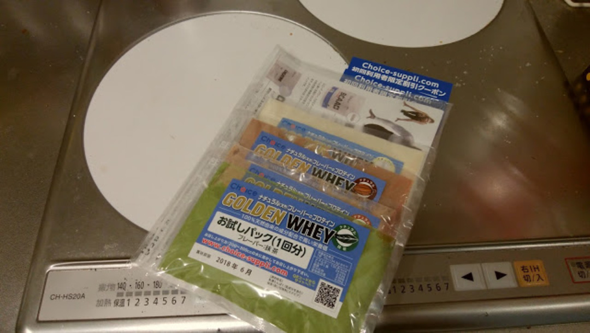
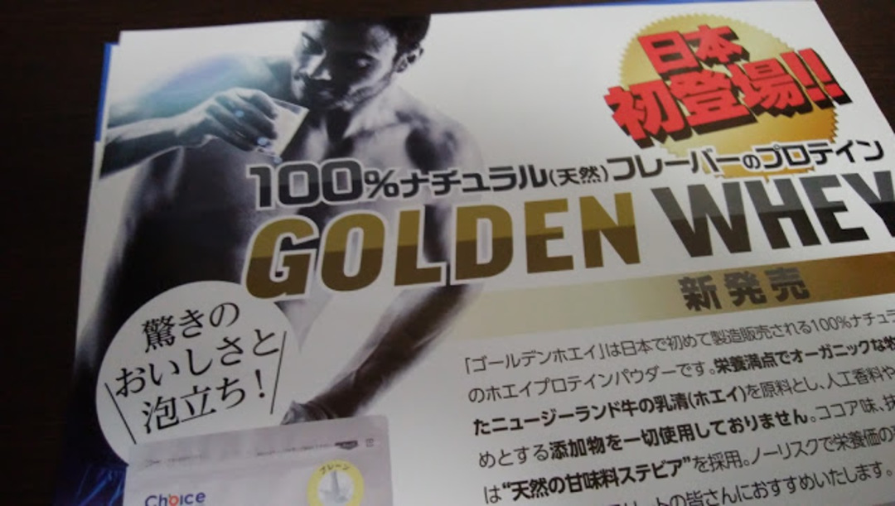

### 天然由来のプロテイン

<a href="https://www.cyclowired.jp/lifenews/node/203989" target="_blank">
  cyclowired で紹介されていた
</a>
人工甘味料不使用のプロテインが、お試し分は送料のみ(600 円)で手に入るということだったので、早速ポチってみた。

注文してから 4 日ほどで到着。
フレーバーは抹茶・シナモン・プレーン・ココアの 4 種類。
割引クーポンも付いてきた。

気になるタンパク質含有率プレーンが約 80％、他は抹茶 74%、ココア 72%、最低のシナモン 65%と続く。
値段は変わらないので、この時点でシナモンは買わなくていいかと思われる。

おおよそ大抵のプロテインは甘味料としてアスパルテーム（人工甘味料）を利用しているが、CHOICE のプロテインは天然甘味料のステビアを利用しているとのこと。  
ちなみにステビアは本来植物の名前で、それから精製した甘味料のことも同じくステビアと呼ばれている。天然由来素材しか使っていないので健康的だという売り文句にはちょっと物申したい部分もあるが、本題ではないので触れないでおく。  
美味くてタンパク質が効率的に摂れれば文句はないので。

普段使っているソイプロテインと違って今回はホエイプロテイン。  
プロテインの基礎知識は<a href="/2016/02/blog-post.html" target="_blank">こちらの記事</a>で説明しているので気になる方はどうぞ。

「驚きのおいしさと泡立ち！」とあるが個人的には泡立ちは少ないほうが嬉しい…

### インプレ

珍しい抹茶味からためしてみることに。

パッケージを開けると粉が非常にさらさらしていることに気がつく。
水 300ml とシェイクすると、一瞬で全て溶けていく。同時にシェイカーいっぱいの泡が…

泡立ちはともかく、溶けやすいのは好印象。

口当たりよし！…後味悪し！

砂糖じゃない変な甘さが口の中に残る…  
次にプレーン味を飲む。

普通に飲める、後味もすっきり残らない感じ。

溶けやすさもタンパク質含有量も優秀なので、プレーン味はおすすめできるかもしれない。

しかし明らかにフレーバー付きよりプレーン味のほうが美味しい。  
今使っている<a href="http://amzn.to/2ceAC4l" target="_blank">ソイプロ</a>も大豆の味がすることを除けば後味はさっぱりすっきりだ。

### プロテインを不味くする元凶は甘味料？

「プロテインは銘柄を選ばないと不味い」

古今東西よく言われるセリフである。  
そのために「どこそこのチョコ味はおいしい」「輸入品は甘さが強くてマシ」など色々な意見交換が行われている。

メーカー各社も色々なフレーバーを付けて、飲みやすさを競っている。  
しかし、プロテインはローカロリーでのタンパク質摂取が本来の目的、味のために砂糖をドバドバ入れては意味がなく、結局砂糖以外の甘味料を使うことになる。  
色んなプロテインを飲んできたが、プレーン味は味の起伏が無い代わりに後味すっきりで後を引かない。

しかし、DNS も SAVAS も Optimum も Champion も今回の CHOICE もフレーバー付きのプロテインは変な後味から逃れられない。

おそらく、皆さん揃って使用している甘味料の仕業である。  
プロテイン以外のローカロリー食品は可能な限り砂糖での味付けに近くなるよう工夫されているが、プロテインはまだまだその域には達していない。正直、プレーン味のほうがマシである。

不味いプロテインを飲みやすくするために甘みをつけているのにそのせいでまずく感じてしまう悪循環。

そんなわけで今後は基本的にプレーン味のプロテインを買っていこうと思う。  
プレーン味はタンパク質含有量も多くなるので、一石二鳥である。

<LinkBox isAmazonLink url="https://www.amazon.co.jp/dp/B004MWQUZG/" />
