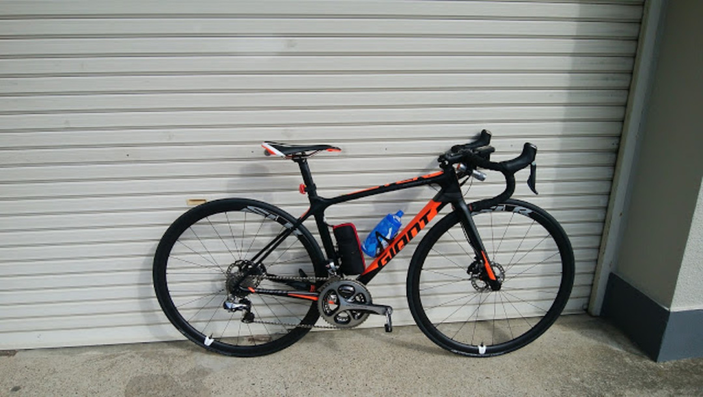

### GIANT さんはとんでもないバイクを作っていきました

<a href="/2016/10/tcr-advanced-pro-disc.html" target="_blank">
  前回の納車記事
</a>
の続きです。

箕面から高山に抜けるいつものコースでシェイクダウン。シクロワイヤードにインプレ記事の先を越された…

比較対象はKOGA Solacio ＋ WH-9000-C50TU(or WH-6800)です。

コンポは9070でレバー以外同じ。

車重は大きく変わりませんが、フレームとホイールが軽くなりレバーとハブ周辺が重くなったのでゼロスタートや登りでの加速感が段違い。

加えて、エンデュランスモデル → レーシングモデルへの変更もあって入力がロス無く推進力に変わっている感覚があります。

以前はパワーを掛けるとワンテンポ遅れてスピードがググっとあがる感覚だったこともあって加速するのが面倒に感じていましたが、こいつはバイクが「もっと踏め」と語りかけてくるような錯覚があります。

「速く走っている」感覚になるバイクなのですが、実際に60kmで7セグメントの自己記録を更新できたのでタイム上もいい具合です（効果には個人差が有ります）

乗り心地はチューブレスということもあって悪くないです。

スルーアクスルによる剛性UPの影響で振動減衰性の低いディスクロードもあるようですがこいつはそんなことは感じません。

下りでも路面に弾かれること無く、GIANT特有のヘッド周りの剛性とジオメトリから来る切れ込みの良さで気持ちよく走れます。

ただ、スポーク数の問題なのかハイスピード域の伸びはイマイチの模様。

リムハイトが高くて、せめて20Hのフロントホイールを使いたいところ。

### 油圧コンポの真髄

フレームとホイールはこれくらいにして、油圧ディスクブレーキの感想へ。

タイヤがロード用なので、リムブレーキに比べてフルブレーキ時の減速が速いなんてことはないのですが、コントロール性が格段に向上しています。

コーナーでは確実に思った通りのスピードで侵入できます。

カックンブレーキということもなくロードらしいブレーキタッチ。Movementで調整してもらいました。

雨上がりだったので濡れた路面をかなり走ったのですが、リムに水がついて制動力が下がったり、砂を挟み込まないのも大きなポイント。雨が降ってこない限りドライと同じ感覚で走れます。

手が小さい自分には、ワイヤーと違って再調整なしにレバーのリーチを独立して変更できるのも大きなメリット。

ただ、今までスプリンタースイッチ愛用していたのがST-R785への変更に伴い使用不可となったので、下ハンドル時のシフトチェンジはやや面倒に。これはR9170かR8070（仮）への乗り換えが必要。

油圧のデメリットは調整できる店を選ぶことくらいでしょう。

### まとめ

来年度のJCFがディスクロードになんと言うかわかりませんが、レースでもツーリングでも油圧Di2に対して性能的に勝るものはないんじゃない？という印象です。

パッケージとしてもカーボンホイールまでついて50万なので文句なし！

<Amzn asin="B00VHJLCWS" />
