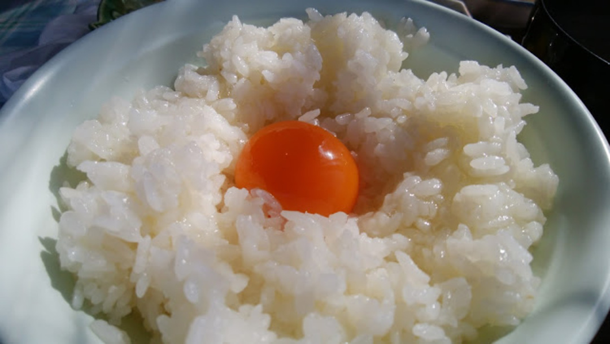
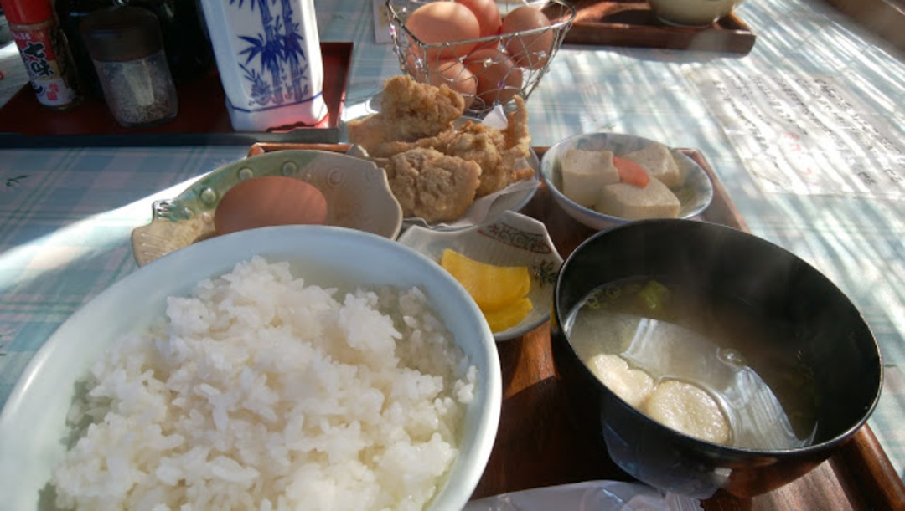

### What&#8217;s your TKG style?

卵かけご飯はどのようにして作っていますか？

小鉢で黄身と白身を混ぜ合わせて投入？そのままご飯にかけて混ぜ合わせる？

醤油はいつ入れる？小鉢で混ぜるとき？ご飯に落として黄身を割る前なのか？後なのか？

日本人なら誰もが知っている卵かけご飯だが、個人の流儀によって作り方は様々だと思う。

先日のツーリング時に「究極の卵かけご飯の作り方」なるものを学んだので紹介したい。

### 卵かけご飯専門

会場は大阪北部の山を登り、京都に抜けたすぐそこにある「弁天の里」

地鶏の卵かけご飯専門。

ついでにサイドメニューとして唐揚げも食べることも出来る。

なんと卵かけ放題！！！！！

だが、ご飯のおかわりは有料。商売上手である。

卵かけご飯定食並（450円）＋唐揚げ（150円）

唐揚げは別に無くてもいいので、450円でこの本格日本の朝ごはんが食べられる。

卵かけ放題で。

我が家の場合、ジュース1杯で走り始めてここで朝食を取ればばっちりの距離なのでここを起点に山岳ツーリングを楽しめる。

### 究極 TKG の作り方

ここで支持されている作り方はこうだ。

1. 白身だけをご飯に投入して混ぜ合わせる
2. ご飯の真ん中をくぼませて黄身を入れる
3. 黄身を割り、お好みの醤油をかける

以上である。

重要なのは1の段階で、白身を綺麗に分離する必要があるが、料理の心得があれば特に問題はない。白いご飯に白身が絡み合い、さながら宝石のような輝きを持ったところの中央に新鮮で張りのある黄身を投入。

すると冒頭のように魅力あふれるTKGの出来上がりというわけだ。

順番で味が変わるかどうかは半信半疑だったが、食べた瞬間、怒涛のような黄身の風味が口の中に広がった。

白身と直接混ぜないことで、本来の風味が損なわれることなくダイレクトに味わうことができるようだ…恐るべし究極のたまごかけごはん。

ちなみにこの店では「卵かけご飯用醤油」の他に「山椒醤油」「にんにく醤油」が準備されている。

自分の好みはにんにく醤油。朝の胃とあいまって食欲を無限に高めてくれる最高の相棒だ。

ちなみに家で上記の作り方を再現しても、普通の卵かけご飯とは違った味になることを報告しておく。

流石に新鮮高級卵と同じ味とはいかないが、ちょっとした工夫で朝ごはんが美味しくなるのであれば大歓迎だ。

<Amzn asin="B006GLLSK8">
