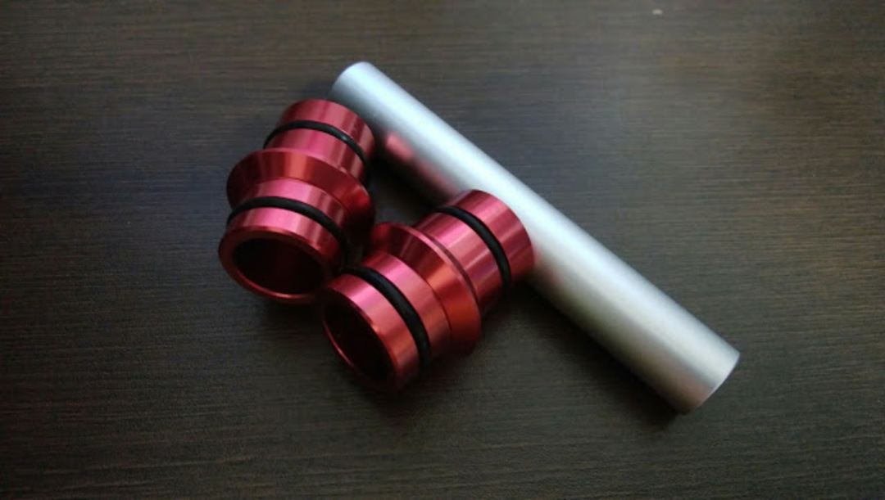
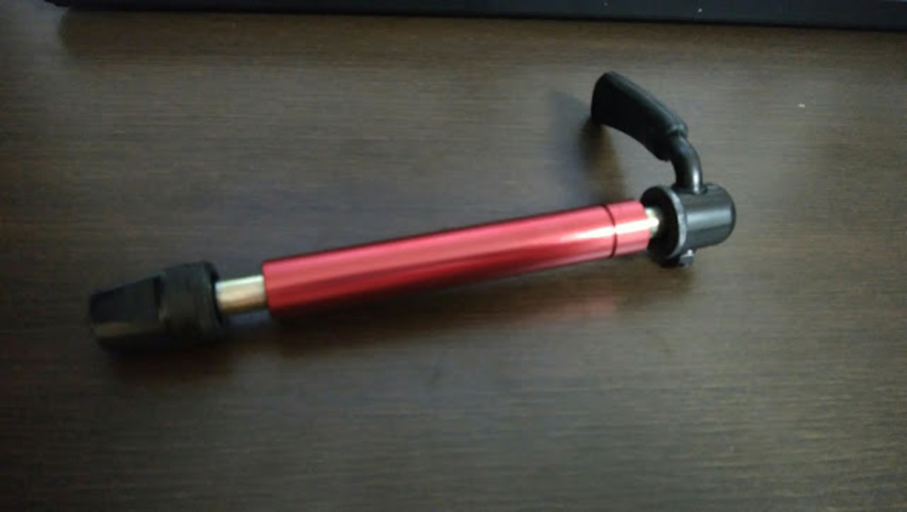
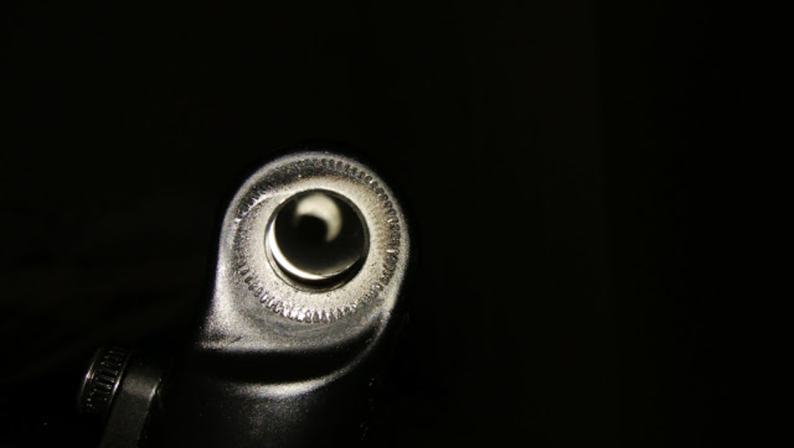
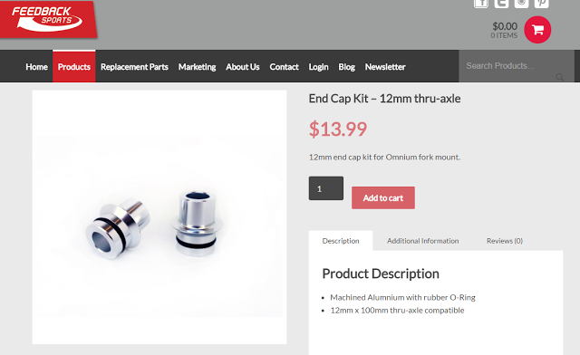
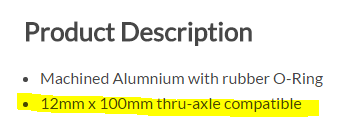
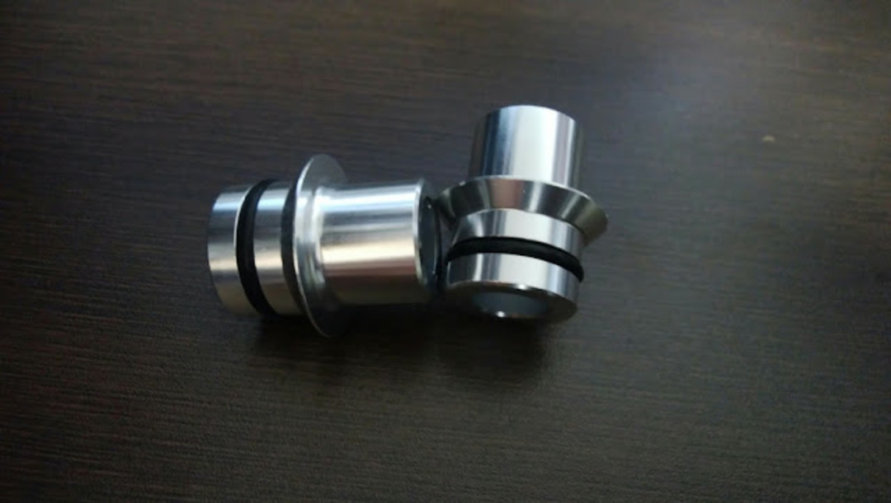
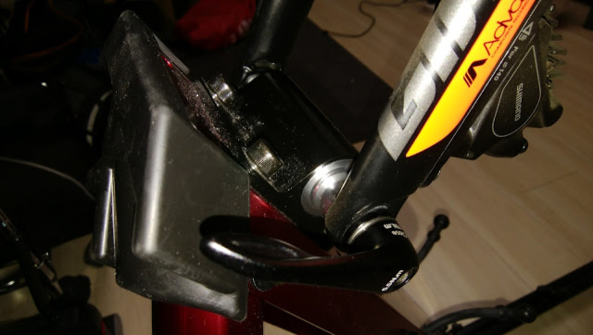

### 万能ローラー！のはずが…

Omniumu Trainerを持っていたが、シクロクロスのフォーク多様化やディスクロードを見据えてFeedBack Sportsの<a href="/2016/07/blog-post.html" target="_blank" rel="noopener">Portable Trainerに乗り換えた</a>。

公称では、9mmクイック/100x12mmTA/100x15mmTA/110x15mmTAに対応しているので、DHバイク以外ならなんでも使える超万能ローラーとなる…はずだった。

問題の発覚は、ロードバイクをTCR ADVANCED PRO DISCに乗り換えてシェイクダウンも終え、意気揚々とZwiftを始めようと思った時。

12mmスルーアクスル仕様への組み換えは、9mmクイック用に使っているインナースペーサーを（下図）を冒頭の銀色スペーサーへ置き換えること。

これで15mmスルーアクスルと同じハブ外径で（ココ重要）中のスペースが12mm軸となる。

しかし、アクスルが通らない。

銀色のスペーサーの精度が悪くて12m m軸が通らないのかと思ったが、単体ではアクスルがちゃんと貫通する。

アダプタ部分だけをフォークに当ててみてよーく観察したら問題が発覚。

…芯がズレてる！！！！

これじゃアクスル通るはずありませんね。

15mmアクスル用の状態でシャフトを通すことはできるけれど、本来アクスルとフォークが接する部分ではない箇所に力がかかるので使用はとりやめ。

TCRの12mmスルーアクスル用ホイールと、ローラーのアダプタを見比べて「15mmスルーアクスルと12mmスルーアクスルはハブ側の外径が違う」ということがわかった。

### 悪いのはどっち？

現時点では、GIANTのフォークが独自規格なのか、それともFeedback Sportsのアダプタが仕様を理解せずにノリで作ったのかわからない。

これによってGIANTとFeedBackどちらに話をもっていくかが変わってくる。

ウンウン唸りながら、ディスクロード先進地域の欧米にノウハウが無いかググりまくる。

そうしたら<a href="https://www.feedbacksports.com/product/end-cap-kit-12mm-thru-axle/" target="_blank" rel="noopener">こんなページ</a>が…

ん？

こいつ…シレッと対策品出してやがる！！！！！！！！

（当初の棒みたいな12mmスペーサーも複数言語説明書に記載してある公式品です）

このページを見つけた5分後に

「Heyフィードバックさん、12mmTA対応って書いてあるから買ったPortableTrainerなんだけど俺のTCRで付属してたアダプタ使ってもうまく取り付けできないんですよ。んでWEBサイトよく見たらこんなパーツ出してるじゃねーか、適当なアダプタ作っちゃったのわかってるならさっさと代替品としてそれよこせや、もちろん保証期間内だからタダだよな？（意訳）」

というメールを発射。

翌日には「オッケー分かった分かった、台湾から代理店経由で送るよ、よろしくな」という返信を頂いたので一件落着。対応は速い、素晴らしい。

届いたパーツがこちら。キレイなシルバー。

取り付けもバッチリ、付属の12mmアクスルで完了した。

滑らかに入っていく精度は流石の一言（GIANTもFeedbackも）

というわけで12mmスルーアクスル（最近のCXやディスクロード）でPortableTrainerを使う際は気をつけましょう。

15mmモードで無理矢理運用すると、フォーク先端の穴下部に荷重がかかるので下手したらフォークが逝くかもしれない…泣くに泣けないのでちゃんと対策品を使いましょうね。

【追記】

この製品、最近になって（12mmアクスルが普及するにあたって）問題点が発覚したので、部品は順次ランニングチェンジしているそうです。

このアダプタは既存ユーザーにはUS、US以外を問わず順次無料配布されるそうです。

この件をTwitterに投稿してたら丁寧にセールスマネージャーより補足がきました。

その他の問題についてもまずは代理店に相談すれば問題点には迅速に対応するとのこと。

安心のアフターサービスですね。

<LinkBox isAmazonLink url="https://www.amazon.co.jp/dp/B01DNU5B0C/" />
