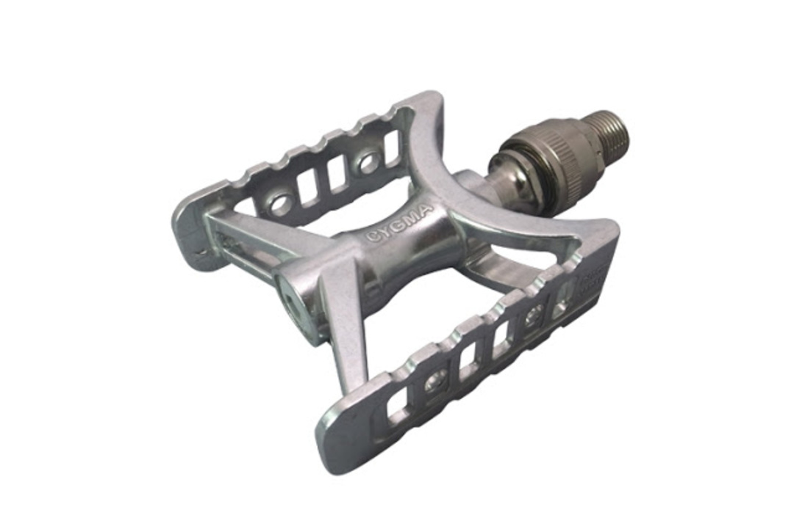

### 年末の恒例行事といえば？

最近、年末になると知り合いがコソコソと話をはじめるのがふるさと納税の話。

地方自治体に寄付をすることで所得税と住民税を実質お得にしようというヤツ。

制度の趣旨から肉・酒・海鮮などご当地モノがメインとなっている。

普段口にしない高級食材やクラフトビールに舌鼓を打つのも一興だが、自転車乗りを含むアウトドア趣味を持った人間には食べ物以外にもお得な返礼品が揃っているので、いくつか紹介したい。

### ペダル祭り

{" "}

まずは埼玉県所沢市の三ヶ島ペダル。

地味なメーカーだが回転の良さと、工具無しで取り外すことができるEzyペダルには定評がある。

寄付額は10000/15000/25000円で別れており、それぞれ<a href="https://www.amazon.co.jp/dp/B001F2WTLU/gensobunya-22/ref=nosim/" target="_blank">LAMBDA</a>、<a href="http://www.amazon.co.jp/exec/obidos/ASIN/B00ME93CG4/gensobunya-22/ref=nosim/" target="_blank">PRIME SYLVAN TOURING</a>、<a href="http://www.amazon.co.jp/exec/obidos/ASIN/B00OOII5CO/" target="_blank">CYGMA Ezy</a>を返礼品としてもらうことが出来る。

特にシグマEzyは輪行時に威力を発揮するのでツーリング派は是非視野に入れて欲しい。

### モンベルポイント

{" "}

~~こいつがド本命。~~  
2018/09/15追記：ふるさと納税規制の結果、交換できる自治体が消滅した。残念。

テントなどをもらえる納税もあるが、概ね寄付額の50％＋ 1年の会員権を返礼品としてもらうことができる。

ありがとう<a href="http://www.furusato-tax.jp/japan/prefecture/20486" target="_blank">長野県小谷村</a>。

モンベル購入できるでオススメ品は、なんといってもヘリノックスのキャンプ道具。  
コンパクトで軽量で快適なので、レース会場では重宝する。

その他、コーヒーを淹れるための<a href="http://amzn.to/2fEOgkt" target="_blank">ジェットボイル</a>などもこれを機会に買って

<LinkBox isAmazonLink url="https://www.amazon.co.jp/dp/B00U72QEFQ/" />

また、シクロクロスシーズンでは待ち時間に冷え込むことが想定されるので、ウェアの上からダウンベストを着ている。

ユニクロとは違い圧倒的な保温性と折りたたみ性能となっている上、ベストなので出走直前にストレス無く脱ぐことが出来る。

<LinkBox isAmazonLink url="https://www.amazon.co.jp/dp/B00F68FLVO/" />

御存知の通り、モンベルは自転車製品も充実している。  
トゥーカバーなどの防風・防水製品類は本業の山岳ギアの性能が反映されていて非常にクオリティが高い。

最近流行りのバイクパッキングに最適なウルトラライトのキャンプギアも充実しているので、実によりどりみどりといった具合。  
ふるさと納税の控除上限は決まっているので、各自しっかり調べた上でうまく活用して良い自転車ライフを送ろう。

<LinkBox isAmazonLink url="https://www.amazon.co.jp/dp/B00INR93EQ/" />
