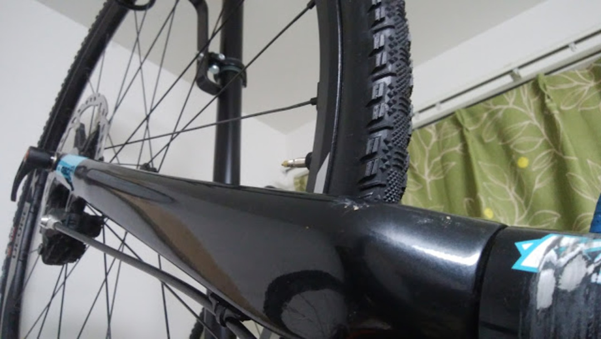
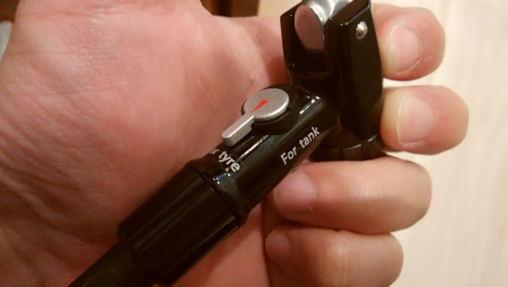

### ようやくやってきたチューブレス版シケイン

ついに待ち望んでいたサイドノブ＋センターセミスリックパターンのチューブレスタイヤが発売。

<LinkBox isAmazonLink url="https://www.amazon.co.jp/dp/B01M8LR2G6/" />

芝路面ではシラクサンドが圧倒的な速さを誇るが、コースが全て芝ということはなく、どこかでサイドグリップを求められる場面が出てくる。

ただシラクサンドでサイドグリップを出せるのはかなりの技術が必要、具体的には「面でグリップ」を理解して実行できるレベル。当然自分はムリ。

数回地面に脛をグリップさせて得た結論は「タイヤに頼ろう」なのですが、いかんせんセミスリック＋サイドノブという所謂Challengeのシケインパターンは各社出しておらず、完全な空白地帯。

満を持してMaxxisさんが出してくれました、ユーロバイクでの発表からずっと待ってたぜ。

国内発売即購入。

触っただけの感想だとサイドノブがおもったより高いのと、IRCシラクシリーズ比でサイドの剛性が高い感じですね。

### チューブレス「レディ」

唯一の心配はこいつがチューブレス、いわゆるUST規格ではないチューブレスレディであること。

今までのM785ホイール＋ IRCチューブレスの相性が最高だったので、少なくともこの組み合わせ以下であることは覚悟していました。（IRCはUST互換のチューブレス規格）

MTB乗ってる方はご存知だと思いますがUSTとチューブレスレディには深い深い溝があります。

ビード上がらない、タイヤ嵌まらない等々トラブルの元です、ハイ。

さて、手持ちのXTホイールとSpeedTerraneの相性は結論から言うとダメです。

簡単にホイールに嵌まるけどフロアポンプではスッカスカで全然ビード上がりません。

29erリムと700cリムはちょ～～～っとだけ規格が違うらしいのでそのせいですかね…

なので友人の体験談を元にビード上げるためのポンプを買うことに。

B○NTRAGERを始めとするフラッシュチャージャーより結構安い、LEZYNEもチューブレスタンク付きのポンプ出すみたいですね、どうせ高いでしょうが。

GIANTのチューブレスタンクもいい感じのお値段だったのですが、GIANTのやつは入り口が米式らしいので却下。

フラッシュチャージャーと違ってちゃんと表示がついてるのでわかりやすい。

タンクについてるレバーを倒すタイプはどっちが解放なのかわかりづらいんですよね…

ただしGF-94Tの欠点として、タンク容量が少ないためMTBタイヤのビード上げに使うのは厳しいかもしれない。CXタイヤのエアボリュームなら問題なし。

フロアポンプではダメダメだったMaxxisのタイヤもこちらを使ったらビードが2秒で上がりました、最高。

明日向山のコースで練習してくるので、タイヤそのもののインプレは明日アップします。

<LinkBox isAmazonLink url="https://www.amazon.co.jp/dp/B01JG277DA/" />
