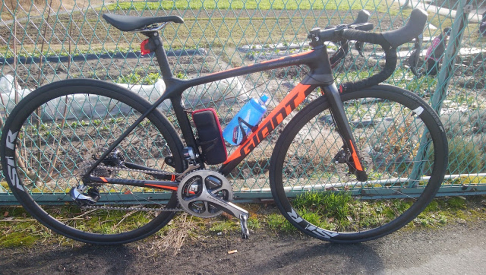
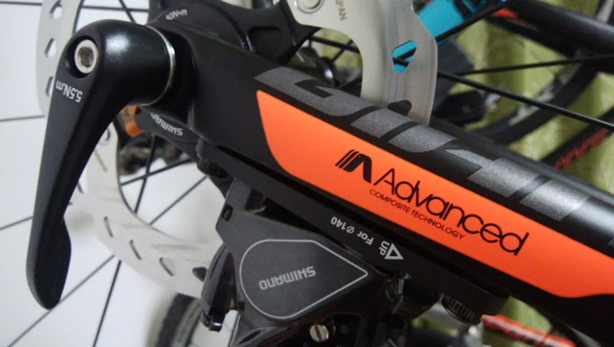
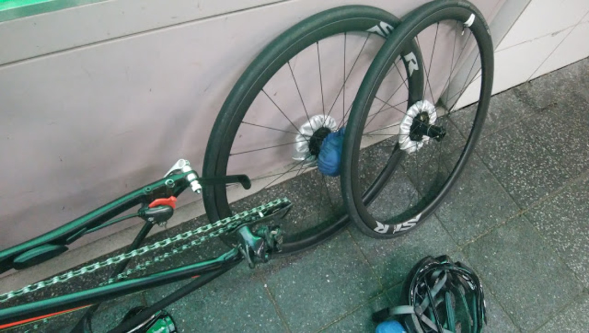
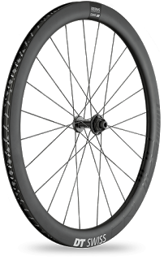
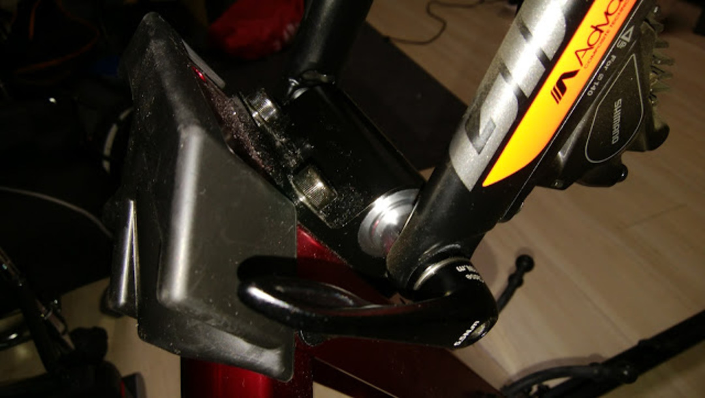

### ディスクロード元年説

昨年のロードシーズン終了後、ロードバイクを TCR ADVANCED PRO DISC に乗り換えた。

ディスクロードは 2015 年あたりから少しづつ噂や先進的なモデルが現れていたが、2017 年モデルになって「実質的な規格の統一」「レーシングバイクのディスクブレーキモデル登場」という大きな変化のある年になった。

9100 デュラエースの登場により、前後 12mm スルーアクスル・フラットマウントブレーキがデファクトスタンダードとなり、ローター径はメーカーによってやや差がでるものの、140mm が基本になっている。

※CANYON など一部メーカーは 160mm を完成車付属としている。

とはいえ、競技への浸透はまだこれからとなっていて、UCI レースで試験的運用が続けられており、国内のレースでも何故かディスクロード&#8221;だけ&#8221;締め出しをくらうホビーレースが多々存在するため、サーキットエンデューロくらいしか出場できない。

この辺は、なんとなく存在するディスクロードへの不信感が原因だと思うが、正直乗りこんでおらずイメージで語っている人が殆どだろう。

今年は新型アルテグラが発売されることが確定されており、2018 年モデルでディスクロードを検討している人もいるだろう。

実際に乗っている身としては、この記事を書いている時点で、ディスクロードに対する間違ったイメージが世の中に浸透していると感じている。

これからディスクロードに乗ろうとしている人のために、こ半年ほどでわかったことをつらつらと書いていこうと思う。

### 制動力は高くないが、レバーの引きは異次元の軽さに

これが、最大の誤解なのだがブレーキシステムがリムブレーキからディスクブレーキに変わったところで制動力が変わったりはしない。

大事なことなので 2 回言うけれども、制動力は変わらない。正確にはブレーキのコントロール性は変わるけれども、最大制動力が変わることはない。

9000 デュラエースのブレーキから R785 シリーズのディスクブレーキに変更したが、殆ど違和感なく使うことが出来た。

そもそも、ブレーキの最大制動力はタイヤと地面の摩擦係数で決まる。ロードタイヤを使っている限り、リムブレーキでタイヤがロックする場面ではディスクブレーキでもタイヤはロックしてしまう。

油圧なら、レバーを引くために力はいらず、微妙なタッチを出しやすいというだけ。

握力がいらないほか、「ブレーキパッドとローターの摩擦力」が「リムのブレーキ面とブレーキシュー摩擦力」より大きい場合があるのでブレーキが効きやすいと勘違いしてしまう。

むしろ、アルミリムのホイールと効きの良いパッドを使うと、140mm のディスクブレーキより制動距離が縮められる可能性すらある。ホイールを 700c の仮想ブレーキローターとして考えればテコの原理でリムを制動させたほうが強い力を出せる。

※実際には 700mm ローターを作ってもそうはならないがそれはまた別の話

その代わり、ブレーキ面が濡れてしまうような局面ではディスクブレーキのほうが影響を受けづらい。

リムは地面に近くて濡れやすい、ローターは地面から遠く、濡れにくいし異物も入り込みづらい。結果としてウェットな環境ではディスクブレーキのほうが制動力が安定する。（濡れたらディスクブレーキもそれなりに制動力が落ちるが、リムブレーキほどではない）

ちなみに、ワイヤー引きのディスクブレーキはリムブレーキと同等かそれ以下のコントロール性しかないので、ディスクロードを買う場合に油圧は必須要件。

そして、「急に制動力が立ち上がって危険」というのは完全な妄想なので気にしなくて良い。ロード用のオイルラインは剛性を下げてあるし、140mm ローターにそんな制動力はない。

リムブレーキだって力いっぱい引けば急に制動力が立ち上がると思うが、それはブレーキングが下手なだけであり、ブレーキシステムは関係ない。

油圧レバーの引きの軽さはワイヤーでは決して到達できないレベルになる。

力を入れたかどうかは関係なく、「引いた分だけ効く」ということを理解すれば 200km 以上走っても握力に困ることはない。

ブレーキに握力が不要になるということは、非常に素晴らしい。

### 輪行装備が増える

ディスクブレーキは油に弱い。ローターやパッドに油分がついてしまうと途端にブレーキが効かなくなってしまう。

フレームへの傷を気にしなくとも、大抵の輪行袋は油まみれなので、ローターを保護しないときっとひどいことになる。ローターカバーが必要。

<LinkBox isAmazonLink url="https://www.amazon.co.jp/dp/B001E7P5H6/" />

パッドのスペーサーも必要だと言われているが、実は付けなくてもピストンが出っぱなしになることはそうそうないので余り気にしなくても良い。

代わりに、縦型輪行の人はスルーアクスル用のエンド金具を買う必要が出てくる。

<LinkBox isAmazonLink url="https://www.amazon.co.jp/dp/B01B380GJW/" />

ただ、ディスクロードの輪行はデメリットばかりではなくメリットもある。

スルーアクスルになったことで、ホイールのハブの突起が無くなるため、フレームや輪行袋へのダメージがかなり減る。ついでに否応なしにローターカバーを付けるため、背負っているときに突起が体に当たって痛い思いをすることは減るだろう。

### ホイールが！！！少ない！！！！！！

12mm スルーアクスルホイールは、後から交換しようとすると本当に選択肢が少ない。

モデル自体は存在しているが、完成車付属品から交換するとなるとそれなりにグレードアップを望みたいもの。

ZIPP や Reynolds はディスクブレーキモデルに力が入っているが、全てカーボンリムでそれなりにお高い。

上から下までラインナップしているのは現状 DT Swiss のみ。知っての通り日本国内での入手は絶望的。自分は GIANT の完成車付属のカーボン TL ホイールを使っているが、丸スポークのせいかどうにも下りでスピードが乗らない。とはいえそれなりに高いホイールなので思い切って交換できずにいる。

スポーク数が最低 24 本必要になってしまう点も踏まえて、リムブレーキモデルに比べてホイールが熟成されていない点は否めない。

幅広リムで空力を稼ぐアプローチが流行っているが、「28c 前提！」みたいなグラベルモデルは現状日本の道路では必要ないので、もうちょっとなんとかなってほしい…

とはいえ、DT swiss の<a href="https://www.dtswiss.com/Wheels/Road-Wheels/R-23-Spline-db" target="_blank" rel="noopener">R23 spline</a>あたりはコスパに優れているため、アルミリムも少数ながら良いホイールがある。選択肢は少ない…が、油圧レバーもメリットはこれをカバーして余りあるレベルということは付け加えておく。

入手性に関しては 2017 年から DT の代理店が変わったので改善があるかも？

### ハンドリング剛性の向上

いい画像が無かった。

スルーアクスルによる一体化の恩恵なのか、ディスクブレーキ化による低重心化なのか、GIANT 特有の OD2 規格が効いているのかわからないが、下りのライン取りが恐ろしく安定する。

狙ったラインにスッと乗って、一切のブレなく地面に吸い付くようなコーナリングができるようになった。

走っていて非常に気持ちいい。

それに加えて、リアバックの路面追従性も上がっている。これは BB 下ダイレクトマウントのモデルもそうだが、シートステーの自由度が上がったことに起因していると思われる。

乗り心地が良く、トラクションもかかりやすい。

### 結論

ロードバイクがディスクブレーキになったところで、レバーの引きの軽さ以外は拍子抜けするくらい変わらない感覚で使うことができている。

各種アクセサリーをスルーアクスル対応にしたりする必要があるので、その点は注意。

今年は R8000 系アルテグラのお陰で 2018 年モデルに沢山のディスクロードモデルが出てくると思われるが、リムブレーキと比べて走行性能がそうそう変わるわけではないので興味があるなら買っても大きな問題は出ないだろう。

逆に言えば、買い替えのタイミングでなければそう急いで移行しなければいけないタイプの製品ではないとも言える。

ディスクロードを買うときは、せっかくだから油圧ブレーキに加えて電動変速の導入をおすすめする。

定常的なメンテナンスがほぼ不要になり、チェーンとタイヤだけ気をつけていれば良くなり、走行距離次第では 1 シーズンノーメンテナンスという運用すら可能になる。

最高のものぐさバイク完成である。

ただし、スプリンタースイッチが使える油圧 Di2 レバーがないことには注意。

ST-R785 と ST-R9170 共に、スプリンタースイッチ用のポートは存在していない。似た変速感覚を再現するためには SW-R9150 を買う必要がある。

メーカーの意向として、ディスクロードへの移行を促したいのはミエミエなので、そのうち「乗りかえないとまずい…」という局面も出てくるかもしれない。

このエントリーを読んでいざ移行する際にそこまで身構える必要はないということだけ覚えて貰えれば幸い。

<LinkBox isAmazonLink url="https://www.amazon.co.jp/dp/B06VY5S3DN/" />
