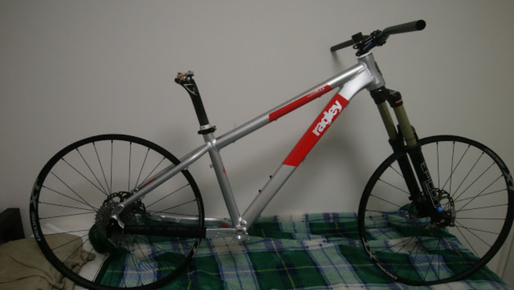
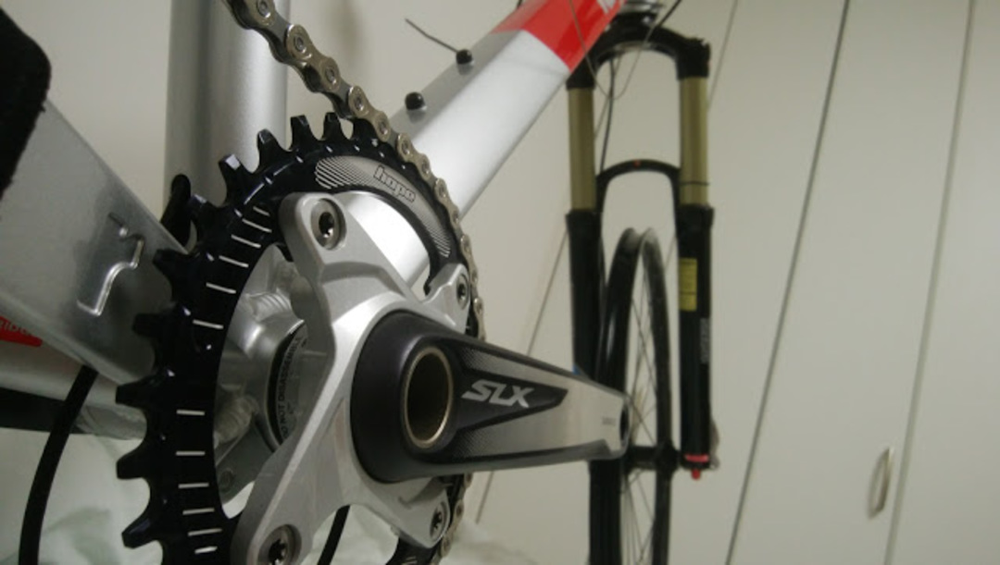
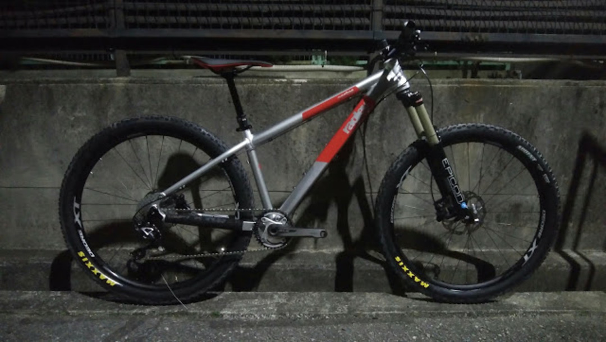

### 3 度目の MTB

買っては乗らなくなり、売り払い、また買うという行為を繰り返していたがこんどこそ 3 度目の正直。

ディスクロード購入で、夏シーズンロードレースとほぼ無縁になったので王滝やシマノバイカーズで遊ぶための MTB を購入！

友人が 27.5 のコンポ・フォーク・ホイールを処分したがっていたとのことなので、それらを全て引き取って対応するフレームだけ購入。

遊ぶためのフレームなので、個性あるものをと探していたところ、Ragley bike（英）の Mmmbop27.5 を教えてもらって即決。ウルト ○ マンを彷彿とさせる銀色のフレーム！

規格的にも 12&#215;142 の非 Boost で、手持ちホイールと適合していたことも大きい。

ヘッドが寝ていて、150mm フォークが適正と下り向きの AM HT。タイヤもリアは 2.4 インチまで許容できるので楽しく下れるフレームになっているはず。

コンポは SLX と Deore10s。36-11-36 という男ギア比。

最終形がこちら。

ドロッパーポストと[ESI グリップ][1]は初経験。

トレイルでシェイクダウンしたら感想を書いていきたい。

<LinkBox isAmazonLink url="https://www.amazon.co.jp/dp/B003RLLQUM/" />

[1]: http://amzn.to/2pCgmQH
