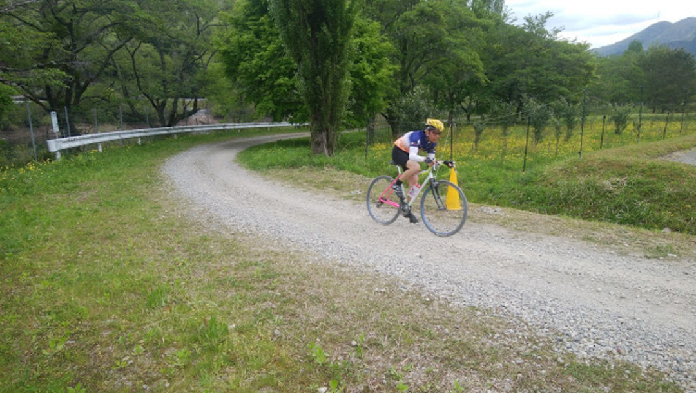
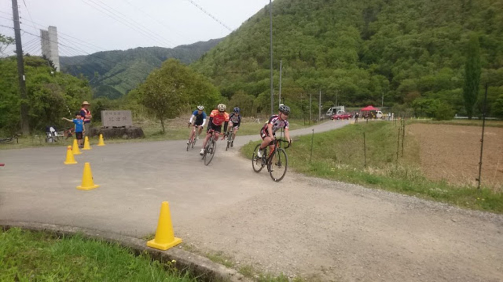
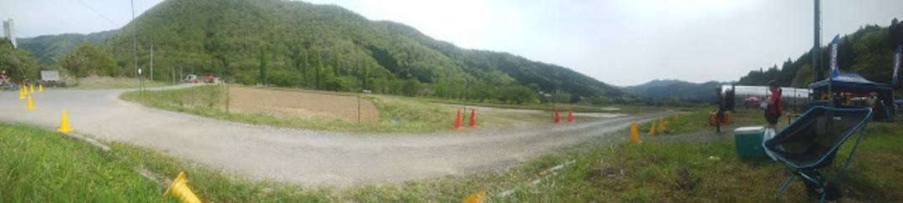
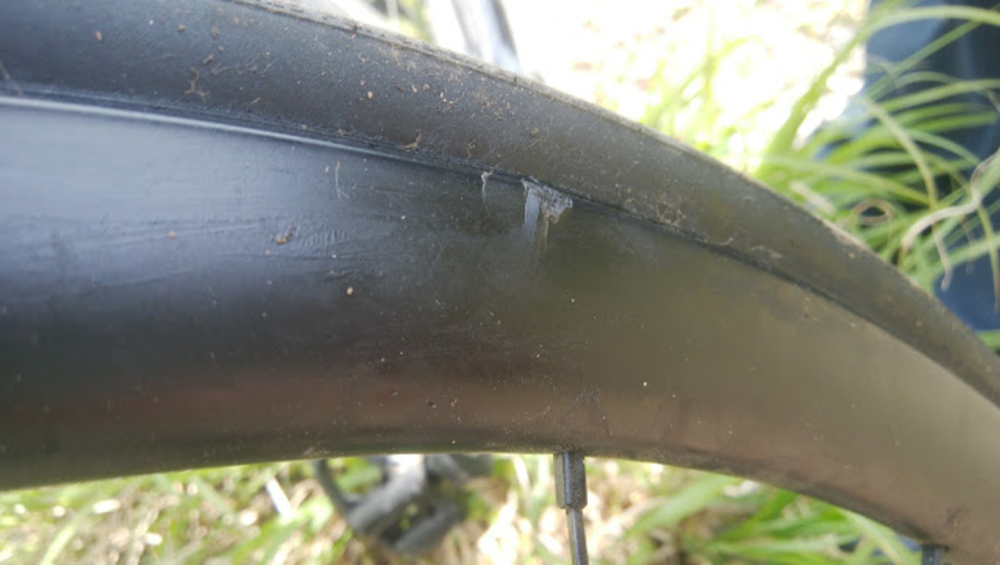

### オンロードとオフロードのクロス

昨年より始まった三船さんプレゼンツの新機軸レースイベント「グラベルクリテリウム」。

今年はJBCFレース参戦を見送る代わりにこういった面白そうなロードイベントに参加することに。

普段日の目を見ないディスクロードのアドバンテージが存分に活かせそうなこともあり、参戦を決定。

名前の通り、グラベルロードでクリテリウムを行うが、タイヤ幅が30mmに制限されている。

コースは約800mのゆるいアップダウンを含む美山向山地区の周回コース。下りとその後の平坦にすこし大きい石が転がっており、舗装路は30mほど。

草の部分をうまく使えばロードタイヤでも程よくグリップするが、石が隠れているといういやらしい仕組み。これでも昨年よりは優しくなったらしい…

スピードもそこまで上がらない（上げられない）ので、それなりに安全。

最初に開催されたビギナークラスはクリテリウムらしく、周回遅れで足切りがされていき段々と人が減っていく展開。スピードもそこまで上がらず和やかだった。

### サバイバル、そして

ロードシーズンと被っているのでエントリー数も少なく、自分の参加するインターミディエイトクラス（20周）は出走4人。この人数なので足切りは無しということが宣言される。

後にこのルールが非常に重要だということを思い知らされる。

周りの人が30mmギリギリのタイヤを履いているのに対し、自分はロードバイクに前後25c。銘柄違いで実測基準で言うとフロント23mm(GIANT GaviaSLR)/リア26.5mm(IRC旧RBCC)。

タイヤが細い分下りでのディスアドバンテージとなるので、積極的に先頭を引くことにする。平坦と登りで稼ぐ算段。

<blockquote class="twitter-tweet" data-lang="ja">
  

    インターミディエイト、先頭。 <a href="https://t.co/maJlTNOmr6">pic.twitter.com/maJlTNOmr6</a>
  

  

    — グラベルクリテリウム2017公式 (@GravelCriterium) <a href="https://twitter.com/GravelCriterium/status/859576648756113408">2017年5月3日</a>
  

</blockquote>

思惑通り先頭でスタートし、淡々と踏んでいたら5周ほどで一人旅になったのでそのまま回し続ける。

くろんど池CXで独走パンクをやらかした経験から、途中で多少ペースを落として丁寧なライン取りを心がけて走行。

8周目か9周目、グリップが上がったような感覚があり嫌な予感。ロードノイズも心なしか前の周回と違う音が…している…ような…？

ﾌﾟｼｭｰ

前輪パンクwwwwwwwww（ビード外れ）

DNFがないルールなので、荒れていない箇所は走行し残りは担いで周回をクリア。

観客のところでパンク修理をはじめる。知り合いがチューブを提供してくれるが、チューブレスホイールとタイヤにチューブを入れるのはとても大変。

ガチャガチャやっているうちに-4Lapほど失う。しかし他の人もパンクしている…

ビリを牽かなければ表彰台なのであちらこちらで必死のリカバリ作業が始まっている。

<blockquote class="twitter-tweet" data-lang="ja">
  

    インターミディエイトは、出走が4人しかいないので、周回遅れでもパンク修理して、何がなんでも走らされてます！なので、表彰台は激しい争いですw <a href="https://t.co/iXfpXjoVmN">pic.twitter.com/iXfpXjoVmN</a>
  

  

    — グラベルクリテリウム2017公式 (@GravelCriterium) <a href="https://twitter.com/GravelCriterium/status/859581262670970880">2017年5月3日</a>
  

</blockquote>

チューブを入れて再スタート。TLのときは4.5気圧だったがチューブドであることを考慮して5.5気圧でスタート。

ﾊﾞｽﾝ

走行開始2周目でリム打ちパンクwwwwwwwwwwww

もうチューブないでーすwwwwwwwww

再度ランニングでコントロールラインを抜けると、三船さんのバイクを貸してもらえることに！

ありがとうございます！！！

しかし三船さんの身長は180cmオーバー、自分は160cm。ペダルもSPD-SLからTIME XCという変化。しかし走らねばならない…

最適解を求めた結果、こうなった。

<blockquote class="twitter-tweet" data-lang="ja">
  

    ついに、タイヤも尽きて三船バイクを借りて走っております！シューズが合わずに、靴を脱ぎ捨てあと5周くらい。 <a href="https://t.co/kZcdvRyqFm">pic.twitter.com/kZcdvRyqFm</a>
  

  

    — グラベルクリテリウム2017公式 (@GravelCriterium) <a href="https://twitter.com/GravelCriterium/status/859582426053353473">2017年5月3日</a>
  

</blockquote>

靴を脱いで靴下でペダルを踏む！（痛い）

サドルに乗ったら1mmもペダルを回せないのでトップチューブに乗る！（痛い）

しかもカンパだこれ！（シフトチェンジを逆方向にやってしまい降りるハメに）（路面の石が痛い）

解決策として2周目ではシューズをスタッフの女性にお借りして走行を続けることに。

<blockquote class="twitter-tweet" data-lang="ja">
  

    靴を借りて再出走。 <a href="https://t.co/Ex6aKT8hNM">pic.twitter.com/Ex6aKT8hNM</a>
  

  

    — グラベルクリテリウム2017公式 (@GravelCriterium) <a href="https://twitter.com/GravelCriterium/status/859583951333081088">2017年5月3日</a>
  

</blockquote>

スニーカーは偉大であり、ちょっと滑るものの裸足に比べれば圧倒的に安定した走行ができた。人類の文化に乾杯。

先頭以外の全員がパンクするという事態になり、タイヤ以外にもチェーントラブルが起きていた模様。延べトラブル率実に100％を越える凄まじいサバイバルレースだった。

結果は-7Lapsのビリ。ﾁｰﾝ。

初回のパンク修理に時間がかかったのが痛かった…

### パンク祭り

午後のオープンクラスやエリートクラスもパンクでDNFする選手が続出。

そんな中の解説…

**三船さん「実はこういうコース、空気圧は高くしたほうがいいんですね。跳ねるけれどもトラブルを避けたほうが」 **

<strike>最初に言ってくれ</strike>

同行した友人は漢の23cで参戦。

オープン：「午前を参考に6気圧だ！！！」→ パンク

エリート：「6気圧でダメなら漢の7気圧！オンロードと同じ！」→ パンク

リベンジ：「これ以上空気圧上げない！5周くらい持つだろ！」→ パンク

エアボリュームがないとそもそもどうにもなりませんなこれは…

## 被害

- カーボンホイール死亡
- チューブ死亡
- GIANTタイヤはビード落ちしたため信頼できなくなり廃棄

リベンジレースに出るつもりでしたが、ホイールが壊れてしまったので参加できず。

後日瞬着で固めたところIRCのタイヤはビードが上がってくれたのでなんとか利用は継続できそう？

タイヤに関しては、本来TLタイヤはリム打ちパンクしてもリムから外れないのが基本のはずがパンクせずに外れてしまうという具合だったので、安心と信頼のIRCしか使わないことに。

レースには使わないにしても輪行できる範囲の利用にはなんとかといった具合。

完全に膨らんでいるのでリムブレーキなら廃棄せざるを得ないところだけれどもディスクブレーキならタイヤさえ保持できればどうとでもなるというメリットを発見した。

普通のレースではない異常な雰囲気だったが、アホみたいに面白かったので次回はちゃんとアルミホイールで参戦しようと思う。

<LinkBox isAmazonLink url="https://www.amazon.co.jp/dp/B00NIE8FKM/" />
