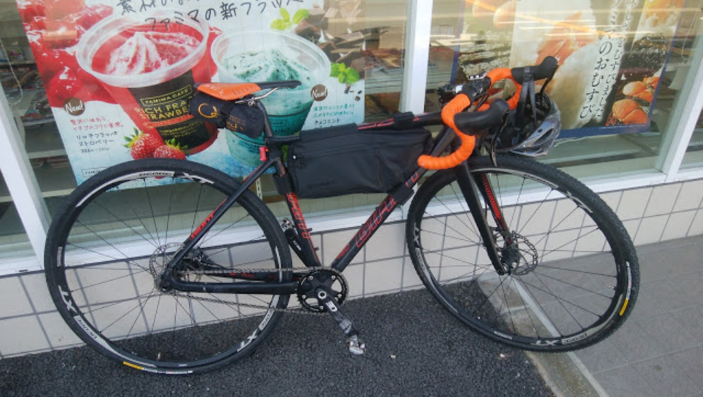
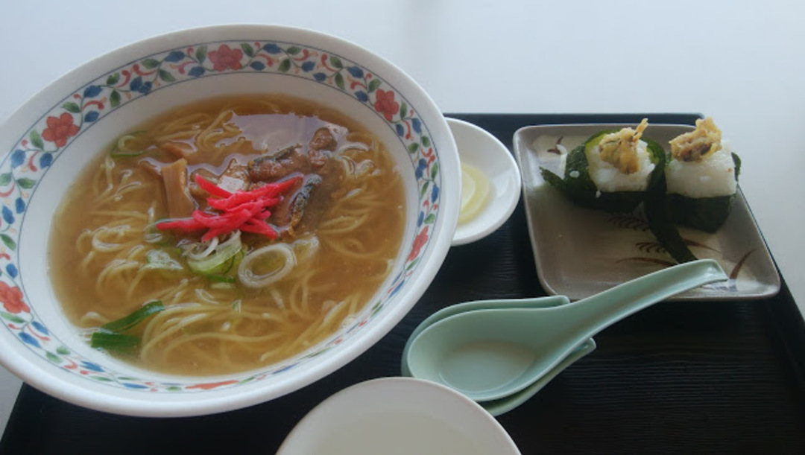
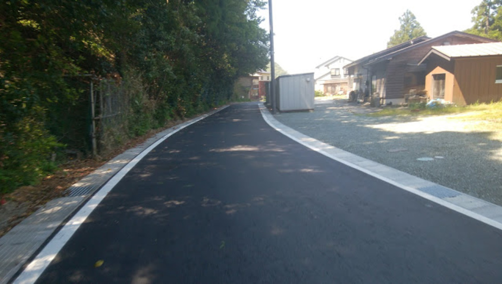
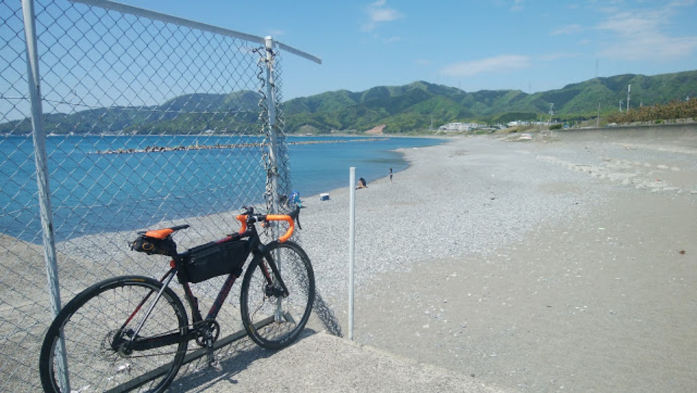
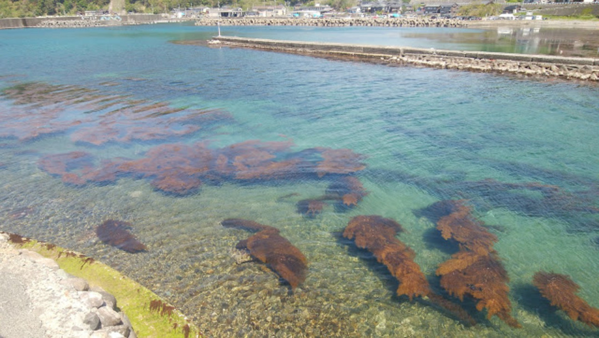
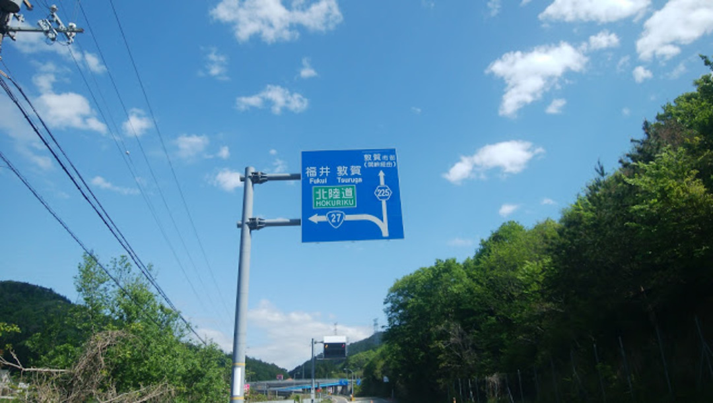
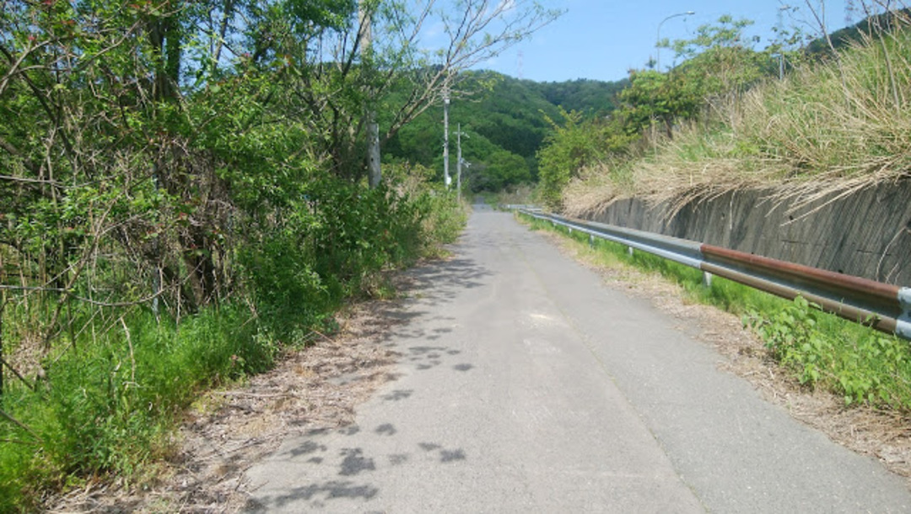
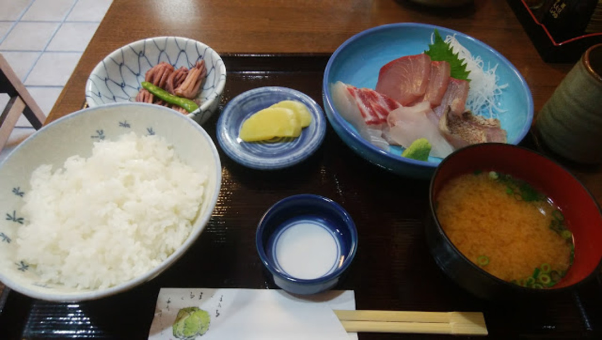
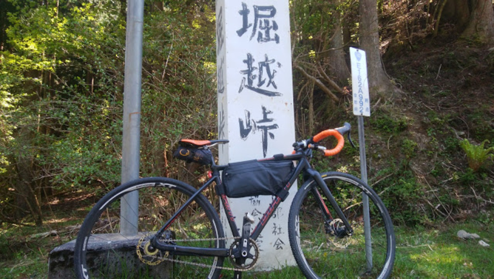

### GW の危機

<a href="/2017/05/2017.html" target="_blank">前日のレースで唯一のロードホイールを破損してしまい</a>、GWの予定立て直しを強いられてしまう。

「ホイールを買う？」→12mmスルーのフロントホイールなどポンポン売っていない

「CXホイールにアダプタは？」→ 店頭在庫ないし配送は当然GW後

「CXでいけば？」→ ギアードはバラしてフレーム売っちゃった

という八方塞がり状態。

残りの自転車はSSCXとMTB。MTBは下り向けなのでオンロードをまともに走れそうなのはSSCXのみ…！

**じゃあ SSCX で行くしか無いじゃん！！！！！！！！！**

### 前準備

いくら行き当たりばったりとはいえ、一応準備はしっかりと。

まずタイヤの空気圧を4気圧まで上げる。ロードタイヤに付け替えることも考えるがホイール側の上限をたやすく越えてしまうためCXタイヤのまま空気圧を上げる方式を選択。

4気圧でも実はホイール上限越えてるのだが…

ギア比は超高速CXコース用の38x17Tに変更。12Tも準備があるがチェーン交換が必要になる上に登りがほぼ無理になってしまうので却下。

目的地は敦賀なので、湖西コースと北摂コースが選択できる。

GWなので元々人の少ない北摂コースを選ぶことにしていたのだが、SSCX化により道路の流れに乗れなくなることは確定的に明らか。

北摂コースでゆったり目指すことに決定。なるべく獲得標高の減るコースを選択していく。

[][1]

ルートはR477から南丹を通過して日吉ダムを通り美山方面へ、そのままR162に合流して小浜からはR27を走るコース。

琵琶湖コースを取れば20kmから30kmほどの短縮になるが、車が多くてストレスフルな行程になりそうなのでパス。

北摂ルートは観光地としてそこそこ名高い三方五湖を経由して170kmほどの行程。

帰りは新快速で大阪まで一本！らくちん！最高！

### 若狭グルメ・観光

若狭と言えば海産物！

三方五湖レークセンターで名物のへしこをスープに使ったラーメンを頂く。魚介スープがうまい！！！

へしこ天むすも独特の味で炭水化物の暴力的なハーモニーを醸し出す。

自転車で塩分をカロリーを失っていることもあり、遠慮なく完飲。

三方五湖はいわゆる汽水湖。

海と湖と山を一気に楽しめる隠れた良スポット。大阪からそれなりに距離があるとは言え、ここまで獲得標高1000m程度なのでそこまでキツさは無し。

GWということもありレインボーロードという有料道路は車やバイクがひっきりなしに通っていましたが、自転車は入れないので裏道をチョイス。

近場の300m級の山から全体を見渡せるスポットがあるらしいが、SSで激坂登りは勘弁ということで次回に回す。

ジェットスキーでも遊べるらしい。

三方五湖を離れ、敦賀までの海岸線を流す。

  日本海は透明度が高く、砂利浜で、すぐ近くが山になることが特徴。

海底まで見渡せる圧倒的な透明度！

敦賀の手前ではR27がバイパスになるため、標識では県道で関峠を通るように指示されるが…

バイパス脇に回避道があり、バイパスの通る2kmトンネルを歩道で走ることが出来る。

下りトンネルでかなりスピードが乗るうえに、緊急避難場所で急カーブを強いられるので走行には注意。

銭湯でゆっくりした後、最後のお楽しみへ。

夕食は<a href="https://goo.gl/maps/WBEVpbshFqC2" target="_blank">うおさき</a>さんの刺身定食をチョイス。

肉厚でプリップリの刺身が頂ける。鯖の浜焼きと迷ったが、鯛のいいのが出ていると言われて刺身を選択！

  帰りはそのまま新快速で寝ているだけで大阪まで到着。

  1時間に1本直通が出ている上、終電も21時台なので安心安全。

### SSCX でオンロードツーリングできるのか？？？

結論から言うと、コースを上手く選択すればロードに匹敵するスピードで走れることがわかった。

SS故に平地の速度は29km/hほど（ケイデンス100-110）が精一杯となる。

下りに関しては35km/hまではなんとか回すことができるが、それ以上の速度では足を休ませざるを得ないのだが、これがツーリングではかなりいい具合に作用して疲れを軽減できる。

今回のコースはゆるい登りが多く、20km/h ～ 30km/hで気持ちよく走る程度の斜度となっていたのでSSのスピード域とバッチリ合っていた。

同じギア比を使うのであれば、駆動抵抗が低いSSと転がり抵抗の低い太いタイヤの影響で気持ちよく進んでくれるのでむしろ登りをコースに組み込んだほうがよいと言える。

平坦で脚を高速で回し続けるのは、後半体力的に辛くなってくるだろう。登りで適当な具合に抑えることで気持ちよく走れる。

太いタイヤが振動による疲労を軽減してくれるのか、上半身へのダメージが少なかったのも特徴。ロングライダーが太めのタイヤを好んで選ぶことも頷ける内容だった。

今回は履いていたタイヤをそのまま（フロントSERAC、リアSERAC sand）使ったが前後Sandならもっと快適だろう。

ここまで快適だと、ギアードCXが戻ってきたときにロードの必要性を考えなければいけないかもしれない…

<LinkBox isAmazonLink url="https://www.amazon.co.jp/dp/B00QHS8BQE/" />

[1]: https://latlonglab.yahoo.co.jp/route/watch?id=640ae6ec2fbbc24f4ee241d39575d3f9 "敦賀ツーリング北摂コース - ルートラボ - LatLongLab"
