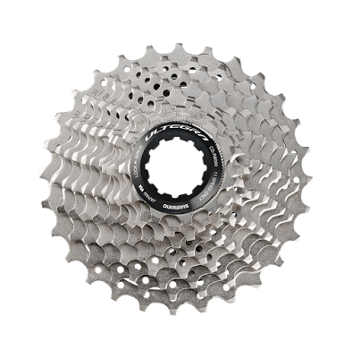

R8000系アルテグラが発表された。

概ねR9000系デュラエースと同様のモデルチェンジであり、コスパに優れた油圧コンポが出て、9001系のようなマイナーチェンジも今のところ存在せず、ノンサプライズの発表だった…「アルテグラ」については。

同時にワイドカセットのCS-HG-800とディスクロード用ホイールWH-RS770が発表された。この2点、実は今回の発表で最も注目すべき製品。

### CS-HG-800 の何がすごいのか

一見して、11-34Tのオールロード向けスプロケットに見えるこいつ、実はMTBホイールのフリーに装着することが可能。

[シマノ USAのサイト](http://bike.shimano.com/content/sac-bike/en/home/news-and-info/news/shimano-new-ultegra-r8000-road-components-deliver-industrys-wide.html)には下記のように書かれている。

> With the addition of the new 11-34T CS-HG800-11 cassette, ULTEGRA further expands gearing options for riders of any terrain. Designed to fit both MTB- and road-specific (with spacer) wheelsets, mixed terrain riders are provided with more wheelset options than ever before.

おそらく、この点がアルテグラではなくグループ外の型番を当てられている理由だと思われる。そして、MTBのフリーボディは**ロード 10s カセットスプロケットを装着できる**。

言わずもがな、HG800は11sであるため、実質的に**巷で流通している 10s フリーコンパチ 11s スプロケットとしての役割を持っている**。

軽い軽いギア比とRDのキャパシティさえ許容できれば、10s時代の機材をまだまだ継続運用できるというわけだ。

もう1つ、ディスクブレーキのCXバイクを使っている人たちにもこのスプロケットは救いの光となる。

ディスクロード以上にハブ規格が混沌としたCXでは、現役で15mmTA+リアQRというフレームが生存しているが、ディスクロードの規格が前後12mmTAになってしまったことでロードホイールの供給が完全に絶たれている。

10s時代は、非推奨ではあるものの29erホイールを流用すれば問題なかったが、ロード11sで運用できないため、RD-6770を何個もストックしている人を伝え聞いている。

だが、HG800を利用すれば**29er ホイールを流用したままロード 11s の機材を利用することが可能**となる。<strike>みんな大好きWH-M785がまだまだ使えるよやったね！</strike>

CXならば、フロントギアを調整することでギア比が軽くなるデメリットも簡単に帳消しにできる。40Tとか42Tとかをシングルギアで運用すれば対応できるスピード域も増えて万々歳だ。

おそらくアメリカをメインにユーザーが多い、マウンテン規格を使っているグラベルロードの救済だと思うのだが、日本国内ではCXerの方が恩恵を受けることになるだろう。

### WH-RS770 はディスクロードホイールのベンチマーク

ディスクロードのホイールは種類が少なく、重量も余りこなれていなかった。

今までベンチマークとして存在していたDT Swiss R23 Spline DBは定価670ドルで1655g。

対してシマノのハイグレードだったWH-RX830は1841gという重さ…勝負になっていない。

DTの完組は実質海外通販だよりなので実売6万円程度。国内流通は調べた限りあんまり…である。

だが、今回リリースされたRS770は**1639g**かつ**国内流通バッチリ**。定価ベースだとハッキリ言って高いが、実売はまぁR23よりちょっと高い程度に収まっている。シマノハブは思いからリムはR23より軽い…かもしれない。

こいつは手持ちのGIANTのカーボンクリンチャーホイールとさして変わらない重量なので、ディスクロード用ホイールのアップグレード代が一気に安くなったと言える。

着々とディスクロード普及への足固めが進んでますね！

<Amzn asin="B075H46GDV" />
