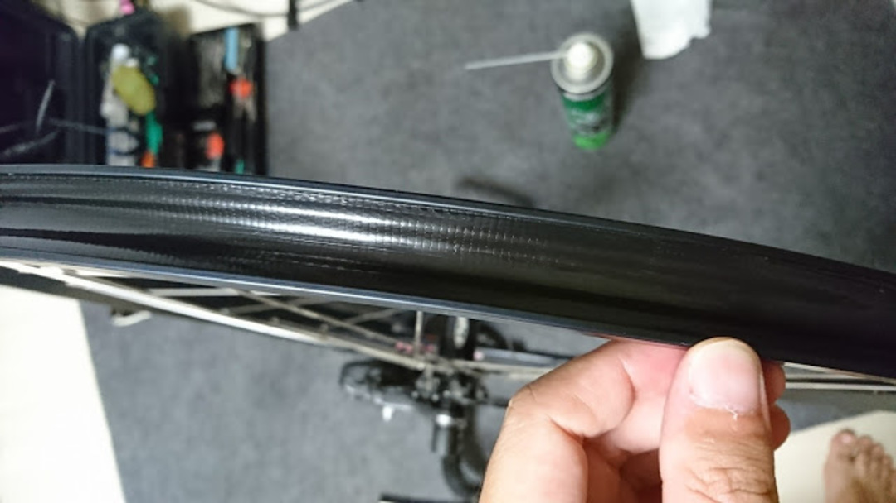
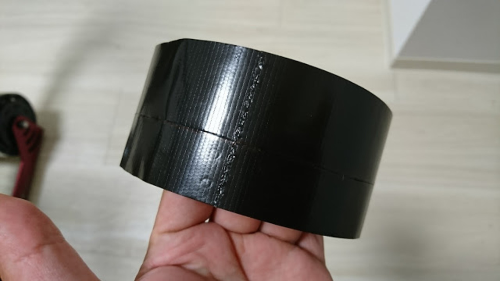
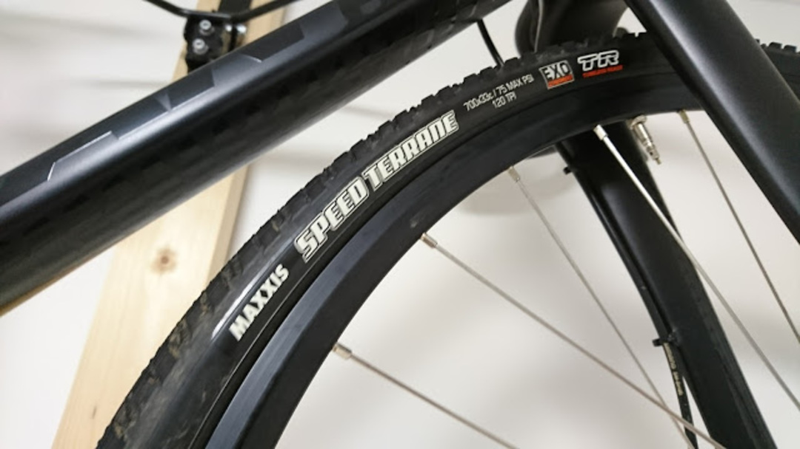

### ダクトテープとは？

アメリカ人が絶大な信頼を寄せるテープ。アポロ 17 号の補修にも使われ、ボートから宇宙船までとりあえずなんでもこれで補修しとけ！という万能テープ。防水・気密。

アメリカでは、高校のダンスパーティーの衣装をダクトテープで作るコンテストもあるほど謎の信頼性と人気を得ている。（<a href="https://ja.wikipedia.org/wiki/%E3%83%80%E3%82%AF%E3%83%88%E3%83%86%E3%83%BC%E3%83%97" target="_blank" rel="noopener">Wikipedia</a>より）

### ダクトテープでのチューブレス化

粘着力の強さ・気密性・粘着力の強さ、何より強度が高いとリムテープの代わりになる要件は十分。もちろんアメリカでは先人がいっぱいいる、主にファットバイクのチューブレス化に利用されている事が多い。

ファットバイクサイズのチューブレステープは市販されていないので、妥当といえば妥当である。日本でも MTB を中心に前例はあるようだ。

ダクトテープと一口に言っても種類は様々ですね。

### CX ホイールをチューブレス化しよう！

今回ご用意しましたのはこちら、<a href="http://amzn.to/2vLbShE" target="_blank" rel="noopener">ニトムズ</a>の<a href="http://amzn.to/2vLtIRN" target="_blank" rel="noopener">気密・防水クロステープ 片面粘着 KZ-7</a>。

化学メーカー勤務の知り合いより推薦。  
こいつを Velocity A23 リムに合うよう 21mm 幅に切り出す。高い強度を誇りながらカッターで簡単に切れ目が入り、手でちぎることも出来るという矛盾。

そして冒頭のようにリムに巻いていきます。  
Notubes のイエローテープしか自分で使ったことはありませんが、粘着面への追従性が高く気泡が全くできない。このテープは Notubes テープよりやや厚い模様。ヘラのようなもので完全にリムに密着させた後、千枚通しでバルブ穴を開けて装着。

Notubes テープと違って穴が広がらないのでやや苦労する。石鹸水を塗ってタイヤとシーラントを装着して、試しに普通のフロアポンプでプッシュ！  
一発でビードが上がる！空気抜けも…装着時点ではなし！

フロントはしっかり施工できました。

後輪編・実走編・シーズン後編、乞うご期待。

<LinkBox isAmazonLink url="https://www.amazon.co.jp/dp/B002P800MS/" />

<LinkBox isAmazonLink url="https://www.amazon.co.jp/dp/B004JLGARI/" />
