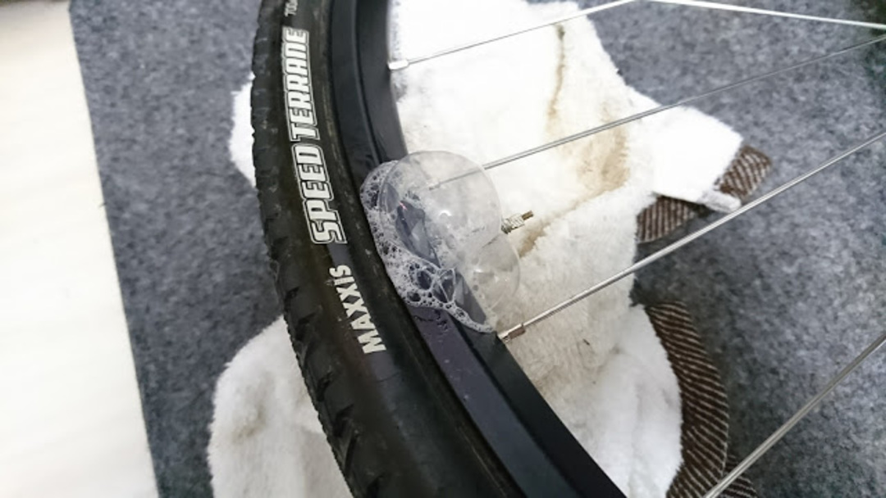

### そして翌朝

この記事は<a href="/2017/08/blog-post.html" target="_blank">前回</a>の続きです。

翌朝起きたら見事にタイヤが萎んでいました。悲しい…

開けてみるとご覧の通りテープがちょっとずれてる、そしてバルブ付近に大量のシーラント痕。

ひとまずテープを巻き直すことに。

剥がしながら観察すると、2重に巻いた2層目が主にずれており1回目は完全な密着を保っている模様。バルブ付近は単純に力任せに穴を開けたのが良くなかったのか？

それでも一応2重に巻き直し、バルブ付近のみ3重化。穴はカッターで十字穴を開けて装着してみた。

果たして翌朝、空気圧が落ちることもなく完全に気密が保たれている。すごいぞ！

1週間近く経った現在も走行に十分な空気圧が保たれたまま、完璧だ。

### 後輪も

後輪は一旦余っていたNotubesのテープでチューブレス化してみた。そしたらバルブ周りがご覧の有様。

ダクトテープで巻き直すと、若干マシになったもののバルブ周りは相変わらず。Notubesのバルブが完全に死んでいるのか？

何度か巻き直してみるも、前輪と同じく2層目がずれていてもリムに直接貼られている部分は無傷なのだがどうしてもバルブ周りの漏れが収まらない。

何度か試すうちにゴムが馴染んだのか、漏れが少なくなってくるも、このままでは非常に不安が残るので根本の気密性が優秀そうな<a href="http://amzn.to/2wTg0ta" target="_blank">DT Swiss系のバルブ</a>を買って試してみることにする。

通販もリアル店舗も納得行くコストで手にはいらないのでOEMらしきGIANTのチューブレスバルブを使う予定。

続編、乞うご期待。

<Amzn asin="B01MRK8TB7">
